# Spring的事件驱动

在开始聊Spring的事件驱动之前，让我们先看一下事件监听器模式

## 事件监听器模式

事件监听器模式，监听器将监听感兴趣的事件，一旦事件发生，便做出响应。涉及的角色如下：

- 事件源（Event Source）：具有注册监听器和发布事件的能力
- 事件监听器（Event Listener）：具有处理事件的能力
- 事件对象（Event Object）

### 事件对象

事件对象为信息的载体

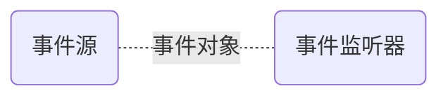

```java
@Data
public class ClickEvent {

	private String type;
    
}
```

### 事件监听器

事件监听器具有处理事件的能力

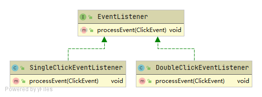

```java
public interface EventListener {

    void processEvent(ClickEvent event);

}
```

单击事件监听器，具有处理单击事件的能力

```java
public class SingleClickEventListener implements EventListener {

   @Override
   public void processEvent(ClickEvent event) {
      if ("singleClick".equals(event.getType())) {
         System.out.println("单击被触发");
      }
   }

}
```

双击事件监听器，具有处理双击事件的能力

```java
public class DoubleClickEventListener implements EventListener {

   @Override
   public void processEvent(ClickEvent event) {
      if ("doubleClick".equals(event.getType())) {
         System.out.println("双击被触发");
      }
   }

}
```

### 事件源

事件源至少拥有以下两种能力：

1. 注册监听器的能力
2. 发布事件的能力

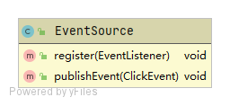

```java
public class EventSource {

   private List<EventListener> listenerList = new ArrayList<>();

   public void register(EventListener listener) {
      listenerList.add(listener);
   }

   public void publishEvent(ClickEvent event) {
      for (EventListener listener : listenerList) {
         listener.processEvent(event);
      }
   }
}
```

### 使用方式

使用事件监听器的步骤如下:

1. 注册监听器
2. 发布事件

```java
public class Demo {
   public static void main(String[] args) {
      // 1. 注册监听器
      EventSource eventSource = new EventSource();
      SingleClickEventListener singleClickEventListener = new SingleClickEventListener();
      DoubleClickEventListener doubleClickEventListener = new DoubleClickEventListener();
      eventSource.register(singleClickEventListener);
      eventSource.register(doubleClickEventListener);

      // 2. 发布事件
      ClickEvent event = new ClickEvent();
      event.setType("doubleClick");
      eventSource.publishEvent(event);
   }
}
```

聊完事件监听器模式，让我们回到Spring的事件驱动。

## Spring的事件驱动模型

三大组成部分

- 事件：ApplicationEvent抽象类
- 事件监听器：ApplicationListener
- 事件发布器：Publisher以及Multicaster


### ApplicationEvent

ApplicationEvent的类图如下

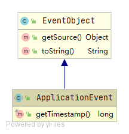

#### ApplicationEvent架构体系

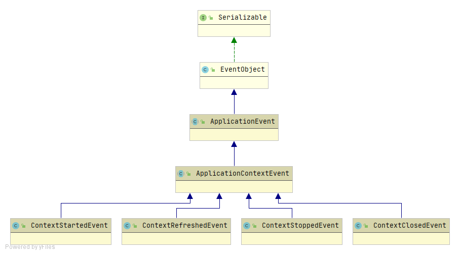

##### ApplicationContextEvent

ApplicationContextEvent是ApplicationContext相关事件基类

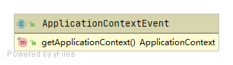

##### 其他事件

ContextStartedEvent：容器启动事件

ContextRefreshedEvent：容器刷新事件

ContextStoppedEvent：容器停止事件

ContextClosedEvent：容器关闭事件

### ApplicationListener


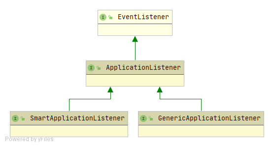

#### EventListener

EventListener是一个标记接口，其中不包含任何方法，但JDK要求所有的事件监听器均要继承自EventListener

```java
/**
 * A tagging interface that all event listener interfaces must extend.
 * @since JDK1.1
 */
public interface EventListener {
}
```

#### ApplicationListener

ApplicationListener接口要求其实现类具有处理ApplicationEvent的能力

ApplicationListener的类图如下：

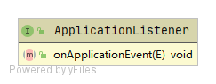

ApplicationListener要求实现类在onApplicationEvent()中处理事件。（题外话：方法名更换为 handleApplicationEvent() 会不会好理解一些）

```java
	/**
	 * Handle an application event.
	 * @param event the event to respond to
	 */
	void onApplicationEvent(E event);
```

#### SmartApplicationListener

SmartApplicationListener的类图如下：

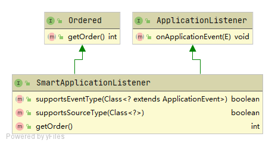

SmartApplicationListener要求其实现类具备以下能力：

1. 判断是否支持某事件类型的能力
2. 判断是否支持某事件源类型的能力
3. 监听器排序能力

#### GenericApplicationListener

GenericApplicationListener的类图如下：

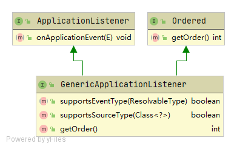

GenericApplicationListener要求其实现类具备以下能力：

1. 判断是否支持某事件类型的能力
2. 判断是否支持某事件源类型的能力
3. 监听器排序能力

可看出GenericApplicationListenery要求的能力和SmartApplicationListener相同，不同点在于事件类型，GenericApplicationListenery支持泛型事件类的筛选

```java
	/**
	 * Determine whether this listener actually supports the given event type.
	 * @param eventType the event type (never {@code null})
	 */
	boolean supportsEventType(ResolvableType eventType);
```

> 提示：ResolvableType是spring4.0新增的用于获取泛型信息的工具。测试demo如下：
>
> ```java
> public class ResolvableTypeDemo {
> 
> 	private HashMap<String, List<Integer>> customizedMap;
> 
> 	public static void main(String[] args) throws NoSuchFieldException {
> 		ResolvableType resolvableType = ResolvableType.forField(ResolvableTypeDemo.class.getDeclaredField("customizedMap"));
> 		System.out.println("resolvableType.getGeneric(0).resolve():" + resolvableType.getGeneric(0).resolve());
> 		System.out.println("resolvableType.getGeneric(1).resolve():" + resolvableType.getGeneric(1).resolve());
> 		System.out.println("resolvableType.getGeneric(1):" + resolvableType.getGeneric(1));
> 		System.out.println("resolvableType.getSuperType():" + resolvableType.getSuperType());
> 		System.out.println("resolvableType.asMap():" + resolvableType.asMap());
> 		System.out.println("resolvableType.resolveGeneric(1,0):" + resolvableType.resolveGeneric(1, 0));
> 	}
> }
> ```
>
> 输出结果如下：
>
> ```java
> > Task :spring-demo:ResolvableTypeDemo.main()
> resolvableType.getGeneric(0).resolve():class java.lang.String
> resolvableType.getGeneric(1).resolve():interface java.util.List
> resolvableType.getGeneric(1):java.util.List<java.lang.Integer>
> resolvableType.getSuperType():java.util.AbstractMap<java.lang.String, java.util.List<java.lang.Integer>>
> resolvableType.asMap():java.util.Map<java.lang.String, java.util.List<java.lang.Integer>>
> resolvableType.resolveGeneric(1,0):class java.lang.Integer
> ```

### 事件发布器

#### ApplicationEventPublisher

ApplicationEventPublisher的类图如下：

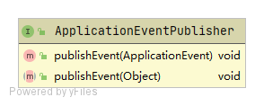

ApplicationEventPublisher要求其实现类具有以下能力：

1. 发布事件的能力

> 扩展知识：ApplicationEventPublisher和ApplicationEventMulticaster的关系
>
> ApplicationEventPublisher仅有发布事件的能力，而ApplicationEventMulticaster具有发布事件和注册监听器的能力。
>
> ApplicationEventPublisher内部其实是调用了ApplicationEventMulticaster的发布事件能力。源码可参见ApplicationEventPublisher的实现类AbstractApplicationContext
>
> ```java
> 	protected void publishEvent(Object event, @Nullable ResolvableType eventType) {
>         ...
> 		else {
>             // 调用Multicaster的发布事件能力
> 			getApplicationEventMulticaster().multicastEvent(applicationEvent, eventType);
> 		}
> 
> 		// Publish event via parent context as well...
> 		if (this.parent != null) {
> 			if (this.parent instanceof AbstractApplicationContext) {
> 				((AbstractApplicationContext) this.parent).publishEvent(event, eventType);
> 			}
> 			else {
> 				this.parent.publishEvent(event);
> 			}
> 		}
> 	}
> ```

#### ApplicationEventMulticaster

ApplicationEventMulticaster的类图如下：

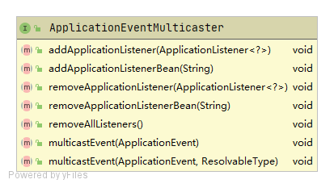

ApplicationEventMulticaster要求其实现类具有以下能力：

1. 注册或注销事件监听器的能力
2. 发布事件的能力


##### ApplicationEventMulticaster的架构体系

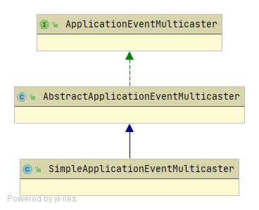

###### AbstractApplicationEventMulticaster

ApplicationEventMulticaster的公共实现。通过源码可知：其是通过Set保存Listener列表的

```java
public final Set<ApplicationListener<?>> applicationListeners = new LinkedHashSet<>();

public final Set<String> applicationListenerBeans = new LinkedHashSet<>();
```

###### SimpleApplicationEventMulticaster

ApplicationEventMulticaster的默认实现，支持多线程