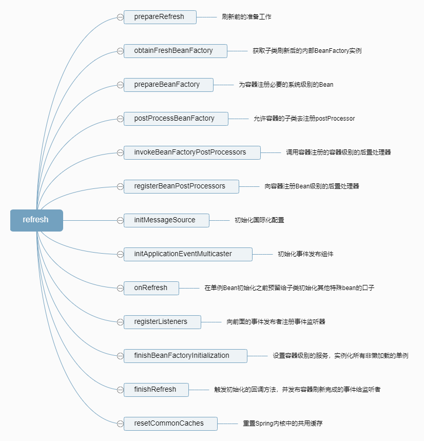

# refresh()

refresh()方法是xml容器（如：FileSystemXmlApplicationContext）和注解容器（如：AnnotationConfigApplicationContext）都会执行的公共方法。用于刷新容器，即将BeanFactory清空为初始状态，再按照程序意图填满各种Bean实例。

refresh中涉及的核心方法如下：



## prepareRefresh

容器刷新前的准备工作，包括：

1. 获取当前时间为容器的启动时间
2. 设置容器状态标识为激活
3. 初始化Environment的PropertySources属性及校验RequiredProperties是否都存在
4. 事件相关准备工作

```java
	/**
	 * Prepare this context for refreshing, setting its startup date and
	 * active flag as well as performing any initialization of property sources.
	 */
	protected void prepareRefresh() {
		// Switch to active.
        // 设置容器的启动时间，方便后续的日志记录和容器相关统计工作
		this.startupDate = System.currentTimeMillis();
		this.closed.set(false);
        // 1. 设置容器的状态为激活
		this.active.set(true);

		if (logger.isDebugEnabled()) {
			if (logger.isTraceEnabled()) {
				logger.trace("Refreshing " + this);
			}
			else {
				logger.debug("Refreshing " + getDisplayName());
			}
		}

        // 2. 初始化Environment的PropertySources属性
        // 样例<context:property-placeholder location="classpath*:/config/load.properties"/>
		// Initialize any placeholder property sources in the context environment.
		initPropertySources();

        // 3. 检验Environment的RequiredProperties是否都存在
        // 请参考ConfigurablePropertyResolver#setRequiredProperties
		// Validate that all properties marked as required are resolvable:
		// see ConfigurablePropertyResolver#setRequiredProperties
		getEnvironment().validateRequiredProperties();

		// Store pre-refresh ApplicationListeners...
		if (this.earlyApplicationListeners == null) {
			this.earlyApplicationListeners = new LinkedHashSet<>(this.applicationListeners);
		}
		else {
			// Reset local application listeners to pre-refresh state.
			this.applicationListeners.clear();
			this.applicationListeners.addAll(this.earlyApplicationListeners);
		}

        // 4. 创建事件集合
		// Allow for the collection of early ApplicationEvents,
		// to be published once the multicaster is available...
		this.earlyApplicationEvents = new LinkedHashSet<>();
	}
```

> initPropertySources的使用方法：[initPropertySources方法扩展点](https://blog.csdn.net/u013277209/article/details/109177452)

## obtainFreshBeanFactory

对于xml容器，此步尤为重要，会进行BeanDefinition的注册。而对于注解容器，该方法仅仅调用子类的freshBeanFactory。源码如下：

```java
	/**
	 * Tell the subclass to refresh the internal bean factory.
	 * @return the fresh BeanFactory instance
	 * @see #refreshBeanFactory()
	 * @see #getBeanFactory()
	 */
	protected ConfigurableListableBeanFactory obtainFreshBeanFactory() {
		refreshBeanFactory();
		return getBeanFactory();
	}
```


其中refreshBeanFactory()是一个抽象方法

```java
protected abstract void refreshBeanFactory() throws BeansException, IllegalStateException;
```

- 对于xml容器（如：FileSystemXmlApplicationContext），其实现类为org.springframework.context.support.AbstractRefreshableApplicationContext#refreshBeanFactory，主要工作：

  1. 若BeanFactory已存在，销毁其中的Bean后，关闭已存在的BeanFactory
  2. 创建BeanFactory（DefaultListableBeanFactory实例），并初始化相关信息
  3. 加载BeanDefinition

  ```java
  	/**
  	 * This implementation performs an actual refresh of this context's underlying
  	 * bean factory, shutting down the previous bean factory (if any) and
  	 * initializing a fresh bean factory for the next phase of the context's lifecycle.
  	 */
  	@Override
  	protected final void refreshBeanFactory() throws BeansException {
          // 1. 若BeanFactory已存在，销毁其中的Bean后，关闭BeanFactory
  		if (hasBeanFactory()) {
  			destroyBeans();
  			closeBeanFactory();
  		}
  		try {
              // 2. 创建BeanFactory（DefaultListableBeanFactory实例），并初始化相关信息
  			DefaultListableBeanFactory beanFactory = createBeanFactory();
  			beanFactory.setSerializationId(getId());
  			customizeBeanFactory(beanFactory);
              // 3. 加载BeanDefinition
  			loadBeanDefinitions(beanFactory);
  			this.beanFactory = beanFactory;
  		}
  		catch (IOException ex) {
  			throw new ApplicationContextException("I/O error parsing bean definition source for " + getDisplayName(), ex);
  		}
  	}
  ```

- 对于注解容器（如：AnnotationConfigApplicationContext），其实现类为org.springframework.context.support.GenericApplicationContext#refreshBeanFactory。由于GenericApplicationContext对象实例化时已生成BeanFactory（请见如下构造方法）

  ```java
  /**
   * Create a new GenericApplicationContext.
   * @see #registerBeanDefinition
   * @see #refresh
   */
  public GenericApplicationContext() {
     this.beanFactory = new DefaultListableBeanFactory();
  }
  ```
  
  refreshBeanFactory()方法中主要实现如下能力：
  
  1. 初始化容器相关信息。包括：更新状态标识位为刷新，设置容器id
  
  ```java
  	/**
  	 * Do nothing: We hold a single internal BeanFactory and rely on callers
  	 * to register beans through our public methods (or the BeanFactory's).
  	 * @see #registerBeanDefinition
  	 */
  	@Override
  	protected final void refreshBeanFactory() throws IllegalStateException {
  		if (!this.refreshed.compareAndSet(false, true)) {
  			throw new IllegalStateException(
  					"GenericApplicationContext does not support multiple refresh attempts: just call 'refresh' once");
  		}
  		this.beanFactory.setSerializationId(getId());
  	}
  ```
  
  到此，refreshBeanFactory()方法逻辑解析完毕。
  
  

而getBeanFactory()，同样是一个抽象方法。

```java
	public abstract ConfigurableListableBeanFactory getBeanFactory() throws IllegalStateException;
```

该方法无论是xml容器还是注解容器，主要工作均为返回BeanFactory实例。源码如下：

- xml容器。org.springframework.context.support.AbstractRefreshableApplicationContext#getBeanFactory

  ```java
  @Override
  public final ConfigurableListableBeanFactory getBeanFactory() {
     DefaultListableBeanFactory beanFactory = this.beanFactory;
     if (beanFactory == null) {
        throw new IllegalStateException("BeanFactory not initialized or already closed - " +
              "call 'refresh' before accessing beans via the ApplicationContext");
     }
     return beanFactory;
  }
  ```

- 注解容器。org.springframework.context.support.GenericApplicationContext#getBeanFactory

  ```java
  	/**
  	 * Return the single internal BeanFactory held by this context
  	 * (as ConfigurableListableBeanFactory).
  	 */
  	@Override
  	public final ConfigurableListableBeanFactory getBeanFactory() {
  		return this.beanFactory;
  	}
  ```

  

## prepareBeanFactory

prepareBeanFactory注册一些容器需要的系统Bean。如：classLoader，beanPostProcessor等。源码如下：

```java
	/**
	 * Configure the factory's standard context characteristics,
	 * such as the context's ClassLoader and post-processors.
	 * @param beanFactory the BeanFactory to configure
	 */
	protected void prepareBeanFactory(ConfigurableListableBeanFactory beanFactory) {
		// Tell the internal bean factory to use the context's class loader etc.
        // 告诉内部beanFactory使用外部容器(如：注解容器AnnotationConfigApplicationContext)的类加载器。
        // 这样内部beanFactory便能使用该类加载器获取外部容器的资源了
		beanFactory.setBeanClassLoader(getClassLoader());
        // 设置beanFactory的表达式语言处理器，Spring3开始增加了对语言表达式的支持，默认可以使用#{bean.xxx}的形式来调用相关属性值
		beanFactory.setBeanExpressionResolver(new StandardBeanExpressionResolver(beanFactory.getBeanClassLoader()));
        // 为beanFactory增加一个默认的PropertyEditor
		beanFactory.addPropertyEditorRegistrar(new ResourceEditorRegistrar(this, getEnvironment()));

		// Configure the bean factory with context callbacks.
        // 添加该处理器的作用：当应用程序定义的Bean实现了ApplicationContextAware接口时注入ApplicationContext对象
		beanFactory.addBeanPostProcessor(new ApplicationContextAwareProcessor(this));
        // 如果某个bean依赖于以下几个接口的实现类，在自动装配的时候忽略他们
        // Spring会通过其他方式来处理这些依赖
		beanFactory.ignoreDependencyInterface(EnvironmentAware.class);
		beanFactory.ignoreDependencyInterface(EmbeddedValueResolverAware.class);
		beanFactory.ignoreDependencyInterface(ResourceLoaderAware.class);
		beanFactory.ignoreDependencyInterface(ApplicationEventPublisherAware.class);
		beanFactory.ignoreDependencyInterface(MessageSourceAware.class);
		beanFactory.ignoreDependencyInterface(ApplicationContextAware.class);

		// BeanFactory interface not registered as resolvable type in a plain factory.
		// MessageSource registered (and found for autowiring) as a bean.
        // 修正依赖，这里是注册一些自动装配的特殊规则。比如是BeanFactory class接口的实现类，则在运行时指定为当前BeanFactory
		beanFactory.registerResolvableDependency(BeanFactory.class, beanFactory);
		beanFactory.registerResolvableDependency(ResourceLoader.class, this);
		beanFactory.registerResolvableDependency(ApplicationEventPublisher.class, this);
		beanFactory.registerResolvableDependency(ApplicationContext.class, this);

		// Register early post-processor for detecting inner beans as ApplicationListeners.
        // ApplicationListenerDetector的作用：判断某个Bean是否是ApplicationListener。如果是，加入到事件监听器队列
		beanFactory.addBeanPostProcessor(new ApplicationListenerDetector(this));

		// Detect a LoadTimeWeaver and prepare for weaving, if found.
        // LoadTimeWeaver的作用：类加载期织入。服务于AOP
		if (beanFactory.containsBean(LOAD_TIME_WEAVER_BEAN_NAME)) {
			beanFactory.addBeanPostProcessor(new LoadTimeWeaverAwareProcessor(beanFactory));
			// Set a temporary ClassLoader for type matching.
            // TempClassLoader用于加载并修改Bean对应类的行为。其作用：1. 类型配置相关工作 2. 存放AOP生成的临时代理类
			beanFactory.setTempClassLoader(new ContextTypeMatchClassLoader(beanFactory.getBeanClassLoader()));
		}

		// Register default environment beans.
        // 注册默认的environment beans
		if (!beanFactory.containsLocalBean(ENVIRONMENT_BEAN_NAME)) {
			beanFactory.registerSingleton(ENVIRONMENT_BEAN_NAME, getEnvironment());
		}
		if (!beanFactory.containsLocalBean(SYSTEM_PROPERTIES_BEAN_NAME)) {
			beanFactory.registerSingleton(SYSTEM_PROPERTIES_BEAN_NAME, getEnvironment().getSystemProperties());
		}
		if (!beanFactory.containsLocalBean(SYSTEM_ENVIRONMENT_BEAN_NAME)) {
			beanFactory.registerSingleton(SYSTEM_ENVIRONMENT_BEAN_NAME, getEnvironment().getSystemEnvironment());
		}
	}

```

## postProcessBeanFactory

允许容器的子类去注册postProcessor，是一个钩子方法

```java
	/**
	 * Modify the application context's internal bean factory after its standard
	 * initialization. All bean definitions will have been loaded, but no beans
	 * will have been instantiated yet. This allows for registering special
	 * BeanPostProcessors etc in certain ApplicationContext implementations.
	 * @param beanFactory the bean factory used by the application context
	 */
	protected void postProcessBeanFactory(ConfigurableListableBeanFactory beanFactory) {
	}
```

## invokeBeanFactoryPostProcessors

invokeBeanFactoryPostProcessors()调用了容器级别的后置处理器。源码如下：

```java
public static void invokeBeanFactoryPostProcessors(
      ConfigurableListableBeanFactory beanFactory, List<BeanFactoryPostProcessor> beanFactoryPostProcessors) {

   // Invoke BeanDefinitionRegistryPostProcessors first, if any.
   Set<String> processedBeans = new HashSet<>();

   if (beanFactory instanceof BeanDefinitionRegistry) {
      BeanDefinitionRegistry registry = (BeanDefinitionRegistry) beanFactory;
      List<BeanFactoryPostProcessor> regularPostProcessors = new ArrayList<>();
      List<BeanDefinitionRegistryPostProcessor> registryProcessors = new ArrayList<>();

      for (BeanFactoryPostProcessor postProcessor : beanFactoryPostProcessors) {
         if (postProcessor instanceof BeanDefinitionRegistryPostProcessor) {
            BeanDefinitionRegistryPostProcessor registryProcessor =
                  (BeanDefinitionRegistryPostProcessor) postProcessor;
            registryProcessor.postProcessBeanDefinitionRegistry(registry);
            registryProcessors.add(registryProcessor);
         }
         else {
            regularPostProcessors.add(postProcessor);
         }
      }

      // Do not initialize FactoryBeans here: We need to leave all regular beans
      // uninitialized to let the bean factory post-processors apply to them!
      // Separate between BeanDefinitionRegistryPostProcessors that implement
      // PriorityOrdered, Ordered, and the rest.
      List<BeanDefinitionRegistryPostProcessor> currentRegistryProcessors = new ArrayList<>();

      // First, invoke the BeanDefinitionRegistryPostProcessors that implement PriorityOrdered.
      String[] postProcessorNames =
            beanFactory.getBeanNamesForType(BeanDefinitionRegistryPostProcessor.class, true, false);
      for (String ppName : postProcessorNames) {
         if (beanFactory.isTypeMatch(ppName, PriorityOrdered.class)) {
            currentRegistryProcessors.add(beanFactory.getBean(ppName, BeanDefinitionRegistryPostProcessor.class));
            processedBeans.add(ppName);
         }
      }
      sortPostProcessors(currentRegistryProcessors, beanFactory);
      registryProcessors.addAll(currentRegistryProcessors);
      invokeBeanDefinitionRegistryPostProcessors(currentRegistryProcessors, registry);
      currentRegistryProcessors.clear();

      // Next, invoke the BeanDefinitionRegistryPostProcessors that implement Ordered.
      postProcessorNames = beanFactory.getBeanNamesForType(BeanDefinitionRegistryPostProcessor.class, true, false);
      for (String ppName : postProcessorNames) {
         if (!processedBeans.contains(ppName) && beanFactory.isTypeMatch(ppName, Ordered.class)) {
            currentRegistryProcessors.add(beanFactory.getBean(ppName, BeanDefinitionRegistryPostProcessor.class));
            processedBeans.add(ppName);
         }
      }
      sortPostProcessors(currentRegistryProcessors, beanFactory);
      registryProcessors.addAll(currentRegistryProcessors);
      invokeBeanDefinitionRegistryPostProcessors(currentRegistryProcessors, registry);
      currentRegistryProcessors.clear();

      // Finally, invoke all other BeanDefinitionRegistryPostProcessors until no further ones appear.
      boolean reiterate = true;
      while (reiterate) {
         reiterate = false;
         postProcessorNames = beanFactory.getBeanNamesForType(BeanDefinitionRegistryPostProcessor.class, true, false);
         for (String ppName : postProcessorNames) {
            if (!processedBeans.contains(ppName)) {
               currentRegistryProcessors.add(beanFactory.getBean(ppName, BeanDefinitionRegistryPostProcessor.class));
               processedBeans.add(ppName);
               reiterate = true;
            }
         }
         sortPostProcessors(currentRegistryProcessors, beanFactory);
         registryProcessors.addAll(currentRegistryProcessors);
         invokeBeanDefinitionRegistryPostProcessors(currentRegistryProcessors, registry);
         currentRegistryProcessors.clear();
      }

      // Now, invoke the postProcessBeanFactory callback of all processors handled so far.
      invokeBeanFactoryPostProcessors(registryProcessors, beanFactory);
      invokeBeanFactoryPostProcessors(regularPostProcessors, beanFactory);
   }

   else {
      // Invoke factory processors registered with the context instance.
      invokeBeanFactoryPostProcessors(beanFactoryPostProcessors, beanFactory);
   }

   // Do not initialize FactoryBeans here: We need to leave all regular beans
   // uninitialized to let the bean factory post-processors apply to them!
   String[] postProcessorNames =
         beanFactory.getBeanNamesForType(BeanFactoryPostProcessor.class, true, false);

   // Separate between BeanFactoryPostProcessors that implement PriorityOrdered,
   // Ordered, and the rest.
   List<BeanFactoryPostProcessor> priorityOrderedPostProcessors = new ArrayList<>();
   List<String> orderedPostProcessorNames = new ArrayList<>();
   List<String> nonOrderedPostProcessorNames = new ArrayList<>();
   for (String ppName : postProcessorNames) {
      if (processedBeans.contains(ppName)) {
         // skip - already processed in first phase above
      }
      else if (beanFactory.isTypeMatch(ppName, PriorityOrdered.class)) {
         priorityOrderedPostProcessors.add(beanFactory.getBean(ppName, BeanFactoryPostProcessor.class));
      }
      else if (beanFactory.isTypeMatch(ppName, Ordered.class)) {
         orderedPostProcessorNames.add(ppName);
      }
      else {
         nonOrderedPostProcessorNames.add(ppName);
      }
   }

   // First, invoke the BeanFactoryPostProcessors that implement PriorityOrdered.
   sortPostProcessors(priorityOrderedPostProcessors, beanFactory);
   invokeBeanFactoryPostProcessors(priorityOrderedPostProcessors, beanFactory);

   // Next, invoke the BeanFactoryPostProcessors that implement Ordered.
   List<BeanFactoryPostProcessor> orderedPostProcessors = new ArrayList<>(orderedPostProcessorNames.size());
   for (String postProcessorName : orderedPostProcessorNames) {
      orderedPostProcessors.add(beanFactory.getBean(postProcessorName, BeanFactoryPostProcessor.class));
   }
   sortPostProcessors(orderedPostProcessors, beanFactory);
   invokeBeanFactoryPostProcessors(orderedPostProcessors, beanFactory);

   // Finally, invoke all other BeanFactoryPostProcessors.
   List<BeanFactoryPostProcessor> nonOrderedPostProcessors = new ArrayList<>(nonOrderedPostProcessorNames.size());
   for (String postProcessorName : nonOrderedPostProcessorNames) {
      nonOrderedPostProcessors.add(beanFactory.getBean(postProcessorName, BeanFactoryPostProcessor.class));
   }
   invokeBeanFactoryPostProcessors(nonOrderedPostProcessors, beanFactory);

   // Clear cached merged bean definitions since the post-processors might have
   // modified the original metadata, e.g. replacing placeholders in values...
   beanFactory.clearMetadataCache();
}
```

invokeBeanFactoryPostProcessors()逻辑说明：

1. 容器级别的后置处理器包括：BeanFactoryPostProcessor、BeanDefinitionRegistryPostProcessor。

2. 容器级别的后置处理器来源：参数传递和容器内部

   - 参数传递（通过beanFactoryPostProcessors）

     ```java
     public static void invokeBeanFactoryPostProcessors(
           ConfigurableListableBeanFactory beanFactory, List<BeanFactoryPostProcessor> beanFactoryPostProcessors)
     ```

   - 容器内部

     ```java
     beanFactory.getBeanNamesForType(BeanDefinitionRegistryPostProcessor.class, true, false);
     beanFactory.getBeanNamesForType(BeanFactoryPostProcessor.class, true, false);
     ```

3. 后置处理器执行顺序

   - 先BeanDefinitionRegistryPostProcessor，再BeanFactoryPostProcessor
   - 无论BeanDefinitionRegistryPostProcessor还是BeanFactoryPostProcessor，均按如下次序执行：PriorityOrdered → Ordered → 其他

> 提示：BeanDefinitionRegistryPostProcessor通常用于向容器中注册更多的自定义BeanDefinition；BeanFactoryPostProcessor通常用于对BeanDefinition进行修改

## registerBeanPostProcessors

registerBeanPostProcessors向容器注册Bean级别的后置处理器。

该部分在Bean的创建章节中详细说明，此处不深入展开

## initMessageSource

initMessageSource找到”messageSource“的Bean提供给ApplicationContext使用，使得ApplicationContext具有国际化能力。

非重点，简单略过

## initApplicationEventMulticaster

initApplicationEventMulticaster初始化ApplicationEventMulticaster该类作为事件发布器。

```java
	/**
	 * Initialize the ApplicationEventMulticaster.
	 * Uses SimpleApplicationEventMulticaster if none defined in the context.
	 * @see org.springframework.context.event.SimpleApplicationEventMulticaster
	 */
	protected void initApplicationEventMulticaster() {
		ConfigurableListableBeanFactory beanFactory = getBeanFactory();
        // 如果容器存在ApplicationEventMulticaster的bean实例，则赋值给容器的applicationEventMulticaster
		if (beanFactory.containsLocalBean(APPLICATION_EVENT_MULTICASTER_BEAN_NAME)) {
			this.applicationEventMulticaster =
					beanFactory.getBean(APPLICATION_EVENT_MULTICASTER_BEAN_NAME, ApplicationEventMulticaster.class);
			if (logger.isTraceEnabled()) {
				logger.trace("Using ApplicationEventMulticaster [" + this.applicationEventMulticaster + "]");
			}
		}
		else {
            // 没有则新建SimpleApplicationEventMulticaster
            // 并完成SimpleApplicationEventMulticaster Bean的注册
			this.applicationEventMulticaster = new SimpleApplicationEventMulticaster(beanFactory);
			beanFactory.registerSingleton(APPLICATION_EVENT_MULTICASTER_BEAN_NAME, this.applicationEventMulticaster);
			if (logger.isTraceEnabled()) {
				logger.trace("No '" + APPLICATION_EVENT_MULTICASTER_BEAN_NAME + "' bean, using " +
						"[" + this.applicationEventMulticaster.getClass().getSimpleName() + "]");
			}
		}
	}
```

> 扩展：ApplicationEventMulticaster可以存储所有事件监听者信息，并根据不同的事件，通知不同的事件监听者。详情请见 事件监听器模式 小节

## onRefresh

onRefresh()方法是一个钩子方法，预留给AbstractApplicationContext的子类初始化其他特殊的bean（例如：Web容器就会去初始化一些和主题展示相关的Bean（ThemeSource））。该方法需要在所有单例bean初始化之前调用。

Web容器初始化ThemeSource的源码如下：

org.springframework.web.context.support.StaticWebApplicationContext#onRefresh

```java
	/**
	 * Initialize the theme capability.
	 */
	@Override
	protected void onRefresh() {
		this.themeSource = UiApplicationContextUtils.initThemeSource(this);
	}
```

## registerListeners

注册监听器

```java
	/**
	 * Add beans that implement ApplicationListener as listeners.
	 * Doesn't affect other listeners, which can be added without being beans.
	 */
	protected void registerListeners() {
		// Register statically specified listeners first.
		for (ApplicationListener<?> listener : getApplicationListeners()) {
			getApplicationEventMulticaster().addApplicationListener(listener);
		}

		// Do not initialize FactoryBeans here: We need to leave all regular beans
		// uninitialized to let post-processors apply to them!
		String[] listenerBeanNames = getBeanNamesForType(ApplicationListener.class, true, false);
		for (String listenerBeanName : listenerBeanNames) {
			getApplicationEventMulticaster().addApplicationListenerBean(listenerBeanName);
		}

		// Publish early application events now that we finally have a multicaster...
		Set<ApplicationEvent> earlyEventsToProcess = this.earlyApplicationEvents;
		this.earlyApplicationEvents = null;
		if (!CollectionUtils.isEmpty(earlyEventsToProcess)) {
			for (ApplicationEvent earlyEvent : earlyEventsToProcess) {
				getApplicationEventMulticaster().multicastEvent(earlyEvent);
			}
		}
	}
```

## finishBeanFactoryInitialization

完成此上下文的Bean Factory初始化，初始化所有剩余的单例Bean

```java
/**
 * Finish the initialization of this context's bean factory,
 * initializing all remaining singleton beans.
 */
protected void finishBeanFactoryInitialization(ConfigurableListableBeanFactory beanFactory) {
   // Initialize conversion service for this context.
   // 初始化此容器的转换器 
   // 转化器的职责是处理通过配置给Bean实例成员变量赋值的时候的类型转换工作
   if (beanFactory.containsBean(CONVERSION_SERVICE_BEAN_NAME) &&
         beanFactory.isTypeMatch(CONVERSION_SERVICE_BEAN_NAME, ConversionService.class)) {
      beanFactory.setConversionService(
            beanFactory.getBean(CONVERSION_SERVICE_BEAN_NAME, ConversionService.class));
   }

   // Register a default embedded value resolver if no BeanFactoryPostProcessor
   // (such as a PropertySourcesPlaceholderConfigurer bean) registered any before:
   // at this point, primarily for resolution in annotation attribute values.
   // 注册默认的解析器。
   // 解析器能解析配置文件的值，并将值注入到被@Value注解或在xml中使用${}方式声明的变量中
   if (!beanFactory.hasEmbeddedValueResolver()) {
      beanFactory.addEmbeddedValueResolver(strVal -> getEnvironment().resolvePlaceholders(strVal));
   }

   // Initialize LoadTimeWeaverAware beans early to allow for registering their transformers early.
   // AOP分为三种方式：编译器织入、类加载期织入和运行期织入
   // LoadTimeWeaverAware属于类加载期织入，主要通过JVM进行织入
   String[] weaverAwareNames = beanFactory.getBeanNamesForType(LoadTimeWeaverAware.class, false, false);
   for (String weaverAwareName : weaverAwareNames) {
      getBean(weaverAwareName);
   }

   // Stop using the temporary ClassLoader for type matching.
   // 停止使用临时类加载器进行类型匹配
   beanFactory.setTempClassLoader(null);

   // Allow for caching all bean definition metadata, not expecting further changes.
   // 冻结容器相关的配置，不希望有进一步的更改
   beanFactory.freezeConfiguration();

   // Instantiate all remaining (non-lazy-init) singletons.
   // 实例化所有剩余的（非懒加载）单例Bean
   beanFactory.preInstantiateSingletons();
}
```

org.springframework.beans.factory.support.DefaultListableBeanFactory#preInstantiateSingletons

```java
@Override
public void preInstantiateSingletons() throws BeansException {
   if (logger.isTraceEnabled()) {
      logger.trace("Pre-instantiating singletons in " + this);
   }

   // Iterate over a copy to allow for init methods which in turn register new bean definitions.
   // While this may not be part of the regular factory bootstrap, it does otherwise work fine.
   List<String> beanNames = new ArrayList<>(this.beanDefinitionNames);

   // Trigger initialization of all non-lazy singleton beans...
   for (String beanName : beanNames) {
      RootBeanDefinition bd = getMergedLocalBeanDefinition(beanName);
      if (!bd.isAbstract() && bd.isSingleton() && !bd.isLazyInit()) {
         if (isFactoryBean(beanName)) {
            Object bean = getBean(FACTORY_BEAN_PREFIX + beanName);
            if (bean instanceof FactoryBean) {
               FactoryBean<?> factory = (FactoryBean<?>) bean;
               boolean isEagerInit;
               if (System.getSecurityManager() != null && factory instanceof SmartFactoryBean) {
                  isEagerInit = AccessController.doPrivileged(
                        (PrivilegedAction<Boolean>) ((SmartFactoryBean<?>) factory)::isEagerInit,
                        getAccessControlContext());
               }
               else {
                  isEagerInit = (factory instanceof SmartFactoryBean &&
                        ((SmartFactoryBean<?>) factory).isEagerInit());
               }
               if (isEagerInit) {
                  getBean(beanName);
               }
            }
         }
         else {
            getBean(beanName);
         }
      }
   }

   // Trigger post-initialization callback for all applicable beans...
   for (String beanName : beanNames) {
      Object singletonInstance = getSingleton(beanName);
      if (singletonInstance instanceof SmartInitializingSingleton) {
         SmartInitializingSingleton smartSingleton = (SmartInitializingSingleton) singletonInstance;
         if (System.getSecurityManager() != null) {
            AccessController.doPrivileged((PrivilegedAction<Object>) () -> {
               smartSingleton.afterSingletonsInstantiated();
               return null;
            }, getAccessControlContext());
         }
         else {
            smartSingleton.afterSingletonsInstantiated();
         }
      }
   }
}
```

## finishRefresh


```java
/**
 * Finish the refresh of this context, invoking the LifecycleProcessor's
 * onRefresh() method and publishing the
 * {@link org.springframework.context.event.ContextRefreshedEvent}.
 */
protected void finishRefresh() {
   // Clear context-level resource caches (such as ASM metadata from scanning).
   // 清除上下文级别的资源缓存（例如扫描中的 ASM 元数据）。
   clearResourceCaches();

   // Initialize lifecycle processor for this context.
   // 为此上下文初始化生命周期处理器。
   initLifecycleProcessor();

   // Propagate refresh to lifecycle processor first.
   // 首先将刷新传播到生命周期处理器。给业务留出口子了解容器的刷新情况
   getLifecycleProcessor().onRefresh();

   // Publish the final event.
   // 发布最终事件（容器刷新完成的事件）。
   publishEvent(new ContextRefreshedEvent(this));

   // Participate in LiveBeansView MBean, if active.
   // 参与 LiveBeansView MBean（如果处于活动状态）。
   // LiveBeansView是与JMX相关的组件，往JMX中注册容器，容器便具备了JMX功能
   LiveBeansView.registerApplicationContext(this);
}
```

> 提示：[jmx 是什么？应用场景是什么？](https://zhuanlan.zhihu.com/p/376796753)

## resetCommonCaches

清空spring中的通用缓存。简单略过

```java
/**
 * Reset Spring's common reflection metadata caches, in particular the
 * {@link ReflectionUtils}, {@link AnnotationUtils}, {@link ResolvableType}
 * and {@link CachedIntrospectionResults} caches.
 * @since 4.2
 * @see ReflectionUtils#clearCache()
 * @see AnnotationUtils#clearCache()
 * @see ResolvableType#clearCache()
 * @see CachedIntrospectionResults#clearClassLoader(ClassLoader)
 */
protected void resetCommonCaches() {
   ReflectionUtils.clearCache();
   AnnotationUtils.clearCache();
   ResolvableType.clearCache();
   CachedIntrospectionResults.clearClassLoader(getClassLoader());
}
```