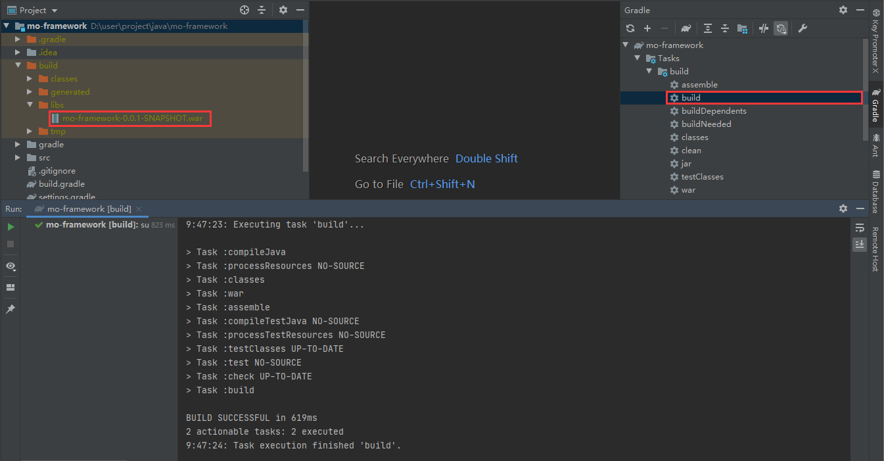

# 刀耕火种的Servlet+JSP时代

在自研框架之前，让我们先看一下，在没有spring之前，Java程序员是如何开发Web程序的？

## 开发步骤

1. 添加`Servlet`、`JSP`的依赖

   build.gradle

   ```java
   implementation 'javax.servlet:javax.servlet-api:4.0.1'
   implementation 'javax.servlet.jsp:javax.servlet.jsp-api:2.3.2-b02'
   ```

2. 编写servlet。Servlet是Java编写的服务器端程序，它可以接收和处理客户端的请求，并生成响应。

   com.moluo.framework.HelloServlet

   ```java
   @WebServlet("/hello")     // 说明：servlet4支持使用@WebServlet注解指定请求路径，用于简化繁琐的web.xml
   public class HelloServlet extends HttpServlet {
   
       @Override
       protected void doGet(HttpServletRequest req, HttpServletResponse resp) throws ServletException, IOException {
           // 设置需要传递给前端的数据
           String name = "MoFramework";
           req.setAttribute("name", name);
           
           // 重定向到前端页面
           req.getRequestDispatcher("/WEB-INF/jsp/hello.jsp").forward(req, resp);
       }
   
   }
   ```

3. 编写jsp页面。JSP（JavaServer Pages）是一种动态网页技术，它允许在HTML页面中嵌入Java代码，可以方便地生成动态内容。

   src/main/webapp/WEB-INF/jsp/hello.jsp

   ```jsp
   <%@ page pageEncoding="UTF-8" %>
   <html>
       <head>
           <title>Hello</title>
       </head>
       <body>
           <h1>Hello!</h1>
           <h2>welcome, ${name}</h2>
       </body>
   </html>
   ```

## 编译部署

1. 在`build.gradle`中添加插件`war`，用于打包war包

   ```java
   plugins {
       id 'java'
       id 'war'
   }
   ```

2. 同步gradle，点击`build`，便可在`build/libs`目录下生成项目war包

   

3. 将项目war包上传到tomcat的`webapps`目录下

   ```bash
   [webapps]# ls
   mo-framework-0.0.1-SNAPSHOT  mo-framework-0.0.1-SNAPSHOT.war
   ```

   tomcat会自动对war包进行解压并部署。

## 测试验收

在浏览器访问`http://localhost:8080/mo-framework-0.0.1-SNAPSHOT/hello`，返回如下结果，则代表成功。


> 说明：mo-framework-0.0.1-SNAPSHOT是小编的war名，观众老爷们自行测试时，请将其改为你自己的war包名

## 开发痛点

尽管原生Servlet开发是Java Web开发的基础，但在使用原生Servlet开发时，它存在一些痛点，如繁琐的代码、低效的开发速度、缺乏灵活性、缺乏标准化和难以进行单元测试等。

1. 繁琐的代码：原生Servlet开发需要手动处理HTTP请求和响应，编写大量的重复代码。例如，解析请求参数、处理请求头、生成响应等。这使得代码量增加，维护和修改变得困难。
2. 低效的开发速度：由于需要手动处理HTTP请求和响应，原生Servlet开发的速度相对较慢。开发人员需要花费更多的时间和精力来处理底层的细节，而不是专注于业务逻辑的实现。
3. 缺乏灵活性：原生Servlet开发通常需要编写大量的代码来实现一些常见的功能，如表单验证、会话管理、权限控制等。这使得开发过程变得复杂，而且很难进行重用和扩展。
4. 缺乏标准化：原生Servlet开发缺乏一套标准化的开发模式和规范，导致开发人员在项目中使用不同的实现方式和代码结构。这使得项目难以维护和理解，也增加了团队协作的难度。
5. 难以进行单元测试：由于原生Servlet开发涉及到底层的HTTP请求和响应处理，很难进行单元测试。这使得开发人员很难对代码进行有效的测试和调试，增加了开发过程中的不确定性。

因此，为了提高开发效率和代码质量，许多开发人员选择使用框架或库来简化和优化Servlet开发过程。这些框架和库提供了更高级别的抽象和功能，使开发人员可以更专注于业务逻辑的实现。

## 参考文档

[Servlet 实例 | 菜鸟教程 (runoob.com)](https://www.runoob.com/servlet/servlet-first-example.html)

