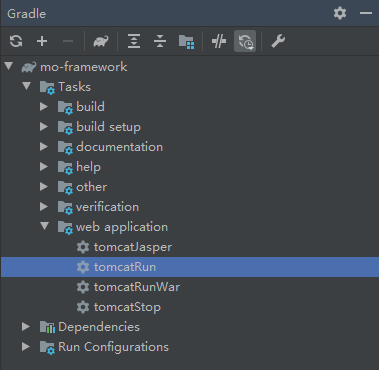

# 嵌入式tomcat

在上一小节中，我们部署项目需要手动将web项目打成war包，再手动上传到tomcat的webapp下，然后启动tomcat来部署项目。甚至有时候你还要手动指定端口，指定项目位置等

在部署阶段，这些步骤无可厚非，然而在开发阶段，这些步骤却显得十分繁琐。有没有开发阶段的一键部署方案呢？那当然是有的。那便是嵌入式tomcat

## 嵌入式tomcat定义

**嵌入式tomcat**本质上还是一个Tomcat，只不过和以前单独部署然后在指定的目录中部署war不一样的是，内嵌是可以用Jar包的形式嵌入到开发者的项目中。这也是Spring Boot web项目能够使用Tomcat的根本。内嵌式Tomcat将以前传统的Tomcat以编码的方式集成到开发者的web程序中。去除了繁琐的配置。这个也和现在Spring Boot的思想不谋而合。

## 使用方法

常见的使用方法如下：

- 通过编码

- 通过maven插件

- 通过gradle插件，如gradle-tomcat-plugin

### 通过编码

使用方法如下：

1. 在`build.gradle`添加依赖

   ```groovy
       implementation 'org.apache.tomcat.embed:tomcat-embed-core:8.5.16'
       implementation 'org.apache.tomcat.embed:tomcat-embed-logging-juli:8.5.2'
       implementation 'org.apache.tomcat.embed:tomcat-embed-jasper:8.5.16'
   ```

2. 在`main()`函数中添加以下逻辑

   ```java
       public static void main(String[] args) throws ServletException, LifecycleException {
           //第一部分
           Tomcat tomcat = new Tomcat();
           tomcat.setPort(8080);
           tomcat.getConnector();
   
           //第二部分
           Context ctx = tomcat.addWebapp("", new File("src/main/webapp").getAbsolutePath());
           WebResourceRoot resources = new StandardRoot(ctx);
           resources.addPreResources(new DirResourceSet(resources, "/WEB-INF/classes", new File("build/classes").getAbsolutePath(), "/"));
           ctx.setResources(resources);
   
           //第三部分
           tomcat.start();
           tomcat.getServer().await();
       }
   ```

3. 运行main()函数即可启动tomcat

   ```bash
   10:19:57: Executing task 'MoFrameworkApplication.main()'...
   
   > Task :compileJava
   > Task :processResources NO-SOURCE
   > Task :classes
   
   > Task :MoFrameworkApplication.main()
   ���� 22, 2023 10:19:59 ���� org.apache.coyote.AbstractProtocol init
   ��Ϣ: Initializing ProtocolHandler ["http-nio-8080"]
   ���� 22, 2023 10:19:59 ���� org.apache.tomcat.util.net.NioSelectorPool getSharedSelector
   ��Ϣ: Using a shared selector for servlet write/read
   ���� 22, 2023 10:19:59 ���� org.apache.catalina.core.StandardService startInternal
   ��Ϣ: Starting service [Tomcat]
   ���� 22, 2023 10:19:59 ���� org.apache.catalina.core.StandardEngine startInternal
   ��Ϣ: Starting Servlet Engine: Apache Tomcat/8.5.16
   ���� 22, 2023 10:20:00 ���� org.apache.catalina.startup.ContextConfig getDefaultWebXmlFragment
   ��Ϣ: No global web.xml found
   ���� 22, 2023 10:20:00 ���� org.apache.jasper.servlet.TldScanner scanJars
   ��Ϣ: At least one JAR was scanned for TLDs yet contained no TLDs. Enable debug logging for this logger for a complete list of JARs that were scanned but no TLDs were found in them. Skipping unneeded JARs during scanning can improve startup time and JSP compilation time.
   ���� 22, 2023 10:20:00 ���� org.apache.coyote.AbstractProtocol start
   ��Ϣ: Starting ProtocolHandler ["http-nio-8080"]
   ```

   

### 通过maven插件

详见：[使用内嵌tomcat的maven插件 - CSDN博客](https://blog.csdn.net/zcl111/article/details/83311424)

### 通过gradle插件：gradle-tomcat-plugin

[gradle-tomcat-plugin插件](https://github.com/bmuschko/gradle-tomcat-plugin)提供将 Web 应用程序部署到任何给定 Gradle 构建中的嵌入式 Tomcat Web 容器的功能。它扩展了 War 插件。目前支持 Tomcat 版本 6.0.x、7.0.x、8.0.x、8.5.x 和 9.0.x。

支持开发期间的部署。由于容器的快速启动时间，该插件允许快速 Web 应用程序开发。 Gradle 在同一个 JVM 中启动嵌入式容器。

使用方法如下：

1. 在`settings.gradle`添加如下buildscript

   ```groovy
   ...
   buildscript {
       repositories {
           gradlePluginPortal()
       }
   
       dependencies {
           classpath 'com.bmuschko:gradle-tomcat-plugin:2.7.0'
       }
   }
   ```

2. 在`build.gradle`引入插件

   ```groovy
   plugins {
   	id 'com.bmuschko.tomcat'
   }
   ```

3. 在`build.gradle`添加依赖

   ```groovy
   dependencies {
       def tomcatVersion = '8.5.16'
       tomcat "org.apache.tomcat.embed:tomcat-embed-core:${tomcatVersion}",
                       "org.apache.tomcat.embed:tomcat-embed-logging-juli:8.5.2",
                       "org.apache.tomcat.embed:tomcat-embed-jasper:${tomcatVersion}"
   }
   ```
   
4. 在`build.gradle`添加tomcat配置

   ```groovy
   tomcat {
   	httpProtocol = 'org.apache.coyote.http11.Http11Nio2Protocol'
   	ajpProtocol  = 'org.apache.coyote.ajp.AjpNio2Protocol'
   }
   ```

   完整的build.gradle如下：

   ```groovy
   plugins {
       id 'java'
       id 'war'
       id 'com.bmuschko.tomcat'
   }
   
   group 'com.moluo'
   version '0.0.1-SNAPSHOT'
   
   repositories {
       mavenCentral()
   }
   
   dependencies {
       implementation 'javax.servlet:javax.servlet-api:4.0.1'
       implementation 'javax.servlet.jsp:javax.servlet.jsp-api:2.3.2-b02'
   
       def tomcatVersion = '8.5.16'
       tomcat "org.apache.tomcat.embed:tomcat-embed-core:${tomcatVersion}",
               "org.apache.tomcat.embed:tomcat-embed-logging-juli:8.5.2",
               "org.apache.tomcat.embed:tomcat-embed-jasper:${tomcatVersion}"
   
       testImplementation 'junit:junit:4.13.2'
   }
   
   tomcat {
       httpProtocol = 'org.apache.coyote.http11.Http11Nio2Protocol'
       ajpProtocol  = 'org.apache.coyote.ajp.AjpNio2Protocol'
   }
   ```
   
5. 刷新Gradle，执行`Tasks → web application → tomcatRun`即可运行：

   

## 参考文档

[内嵌式Tomcat - 掘金 (juejin.cn)](https://juejin.cn/post/7068302141659545613)

[以Gradle插件的方式为Java web项目启动Tomcat](https://juejin.cn/post/7234057845620080695)

[GitHub - bmuschko/gradle-tomcat-plugin](https://github.com/bmuschko/gradle-tomcat-plugin)