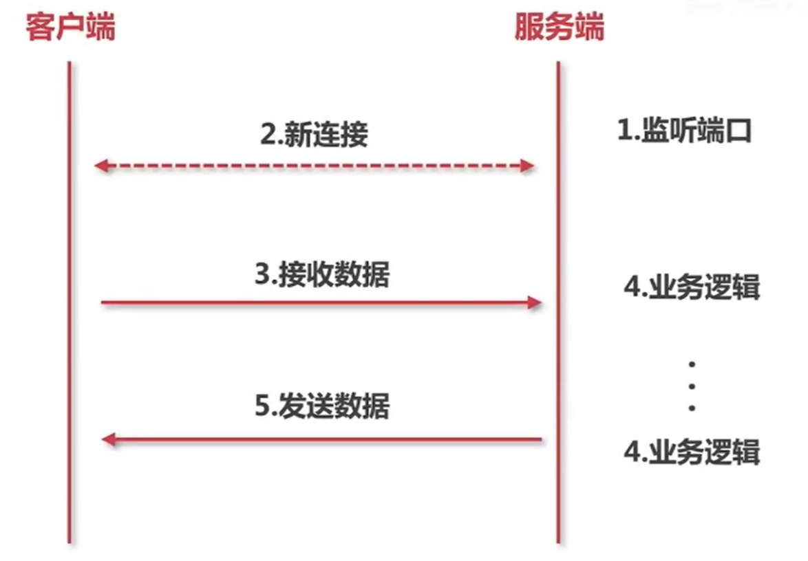
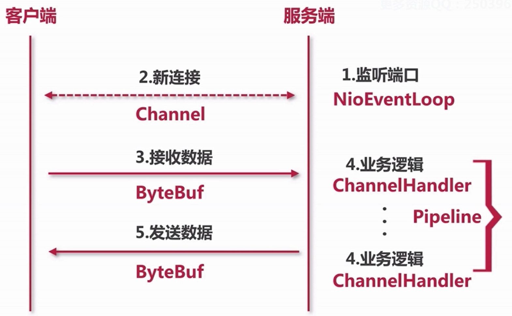

# 一个简单的socket例子

## 代码

### ServerBoot.java

```java
package com.moluo.demo.netty;

public class ServerBoot {
    private static final int PORT = 8000;

    public static void main(String[] args) {
        Server server = new Server(PORT);
        server.start();
    }
}
```

### Server.java

```java
package com.moluo.demo.netty;

import java.io.IOException;
import java.net.ServerSocket;
import java.net.Socket;

public class Server {
    private ServerSocket serverSocket;

    public Server(int port) {
        try {
            this.serverSocket = new ServerSocket(port);
            System.out.println("服务端启动成功,端口:" + port);
        } catch (IOException exception) {
            System.out.println("服务端启动失败");
        }
    }

    public void start() {
        new Thread(new Runnable() {
            public void run() {
                doStart();
            }
        }).start();
    }

    private void doStart() {
        while (true) {
            try {
                Socket client = serverSocket.accept();
                new ClientHandler(client).start();
            } catch (IOException e) {
                System.out.println("服务端异常");
            }
        }
    }
}
```

### ClientHandler.java

```java
package com.moluo.demo.netty;

import java.io.IOException;
import java.io.InputStream;
import java.net.Socket;

public class ClientHandler {

    public static final int MAX_DATA_LEN = 1024;
    private final Socket socket;

    public ClientHandler(Socket socket) {
        this.socket = socket;
    }

    public void start() {
        System.out.println("新客户端接入");
        new Thread(new Runnable() {
            public void run() {
                doStart();
            }
        }).start();
    }

    private void doStart() {
        InputStream inputStream = null;
        try {
            inputStream = socket.getInputStream();
            while (true) {
                byte[] data = new byte[MAX_DATA_LEN];
                int len;
                while ((len = inputStream.read(data)) != -1) {
                    String message = new String(data, 0, len);
                    System.out.println("客户端传来消息:" + message);
                    socket.getOutputStream().write(data);
                }
            }
        } catch (IOException e) {
            e.printStackTrace();
        }
    }
}
```

### Client.java

```java
package com.moluo.demo.netty;

import java.io.IOException;
import java.net.Socket;

public class Client {

    private static final String HOST = "127.0.0.1";
    private static final int PORT = 8000;
    private static final int SLEEP_TIME = 5000;

    public static void main(String[] args) throws IOException {
        final Socket socket = new Socket(HOST, PORT);
        new Thread(new Runnable() {
            public void run() {
                System.out.println("客户端启动成功!");
                while (true) {
                    try {
                        String message = "hello world";
                        System.out.println("客户端发送数据:" + message);
                        socket.getOutputStream().write(message.getBytes());
                    } catch (Exception e) {
                        System.out.println("写数据出错!");
                    }
                    sleep();
                }
            }
        }).start();
    }

    private static void sleep() {
        try {
            Thread.sleep(SLEEP_TIME);
        } catch (InterruptedException e) {
            e.printStackTrace();
        }
    }

}
```

## 图解





**2-2 Netty对于socket的抽象**


