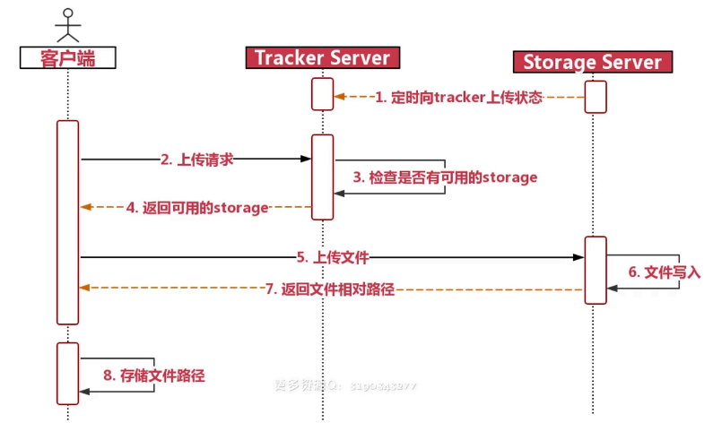

FastDFS

FastDFS是用c语言编写的一款开源的分布式文件系统。

FastDFS为互联网量身定制，充分考虑了冗余备份、负载均衡、线性扩容等机制，并注重高可用、高性能等指标，

使用FastDFS很容易搭建一套高性能的文件服务器集群提供文件上传、下载等服务


文件上传路径




## 安装手册

### 使用linux安装

请参考[fastdfs wiki](https://github.com/happyfish100/fastdfs/wiki)

其中，wiki中的启动命令有问题，请使用如下命令代替

```bash
/usr/bin/fdfs_trackerd /etc/fdfs/tracker.conf  start
/usr/bin/fdfs_storaged /etc/fdfs/storage.conf  start
```

### 使用docker安装

请参考[使用docker安装fastdfs](https://www.jianshu.com/p/e13c269def61)

