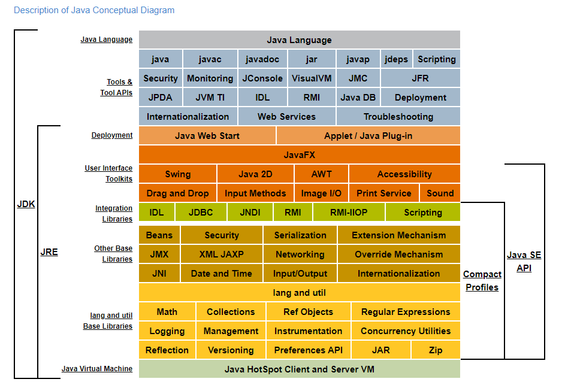
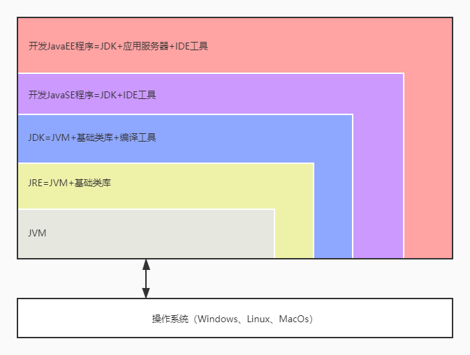

## 什么是JVM？

定义：**Java virtual Mechine**（Java 虚拟机）-java程序的运行环境（更准确的说是java二进制字节码的运行环境）

## 如果没有JVM会怎样？

- 若没有JVM，在windows写的java代码只能在Windows运行，在linux中写的java代码只能在linux中运行，java代码**不具备平台兼容性**。
- 若没有JVM，java程序员写代码时，需要同c、c++程序员一样**需自行进行内存管理，垃圾回收**
- 若没有JVM，数组下标越界后，可能覆盖其他数据区数据，而不是抛出数组越界异常
- 若没有JVM，就没有多态，就没有面向对象，java程序将极难维护，扩展
- 若没有JVM，你的java代码可能运行效率极低。

## 有JVM的好处

- java代码一次编写，到处运行，跨平台
- 自动内存管理，自动垃圾回收，解放java程序员的双手
- 数组下标越界检查
- 多态
- 对java程序员编写代码进行一定优化，提高执行效率

## 面试高频题-Java中常见概念比较

JVM、JRE、JDK的概念比较见下图

Java 概念详图（图片摘自 https://docs.oracle.com/javase/8/docs/ ）

Java 概念简图

