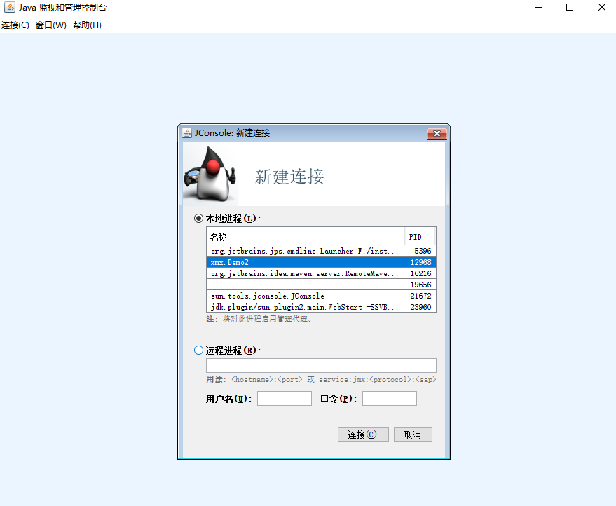
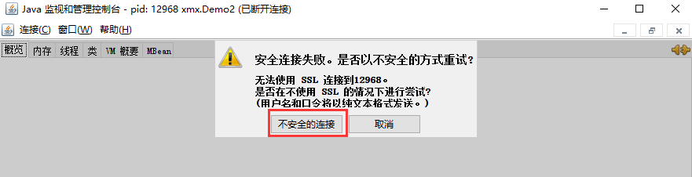
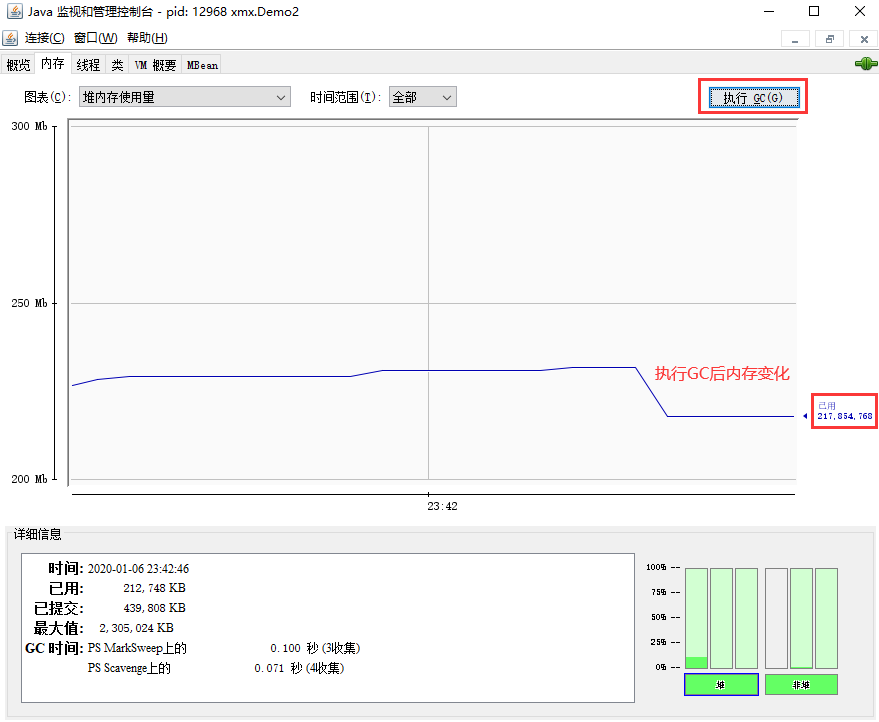
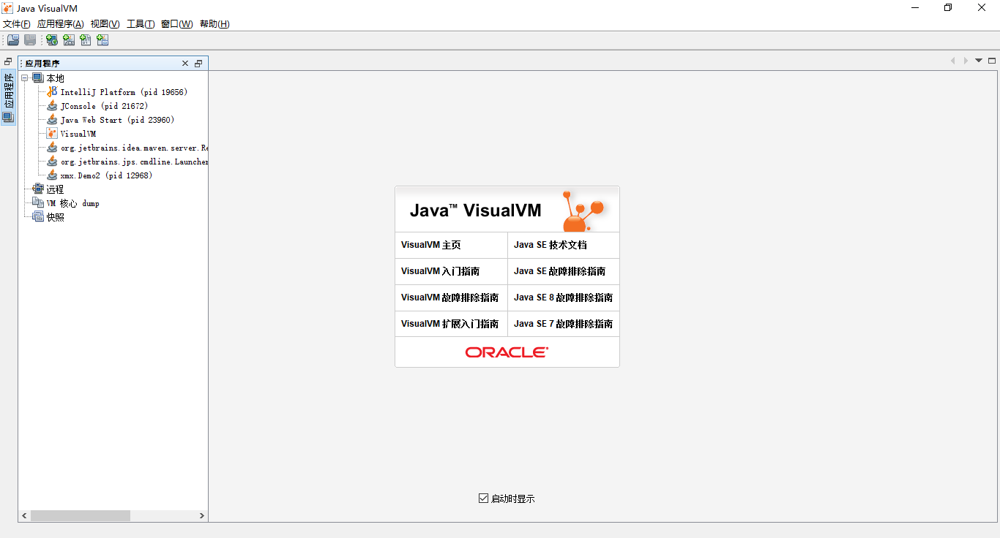
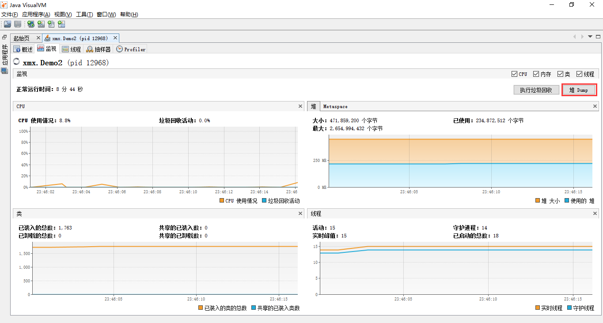
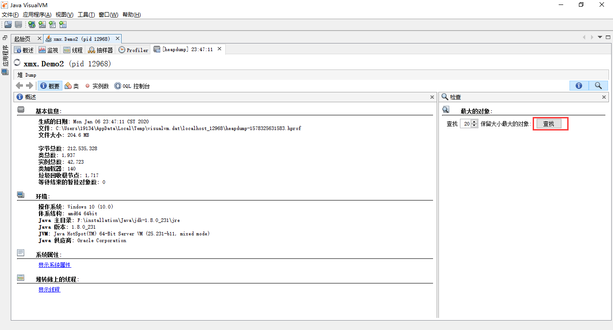
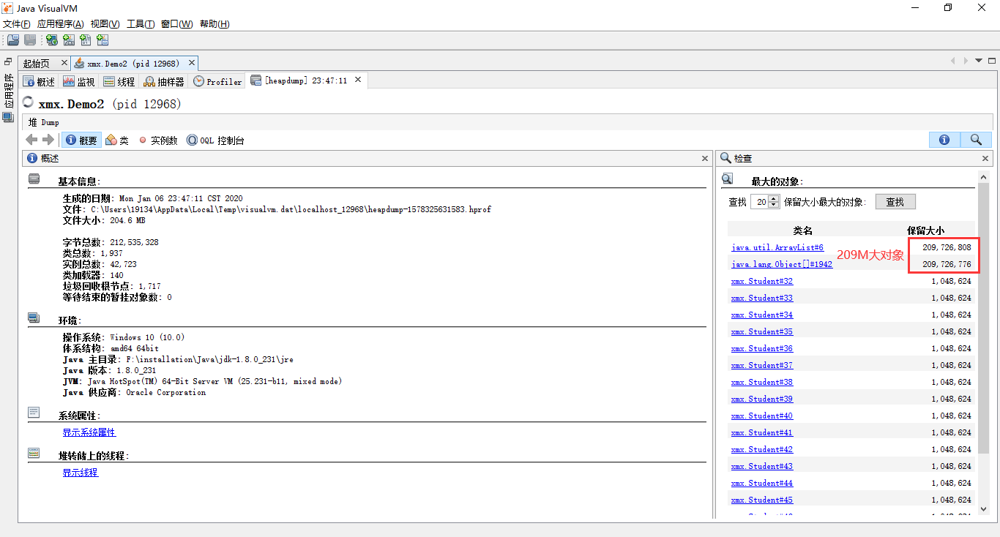
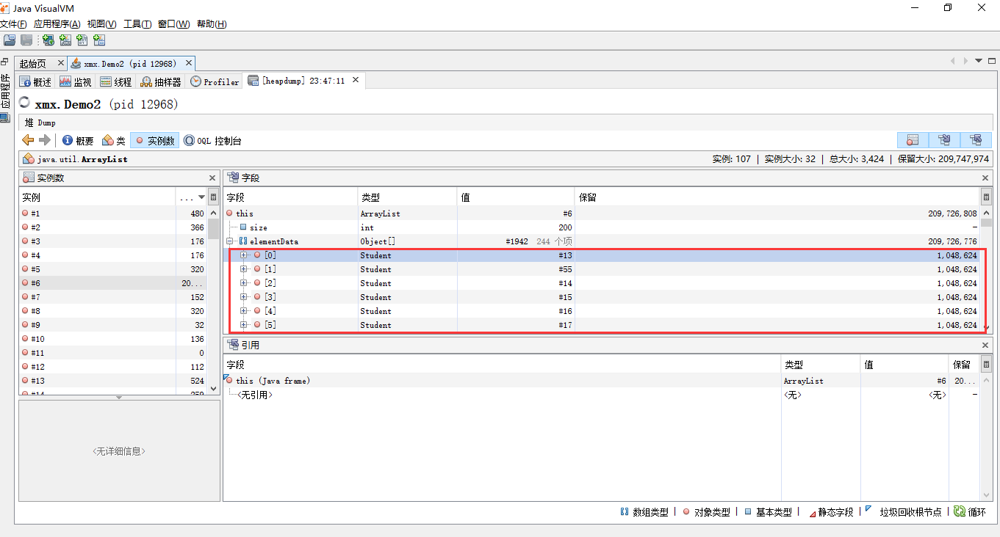

在这一节中，我们将介绍实际开发中，内存问题的排查步骤，我们将从真实的案例下手，案例如下；

**案例：垃圾回收后，内存占用仍然很高**


## 步骤

这里，我们暂时先不看案例代码（案例代码位于文章底部），先尝试通过工具进行内存分析

案例代码Demo2已经运行，接下去我们通过如下步骤排查问题

1.使用`jps`查看进程id

2.使用`jmap -heap {进程id}`查看内存使用情况

3.使用jconsole动态查看内存使用情况

4.使用jvisualvm动态查看内存使用情况


## 演示

1.使用`jps`查看到Demo2的进程id为12968

```bash
$ jps
5396 Launcher
12968 Demo2
16216 RemoteMavenServer
23960 sun.plugin2.main.WebStart
```

2.使用`jmap -heap 12968 `查看堆内存使用情况。发现伊甸园占用48.5M，老年代占用202M

```bash
D:\Test\TestForJava\Learn>jmap -heap 12968
Attaching to process ID 12968, please wait...
Debugger attached successfully.
Server compiler detected.
JVM version is 25.231-b11

using thread-local object allocation.
Parallel GC with 4 thread(s)

Heap Configuration:
   MinHeapFreeRatio         = 0
   MaxHeapFreeRatio         = 100
   MaxHeapSize              = 2654994432 (2532.0MB)
   NewSize                  = 55574528 (53.0MB)
   MaxNewSize               = 884998144 (844.0MB)
   OldSize                  = 112197632 (107.0MB)
   NewRatio                 = 2
   SurvivorRatio            = 8
   MetaspaceSize            = 21807104 (20.796875MB)
   CompressedClassSpaceSize = 1073741824 (1024.0MB)
   MaxMetaspaceSize         = 17592186044415 MB
   G1HeapRegionSize         = 0 (0.0MB)

Heap Usage:
PS Young Generation
Eden Space:
   capacity = 83886080 (80.0MB)
   used     = 50896952 (48.53911590576172MB) # 伊甸园占用48.5M
   free     = 32989128 (31.46088409423828MB)
   60.67389488220215% used
From Space:
   capacity = 6815744 (6.5MB)
   used     = 0 (0.0MB)
   free     = 6815744 (6.5MB)
   0.0% used
To Space:
   capacity = 6815744 (6.5MB)
   used     = 0 (0.0MB)
   free     = 6815744 (6.5MB)
   0.0% used
PS Old Generation
   capacity = 373817344 (356.5MB)
   used     = 212131032 (202.30391693115234MB) # 老年代占用202M
   free     = 161686312 (154.19608306884766MB)
   56.74724177591931% used


1743 interned Strings occupying 156600 bytes.
```
3.使用`jconsole`命令打开jconsole

```bash
$ jconsole
```
选择Demo2连接



连接过程中可能出现如下警告，无需关注，使用 不安全的连接 即可



观察内存占用约为230M，之后我们点击了执行GC后，内存占用下降，但仍占用约217M，这是什么原因造成的呢？


通过jmap命令再次查看内存占用信息，发现垃圾回收后，老年代仍占用202M
```bash
$ jmap -heap 12968
Attaching to process ID 12968, please wait...
Debugger attached successfully.
Server compiler detected.
JVM version is 25.231-b11

using thread-local object allocation.
Parallel GC with 4 thread(s)

Heap Configuration:
   MinHeapFreeRatio         = 0
   MaxHeapFreeRatio         = 100
   MaxHeapSize              = 2654994432 (2532.0MB)
   NewSize                  = 55574528 (53.0MB)
   MaxNewSize               = 884998144 (844.0MB)
   OldSize                  = 112197632 (107.0MB)
   NewRatio                 = 2
   SurvivorRatio            = 8
   MetaspaceSize            = 21807104 (20.796875MB)
   CompressedClassSpaceSize = 1073741824 (1024.0MB)
   MaxMetaspaceSize         = 17592186044415 MB
   G1HeapRegionSize         = 0 (0.0MB)

Heap Usage:
PS Young Generation
Eden Space:
   capacity = 138412032 (132.0MB)
   used     = 10863328 (10.360076904296875MB) # 伊甸园占用10.3M
   free     = 127548704 (121.63992309570312MB)
   7.8485431093158144% used
From Space:
   capacity = 6815744 (6.5MB)
   used     = 0 (0.0MB)
   free     = 6815744 (6.5MB)
   0.0% used
To Space:
   capacity = 6815744 (6.5MB)
   used     = 0 (0.0MB)
   free     = 6815744 (6.5MB)
   0.0% used
PS Old Generation
   capacity = 305135616 (291.0MB)
   used     = 212029760 (202.20733642578125MB) # 老年代占用202M
   free     = 93105856 (88.79266357421875MB)
   69.48705719099011% used

5618 interned Strings occupying 467736 bytes.
```
究竟是何种原因造成老年代内存占用居高不下呢。我们可以使用`jvisualvm`进一步分析

打开jvisualvm

```bash
$ jvisualvm
The launcher has determined that the parent process has a console and will reuse it for its own console output.
Closing the console will result in termination of the running program.
Use '--console suppress' to suppress console output.
Use '--console new' to create a separate console window.
```
选择Demo2连接

使用`堆Jump`抓取快照


查找占用了大量内存的对象



发现一个ArrayList对象占用了近209M的内存，看来这就是我们的罪魁祸首了



查看ArrayList的冤死发现ArrayList中存储着200内大小为1M左右的Student对象（图中仅展示了前6个）



分析到此结束，而事实其实也是如此。

代码如下：

```java
public class Demo2 {
    public static void main(String[] args) throws InterruptedException {
        List<Student> students = new ArrayList<>();
        for (int i = 0; i < 200; i++) {
            students.add(new Student());
        }
        Thread.sleep(10000000L);
    }
}

class Student {
    private byte[] big = new byte[1024 * 1024];
}
```

最后希望，大家都能够熟练掌握排查内存占用问题的方法，谢谢大家。