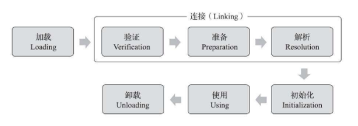

## 定义

Java虚拟机把描述类的数据从Class文件加载到内存，并对数据进行校验、转换解析和初始化，最终形成可以被虚拟机直接使用的Java类型，这个过程被称作虚拟机的类加载机制

> 与那些在编译时需要进行连接的语言不同，在Java语言里面，类型的加载、连接和初始化过程都是在程序**运行期**间完成的


## 类的生命周期



图7-1 类的生命周期

## 何时会进行初始化

有且只有对一个类型进行**主动引用**时必须立即对类进行“初始化”，**被动引用**不会触发初始化。

### 主动引用有且只有六种情况

1. 遇到new、getstatic、putstatic或invokestatic这四条字节码指令。生成这四条指令的典型Java代码场景有：
   - 使用new关键字实例化对象的时候。
   - 读取或设置一个类型的静态字段（被final修饰、已在编译期把结果放入常量池的静态字段除外）的时候
   - 调用一个类型的静态方法的时候。
2. 反射调用的时候。
3. 子类初始化时，需要先触发其父类的初始化
4. 主类，即包含main()方法的那个类
5. 当使用JDK 7新加入的动态语言支持时，如果一个java.lang.invoke.MethodHandle实例最后的解析结果为REF_getStatic、REF_putStatic、REF_invokeStatic、REF_newInvokeSpecial四种类型的方法句柄，并且这个方法句柄对应的类没有进行过初始化，则需要先触发其初始化。
6. 当一个**接口**中定义了JDK 8新加入的**默认方法**（被default关键字修饰的接口方法）时，如果有这个接口的实现类发生了初始化，那该接口要在其之前被初始化。

## 被动引用

下面举三个例子来说明何为被动引用

1. 通过子类引用父类的静态字段，不会导致子类初始化

   通过其子类来引用父类中定义的静态字段，只会触发**父类的初始化**而不会触发子类的初始化

   ```java
   /**
    * 被动使用类字段演示一:
    * 通过子类引用父类的静态字段，不会导致子类初始化
    **/
   public class SuperClass {
       static {
           System.out.println("SuperClass init!");
       }
   
       public static int value = 123;
   }
   
   public class SubClass extends SuperClass {
       static {
           System.out.println("SubClass init!");
       }
   }
   
   /**
    * 非主动使用类字段演示
    **/
   public class NotInitialization {
       public static void main(String[] args) {
           System.out.println(SubClass.value);
       }
   }
   ```

2. 通过数组定义来引用类，不会触发此类的初始化。

   当虚拟机收到newarray字节码指令时，虚拟机自动生成一个直接继承于java.lang.Object的子类，此时触发初始化的是该类

   ```java
   /**
    * 被动使用类字段演示二:
    * 通过数组定义来引用类，不会触发此类的初始化
    **/
   public class SuperClass {
       static {
           System.out.println("SuperClass init!");
       }
   
       public static int value = 123;
   }
   
   public class NotInitialization {
       public static void main(String[] args) {
           SuperClass[] sca = new SuperClass[10];
       }
   }
   ```

3. 引用类的常量时，不会触发此类的初始化

   常量在编译阶段会存入调用类的常量池中，本质上没有直接引用到定义常量的类，因此不会触发定义常量的类的初始化

   ```java
   /**
    * 被动使用类字段演示三:
    * 常量在编译阶段会存入调用类的常量池中，本质上没有直接引用到定义常量的类，因此不会触发定义常量的类的初始化
    **/
   public class ConstClass {
       static {
           System.out.println("ConstClass init!");
       }
   
       public static final String HELLOWORLD = "hello world";
   }
   
   /**
    * 非主动使用类字段演示
    */
   public class NotInitialization {
       public static void main(String[] args) {
           System.out.println(ConstClass.HELLOWORLD);
       }
   }
   ```

   ## 如何判断一个类是否初始化

   在类中定义一个**静态语句块“static{}”**，静态语句块执行则说明类发生了初始化。