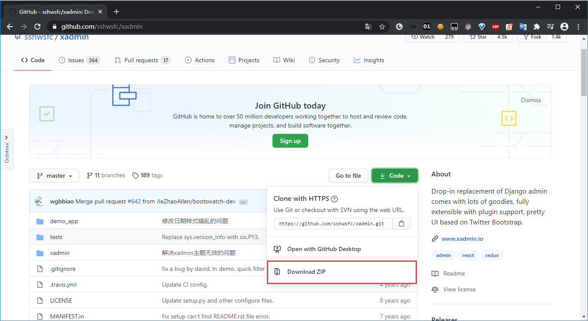
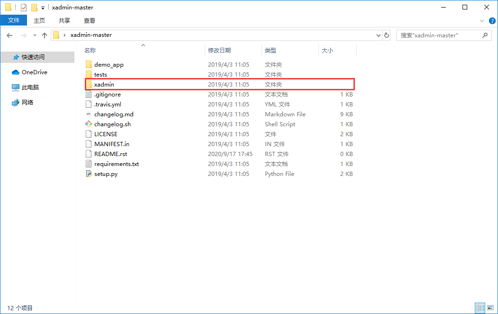

# 使用方式一

## xadmin安装

```bash
$ pip install xadmin
```


## 注册xadmin

hello_django/settings.py

```python

INSTALLED_APPS = [
    ...
    'xadmin',
    'crispy_forms',
]
```


## 配置url

hello_django/urls.py

```python
...
import xadmin

urlpatterns = [
    ...
    path('xadmin/', xadmin.site.urls),
]
```


## 生成数据表

```bash
$ python manage.py makemigrations
$ python manage.py migrate
```


# 使用方式二

## 源码包安装

1. 前往https://github.com/sshwsfc/xadmin下载xadmin的源码zip包

   

2. 解压zip包，在解压包下可以看到一个xadmin的目录

   

3. 在django项目中新建extra_apps包，并将步骤2中的xadmin拷贝到extra_apps下

4. 标记extra_apps为源码目录


配置settings

hello_django/settings.py

```python
...
# Build paths inside the project like this: BASE_DIR / 'subdir'.
BASE_DIR = Path(__file__).resolve().parent.parent
sys.path.insert(0, os.path.join(BASE_DIR, 'extra_apps'))

...

INSTALLED_APPS = [
    ...
    'xadmin',
    'crispy_forms',
]
...
```


## 配置url

hello_django/urls.py

```python
...
import xadmin

urlpatterns = [
    ...
    path('xadmin/', xadmin.site.urls),
]
```


## 生成数据表

```bash
$ python manage.py makemigrations
$ python manage.py migrate
```


## 常见问题

[django3整合xadmin趟坑](https://www.jianshu.com/p/3a3afda82f72)


python3安装xadmin出现 UnicodeDecodeError: 'gbk' codec can't decode byte 0xa4 in position 3444

解决方法请见：https://blog.csdn.net/qingche456/article/details/58279692