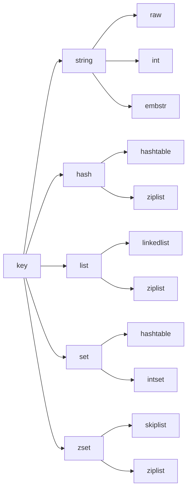

## 数据结构和内部编码

```mermaid
graph LR
A[key] --> B[string]
B[string] --> b1[raw]
B[string] --> b2[int]
B[string] --> b3[embstr]

A[key] --> C[hash]
C[hash] --> c1[hashtable]
C[hash] --> c2[ziplist]

A[key] --> D[list]
D[list] --> d1[linkedlist]
D[list] --> d2[ziplist]

A[key] --> E[set]
E[set] --> e1[hashtable]
E[set] --> e2[intset]

A[key] --> F[zset]
F[zset] --> f1[skiplist]
F[zset] --> f2[ziplist]

```

redis的对象头结构——RedisObject

结构包含以下部分

- type：数据类型，可选值（string、hash、list、set、zset）
- encoding：编码方式，可选值（raw、int、ziplist、linkedlist、hashmap、intset）
- ptr：数据指针
- vm：虚拟内存
- 其他信息

