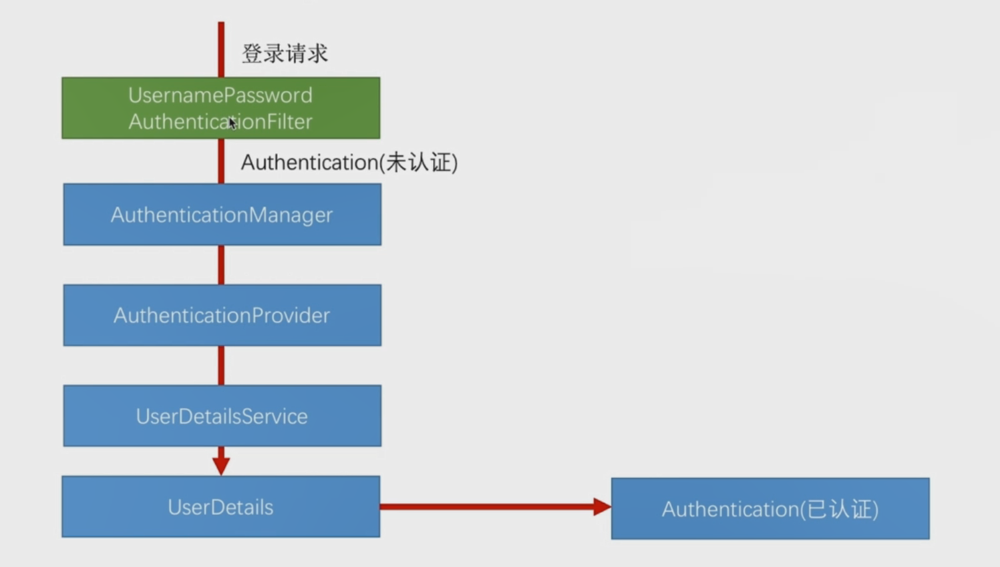
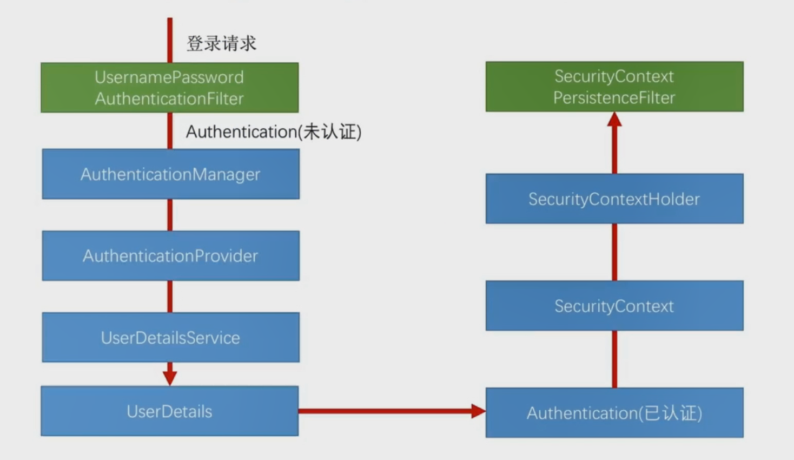
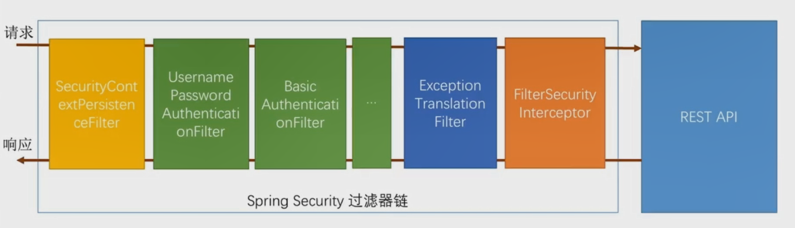

## 	认证处理流程说明




登录请求
SecurityCountexPersistenceFilter类
UsernamePasswordAuthenticationFilter
Authentication（未认证）
AuthenticationManager
AuthenticationProvider
UserDetailsService
UserDetails
Authentication（已认证）
SecurityContext
SecuContextHolder
SecuContextPersistenceFilter

## 认证结果如何在多个请求中共享

于认证结构共享相关的类主要有：

- SecurityCountexPersistenceFilter

- SecurityContextHolder

- SecurityContext



其中最关键的类为`SecurityCountexPersistenceFilter`类，`SecurityCountexPersistenceFilter`类在过滤器中所处的位置如下：



其主要作用为：
请求时检测session，若session中携带SecurityContext，将SecurityContext放到线程里；
响应时检查线程，若线程中有SecurityContext，则拿出来放到响应session中；
用户认证成功后，认证信息会放到程序的线程中，。
通过SecurityContextHolder.getContext().getAuthentication()可以在程序的任意位置获取到当前用户的认证信息。

## 获取认证用户信息
方法一：SecurityContextHolder.getContext().getAuthentication();
```java
    @GetMapping("/me")
    public Object getCurrentUser() {
        return SecurityContextHolder.getContext().getAuthentication();
    }
```

方法二：通过Authentication authentication

省略`SecurityContextHolder.getContext().getAuthentication()`，spring自动将认证信息解析到authentication中

```java
    @GetMapping("/me")
    public Object getCurrentUser(Authentication authentication) {
        return authentication;
    }
```

方法三：通过@AuthenticationPrincipal UserDetails user。这获取以上两种方法返回结果中的principal

仅获取userDitails信息，而不获取完整的authentication

```java
    @GetMapping("/me")
    public Object getCurrentUser(@AuthenticationPrincipal UserDetails user) {
        return user;
    }
```

