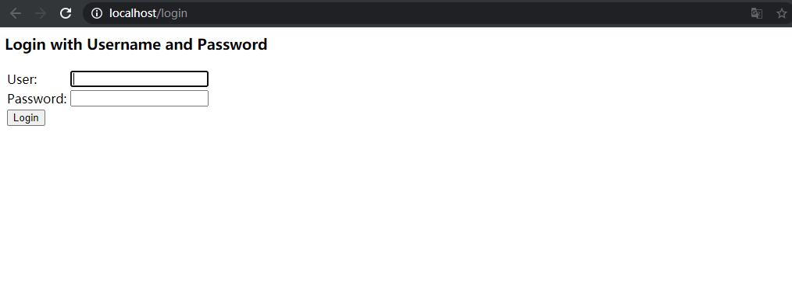
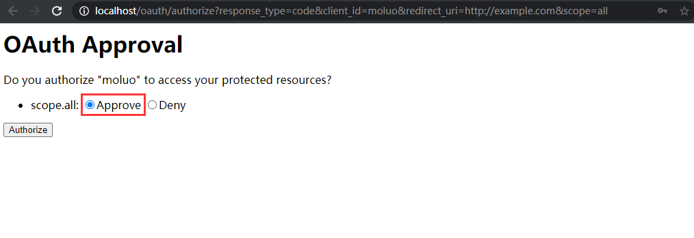
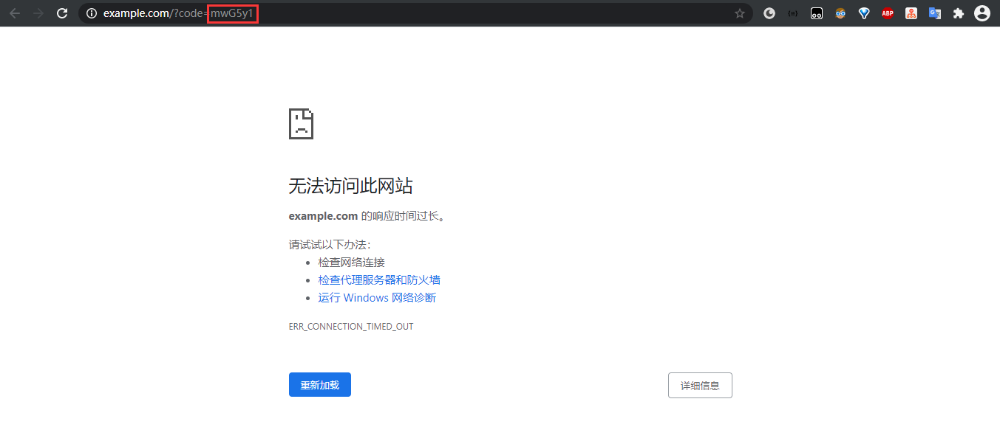
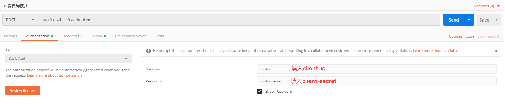
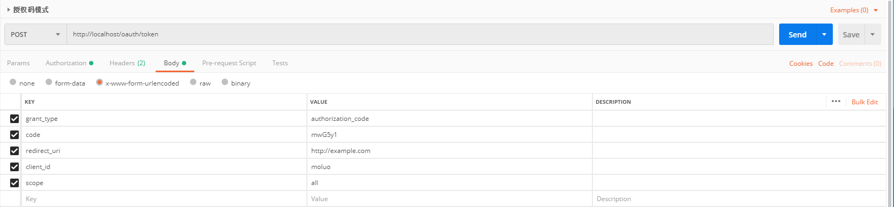
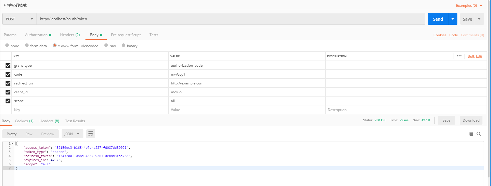
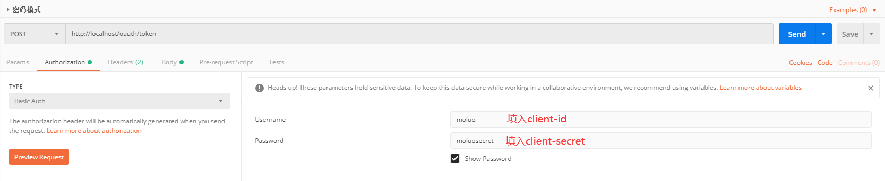
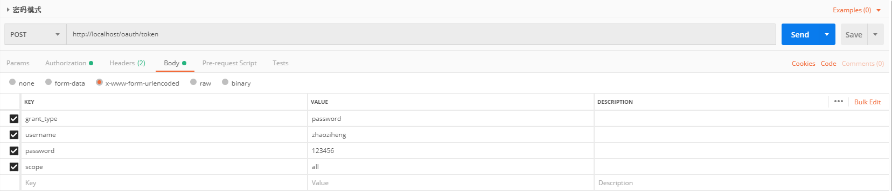
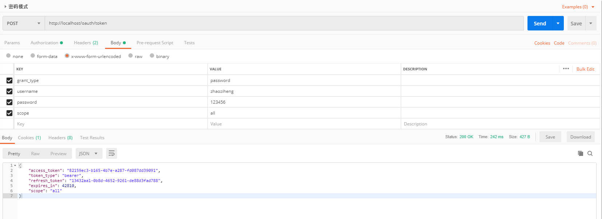

# 实现标准的OAuth服务提供商

OAuth2文档请见https://tools.ietf.org/html/rfc6749#section-4.1


## spring security oauth实现认证服务器

对于服务提供商，需要知道：

- 哪个应用在请求授权？通过client_id分辨哪个应用在请求授权，没个应用都有自己的clientId。

- 请求哪个用户的授权？用户登录

- 给你什么授权？scope

### 实现步骤

1.新建AppSecurityConfig类，继承AbstractChannelSecurityConfig

com.moluo.security.app.AppSecurityConfig

```java
package com.moluo.security.app;

import com.moluo.security.core.authentication.AbstractChannelSecurityConfig;
import org.springframework.context.annotation.Configuration;

@Configuration
public class AppSecurityConfig extends AbstractChannelSecurityConfig {


}
```

2.新建MoluoAuthorizationServerConfig类，使用@EnableAuthorizationServer注解装饰

com.moluo.security.app.MoluoAuthorizationServerConfig

```java
package com.moluo.security.app;

import org.springframework.context.annotation.Configuration;
import org.springframework.security.oauth2.config.annotation.web.configuration.EnableAuthorizationServer;

@Configuration
@EnableAuthorizationServer
public class MoluoAuthorizationServerConfig {

}
```

3.在配置文件中注册需要重定向的url

application.properties

```properties
# 以下两个参数可义不配置，若不配置，系统将自动生成，并将结果打印在控制台
security.oauth2.client.client-id = moluo
security.oauth2.client.client-secret = moluosecret 

#不加这个你页面死也不给你跳转,可能是新版本的原因吧，我也不知道
security.oauth2.client.registered-redirect-uri=http://example.com
```

到此，我们已实现了一个认证服务器

### 功能验证

#### 授权码模式

1.通过浏览器访问http://localhost/oauth/authorize?response_type=code&client_id=moluo&redirect_uri=http://example.com&scope=all获取授权码，网页将返回如下。







2.使用postman访问POST http://localhost/oauth/token换取token，请求头和请求体如下图，请求体中携带步骤一中返回的code





3.返回结果如下



#### 密码模式验证

使用postman访问POST http://localhost/oauth/token换取token，请求头和请求体如下图，请求体中携带用户名和密码





返回结果如下：



## spring security oauth实现资源服务器

### 实现步骤

新建MoluoResourceServerConfig类，使用@EnableResourceServer装饰

```java
package com.moluo.security.app;

import org.springframework.context.annotation.Configuration;
import org.springframework.security.oauth2.config.annotation.web.configuration.EnableResourceServer;

@Configuration
@EnableResourceServer
public class MoluoResourceServerConfig {

}
```
