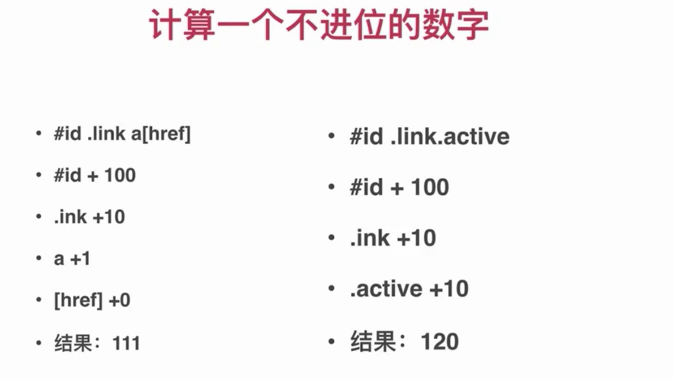

# 选择器

## 基本规则

```json
选择器 {
  属性:值;
  属性:值
}
```

> 建议最后一行也加上" ; "号

## 选择器的作用

- 用于匹配HTML元素。
- 有不同的匹配规则
- 多个选择器可叠加

## 选择器分类

- 元素选择器 a{}
- 伪元素选择器 ::before{}
- 类选择器 .link{}
- 属性选择器 [type=radio]{}
- 伪类选择器 :hover{}
- ID选择器 #id{}
- 组合选择器 [type=checkbox]+ label{}
- ·否定选择器 :not(.link){}
- 通用选择器 *{}

## 选择器权重

- ID选择器 #id{}  +100
- 类 属性 伪类      +10
- 元素 伪元素       +1
- 其它选择器        +0



- !important 优先级最高
- 元素属性 优先级高
- 相同权重，后写的生效

## 解析方式和性能

反向解析


·值得关注的选择器