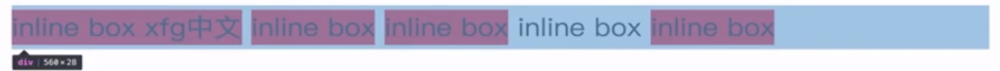
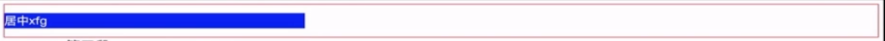
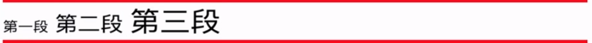
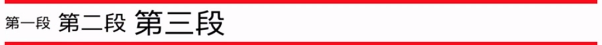
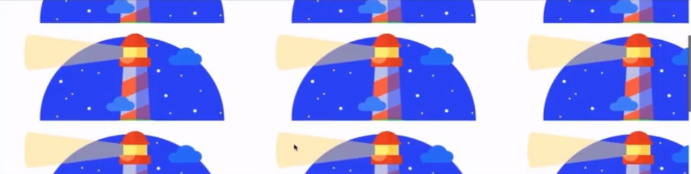
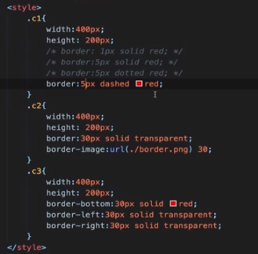
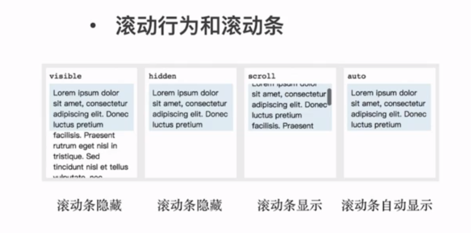

# 非布局样式

- 字体、字重、颜色、大小、行高
- 背景、边框
- 滚动、换行
- 粗体、斜体、下划线
- 其它


## 字体

字体族：serif、sans-serif、monospace、cursive、fantasy

多字体 fallback

网络字体、自定义字体

iconfont


##　行高

- 行高的构成

- 行高相关的现象和方案
- 行高的调整


顶线、基线、底线

文本是按照基线baseline对齐的

行高会撑起inline box的高度，但并不会影响本身布局的高度



line-height

当line-height大于内部元素的height时，多余的高度将平均分到内部元素的上小两侧，居于该特性可以实现垂直居中




文本默认是按照基线baseline对齐的。可通过vertical-align设置对齐方式，vertical的可选值有：top middle bottom 5px



例如当vertical-align:middle时



图片3px空隙问题

原因：inline元素默认是按照基线对齐，而基线和底线之间存在空隙

解决方式一：设置底线对齐vertical-align:bottom

解决方式二：将图片设置为block元素


##　背景

- 背景颜色
- 渐变色背景
- 多背景叠加
- 背景图片和属性（雪碧图)
- base64和性能优化
- 多分辨率适配

### 背景格式

```css
.c1{
    background: write;
    background: #FF0000;
    background: hsl(0, 100%, 50%);
    background: hsla(0, 100%, 50%, .3);
    background: rgb(255,0,0);
    background: rgba(255,0,0..3);
    background: url(./test.png);
    background: red url(./test.png);
}
```


```css
.c2{
    backgroud: --webkit-linear-gradient(left,red,green); // 线性渐变 老的写法
    backgroud: linear-gradient(to right,red,green); // 线性渐变 标准写法
    backgroud: linear-gradient(45deg,red,green); // 线性渐变 带角度
    backgroud: linear-gradient(135deg,red 0,green 10%, blue 100%); // 线性渐变 多种颜色
    backgroud: linear-gradient(135deg,transparent 0,transparent 49.5%, green 49.5%, green 50.5%, transparent 50.5%,transparent 100%); // 划线
    backgroud: linear-gradient(45deg,transparent 0,transparent 49.5%, red 49.5%, red 50.5%, transparent 50.5%,transparent 100%); // 多背景
    backgroud-size: 30px 30px
}
```


背景默认平铺




```css
background-repeat: no-repeat // 不要平铺
background-repeat: repeat-x  // X方向平铺
background-repeat: repeat-y  // Y方向平铺
```

背景图的位置

```css
background-position: center center // 中间位置
background-position: 20px 30px // 距左边20像素，距离顶部30个像素
```

背景的大小

```css
background-size: 100px 50px
```


##　边框

- 边框的属性: 线型 大小 颜色
- 边框背景图
- 边框衔接（三角形)




##　滚动



overflow

## 文字折行

- overflow-wrap(word-wrap)通用换行控制

  -是否保留单词

- word-break针对多字节文字

  -中文句子也是单词

-  white-space空白处是否断行

```css
.c1{
    border: 1px solid;
    width: 8em;
    overflow-wrap: normal; //其他可选值：break-word 打断单词，会考虑单词的完整性
    word-break: normal;//其他可选值：break-all 打断单词，不考虑单词的完整性；keep-all 所有单词都保存完整性，中文句子也会保存完整
    white-space: normal; //其他可选值： nowrap 不用换行
}
```

## 装饰性属性及其它

- 字重（粗体） font-weight
- 斜体 font-style:itatic
- 下划线 text-decoration
- 指针 cursor


```css
.weight{
    font-weight: normal;  // 400
    font-weight: bold; // 700
    font-weight: bolder;  // 取决于父级
    font-weight: lighter; // 取决于父级
    font-weight: 200;  // 范围0-900
}
```

