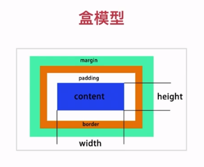
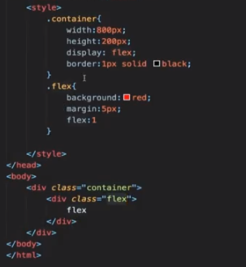
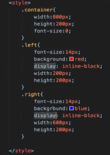

# CSS布局

- CSS知识体系的重中之重
- 早期以table为主(简单)
- 后来以技巧性布局为主（难)
- 现在有flexbox/grid(偏简单)
- 响应式布局是必备知识


## 常用布局方法

- table表格布局
- float 浮动+margin
- inline-block布局
- flexbox布局

## 表格布局


##　一些布局属性



display / position

- 确定元素的显示类型
  block / inline / inline-block
- 确定元素的位置
  static / relative / absolute / fixed


absolute / fixed是脱离文档流的

absolute是相对于其最近的absolute  或relative

层级默认是跟随文档流的，通过z-index:1可以设置层级。relative / absolute / fixed 可以设置z-index

##　flexbox

- 弹性盒子
- 盒子本来就是并列的
- 指定宽度即可



## float

- 元素“浮动”
- 脱离文档流
- 但不脱离文本流


对自身的影响:

- 形成“块”(BFC)
- 位置尽量靠上
- 位置尽量靠左(右)


对兄弟的影响:

- 上面贴非float元素
- 旁边贴float元素
- 不影响其它块级元素位置
- 影响其它块级元素内部文本


对父级元素的影响

- 从布局上“消失”
- 高度塌陷

## inline-block布局

- 像文本一样排block元素
- 没有清除浮动等问题
- 需要处理间隙



## 响应式设计和布局

- 在不同设备上正常使用
- —般主要处理屏幕大小问题
- 主要方法:
  - 隐藏 + 折行＋自适应空间
  - rem / viewport / media query

通过viewport

```html
<meta name="viewport" content="width=device-width, initial-scale=1.0">
```

```css
<meta name="viewport" content="width=320">
```

通过脚本计算content="width=xxx"

```html
<script>
    window.innerWidth;...
</script>
```


通过media query

```css
@media (max-width: 640p×){
    .left{
        display: none;
    }
}
```

```css
.intro{
    display: inline-block;
    width: 180px;
    height: 180px;
    line-heigh: 180px;
    text-align: center;
    border-radius: 90px;
    border: 1px solid red;
    margin: 7px
}

@media (max-wideth: 640px){
    .intro{
        margin:7px auto;
        display: block;
    }
}
```


rem 

一个rem = 一个html的font-size。font-size默认是16px

```css
html{
    font-size: 20px;
}

.intro{
    display: inline-block;
    width: 9rem;
    height: 9rem;
    line-heigh: 180rem;
    text-align: center;
    border-radius: 4.5rem;
    border: 1px solid red;
    margin: .3rem
}
@media (max-wideth: 375px){
    html{
        font-size: 24px;
    }
}
@media (max-wideth: 320px){
    html{
        font-size: 20px;
    }
}
@media (max-wideth: 640px){
    .intro{
        margin: .3rem auto;
        display: block;
    }
}
```

> 注意：大屏的media要写在上面，若将小屏的media写在上面，生效的media将永远是小屏

## 主流网站的布局方式

腾讯

淘宝

网易

apple

请自行分析各大互联网公司的布局方案

## CSS面试真题

### 1.实现两栏(三栏)布局的方法

- 1.表格布局
- 2.float + margin布局
- 3.inline-block布局
- 4.flexbox布局

### 2.position: absolute / fixed有什么区别?

- 前者相对最近的absolute / relative
- 后者相对屏幕(viewport)

###  3.display:inline-block的间隙

- 原因:字符间距
- 解决:消灭字符或者消灭间距

### 4.如何清除浮动

为什么要清楚浮动？

浮动的元素不会占据父容器的布局空间，即父元素布局的时候不会去管浮动元素，从而浮动元素就有可能超出父元素，对其他元素造成影响。所以一个父元素必须要清理浮动，保证对外面是无毒无害的，不会影响其他的元素

如何清理浮动？

- 让盒子负责自己的布局
- overflow:hidden(auto)
- ::after{clear:both} // 让父容器包含浮动元素的布局

### 5.如何适配移动端页面?

- viewport
- rem / viewport / media query
- 设计上: 隐藏  折行 自适应