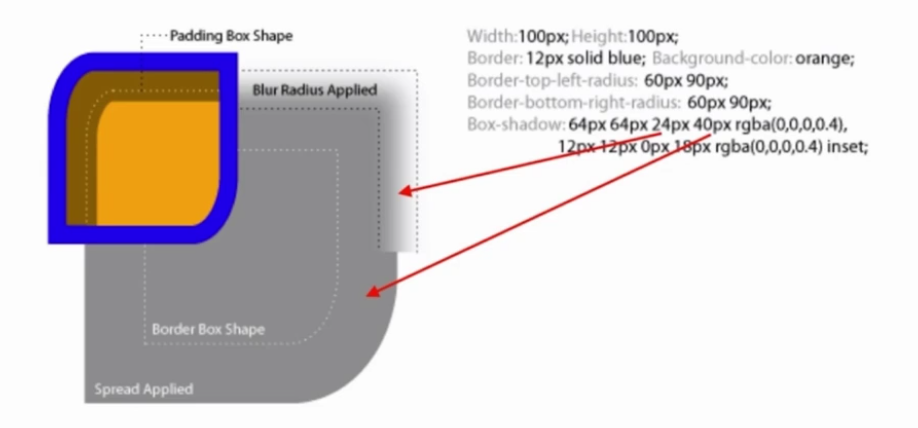
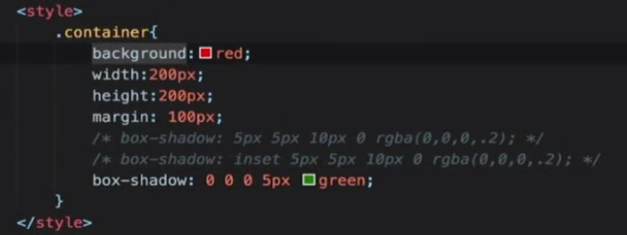
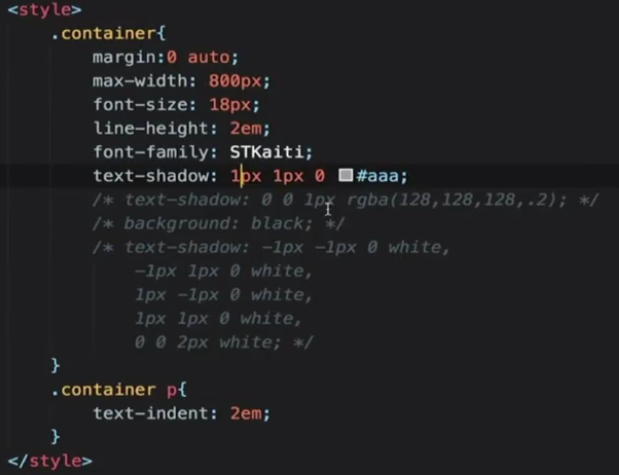
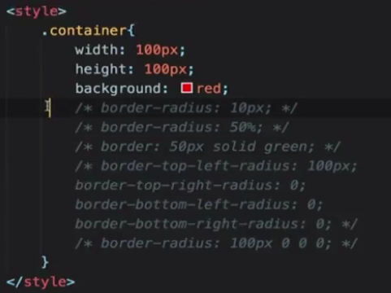
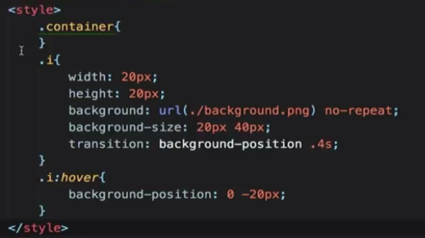
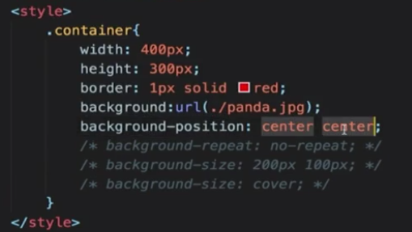
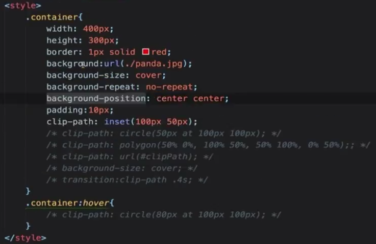
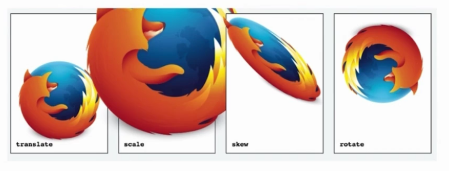
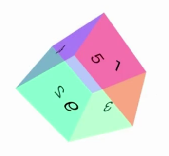

# 效果属性

这个效果怎么实现

css最出彩的一部分

- box-shadow
- text-shadow
- border-radius
- background
- clip-path

##　box-shadow

### 作用（主要用来做什么？）

- 营造层次感（立体感)
- 充当没有宽度的边框
- 特殊效果（比如画机器猫）

### 基本使用

## text-shadow

### 作用（主要用来做什么？）

- 立体感
- 印刷品质感

### 基本使用

## border-radius

### 作用（主要用来做什么？）

- 圆角矩形
- 圆形
- 半圆/扇形
- —些奇怪的角角

### 基本使用

## background

### 作用（主要用来做什么？）

- 纹理、图案
- 渐变
- 雪碧图动画
- 背景图尺寸适应

### 基本使用

雪碧图动画

背景图尺寸适应

## clip-path

### 作用（主要用来做什么？）

- 对容器进行裁剪
- 常见几何图形
- 自定义路径

### 基本使用

## 3D变换

2D变换transform

在3D空间中进行变换

请自行编写css完成立方体的呈现

## 面试真题

1. 如何用一个div画XXX

   box-shadow无限投影

   ::before

   ::after

2. 如何产生不占空间的边框

   1. box-shadow
   2. outline

3. 如何实现圆形元素(头像)

   border-radius:50%

4. 如何实现ios图标的圆角

   clip-path: (svg)

5. 如何实现半圆、扇形等图形

   border-radius组合:

   有无边框

   边框粗细

   圆角半径

6. 如何实现背景图居中显示/不重复/改变大小

   background-position

   background-repeat

   background-size(coverlcontain)

7. 如何平移/放大一个元素

   transform:translateX(100px)

   transform:scale(2)

8. 如何实现3D效果
   1. perspective: 500px
   2. transform-style: preserve-3d;
   3. transform: translate rotate ...

