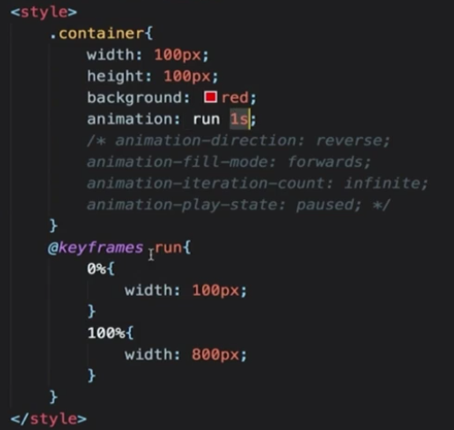

# CSS动画

## CSS中的动画类型

1. transition补间动画
2. keyframe关键帧动画
3. 逐帧动画

## transition补间动画

- 位置–平移(left/right/margin/transform)
- 方位-旋转(transform)
- 大小-缩放(transform)
- 透明度(opacity)
- 其它-线性变换(transform)

timing(easing)

定义动画进度和时间的关系

请网上自行寻找easing工具

## keyframe关键帧动画

相当于多个补间动画

与元素状态的变化无关

定义更加灵活

## 逐帧动画

适用于无法补间计算的动画

资源较大

使用steps()

## CSS面试真题

1. CSS动画的实现方式有几种

   transition

   keyframes(animation)

2. 过渡动画和关键帧动画的区别

   过渡动画需要有状态变化

   关键帧动画不需要状态变化

   关键帧动画能控制更精细

3. 如何实现逐帧动画

   使用关键帧动画

   去掉补间(steps)

4. CSS动画的性能

   1. 性能不坏
   2. 部分情况下优于JS
   3. 但JS可以做到更好
   4. 部分高危属性影响性能，比如box-shadow等