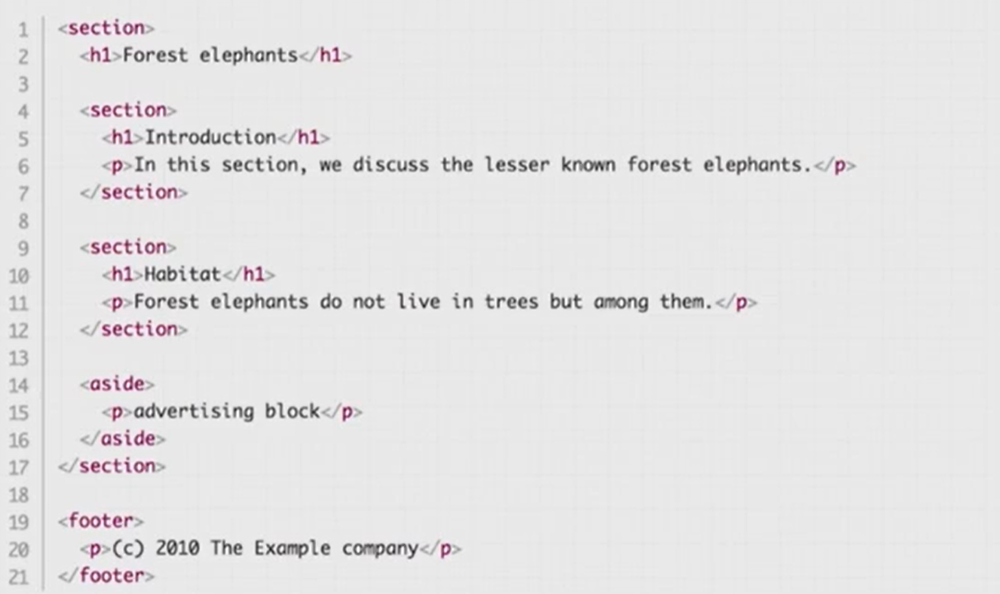
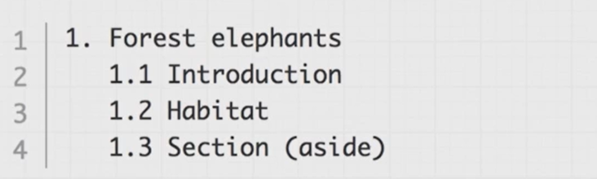
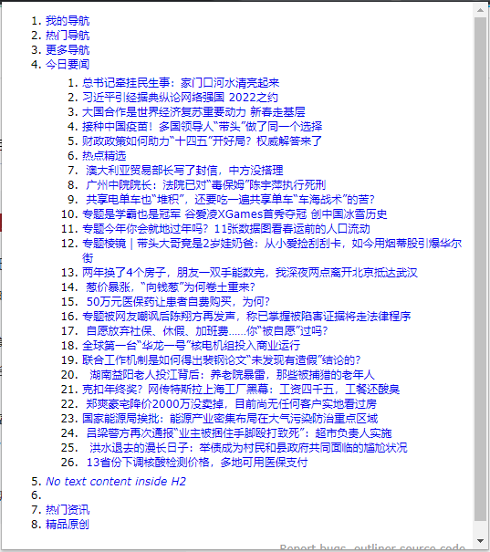
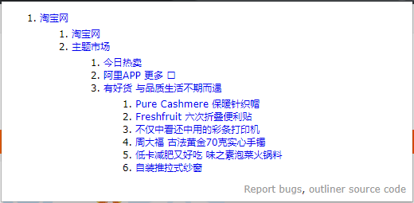

## 如何理解HTML

让我们打开F12，会发现有很多站点的html混乱不堪，而对此，我们的前端工程师需要负主要责任。我们可以肯定一个无限使用div嵌套的前端工程师，一定没有充分理解HTML。在他眼中，前端只是一份任务，只要能实现美工给的界面效果，优雅不优雅与他何干。

一个合格的前端工程师，应该意识到HTML是有结构有大纲的。应该像写书一样编写HTML代码。一段HTML代码应该按照如下的方式看待：

-  以“文档”的方式看待HTML
-  HTML具有“结构”
-  有区块和大纲

## HTML5对结构化的支持

HTML5新增了很多元素，用于描述html5结构，如下：

- section：在 web 页面应用中，该元素也可以用于区域的章节描述。
- header：页面主体上的头部， header 元素往往在一对 body 元素中。
- footer：页面的底部（页脚），通常会标出网站的相关信息。
- nav：专门用于菜单导航、链接导航的元素，是 navigator 的缩写。
- article：用于表现一篇文章的主体内容，一般为文字集中显示的区域。

## 结构化示例

让我们来看一段有结构的html代码

如上代码通过W3C的[h5o](http://h5o.github.io/)工具转换，可得到如下结构，是不是和书籍结构基本相同？

## 更多结构示例欣赏

接下去让我们欣赏一个给大互联网公司的优秀html结构
### [腾讯网](https://news.qq.com/)

### [淘宝网](https://www.taobao.com/)

更多网站，请自行使用[h5o](http://h5o.github.io/)工具查看