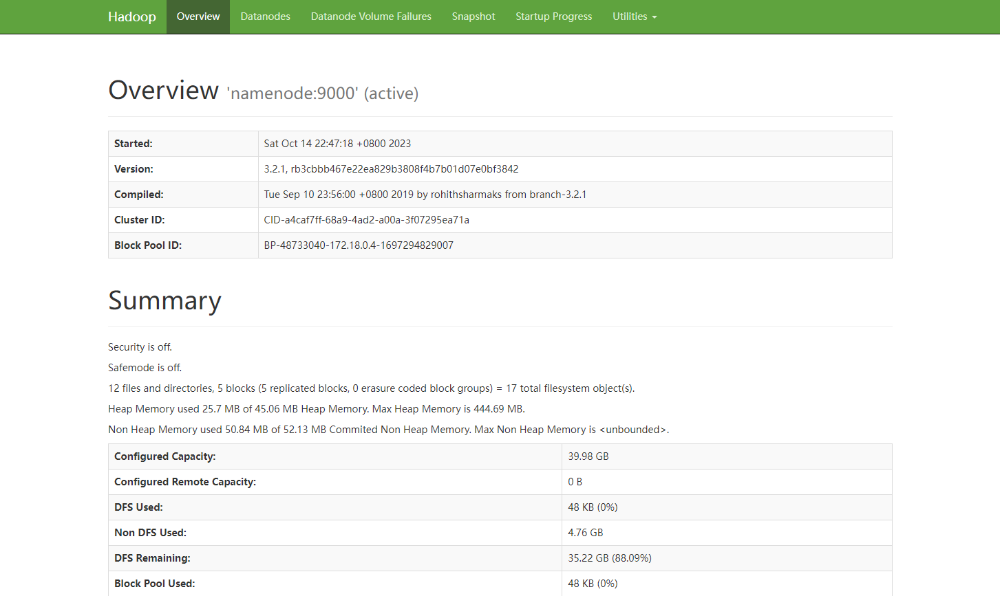

# Hadoop环境搭建-docker

在许多大数据实验中，需要搭建Hadoop环境，但按照教程一步步配置虚拟机并搭建一个可用的环境有些过于繁琐。为降低学习成本，本文将通过Docker-Compose实现Hadoop环境的快速搭建。

## 步骤

1. 拉取[docker-hadoop](https://github.com/big-data-europe/docker-hadoop)项目。docker-hadoop项目是一个开源项目，旨在帮助开发者快速搭建Hadoop环境。

   ```bash
   git clone https://github.com/big-data-europe/docker-hadoop.git
   ```

   > 提示：若无法访问Github，可通过Gitee拉取项目，命令如下：
   >
   > ```bash
   > git clone https://gitee.com/mirrors_big-data-europe/docker-hadoop.git
   > ```

2. 切换分支。docker-hadoop项目的不同分支，对应不同的Hadoop版本，请根据需要安装的Hadoop版本切换分支。本文演示Hadoop `3.2.1`版本的安装，故切换到`2.0.0-hadoop3.2.1-java8`分支。

   ```bash
   cd docker-hadoop
   git checkout 2.0.0-hadoop3.2.1-java8
   ```

   > 提示：查看所有分支可通过 `git branch -a` 命令

3. 运行部署脚本。

   ```bash
   docker compose up -d
   ```

4. 查看容器状态。等待所有的容器状态变为`healthy`即可。

   ```bash
   [root@bigdata hadoop]# docker ps 
   CONTAINER ID   IMAGE                                                    COMMAND                  CREATED          STATUS                    PORTS                                                                                  NAMES
   ae66d34aa937   bde2020/hadoop-datanode:2.0.0-hadoop3.2.1-java8          "/entrypoint.sh /run…"   23 minutes ago   Up 23 minutes (healthy)   9864/tcp                                                                               datanode
   03ff4caf87c5   bde2020/hadoop-namenode:2.0.0-hadoop3.2.1-java8          "/entrypoint.sh /run…"   23 minutes ago   Up 23 minutes (healthy)   0.0.0.0:9000->9000/tcp, :::9000->9000/tcp, 0.0.0.0:9870->9870/tcp, :::9870->9870/tcp   namenode
   44f49e7e8c06   bde2020/hadoop-nodemanager:2.0.0-hadoop3.2.1-java8       "/entrypoint.sh /run…"   23 minutes ago   Up 23 minutes (healthy)   8042/tcp                                                                               nodemanager
   95a85a5ccea6   bde2020/hadoop-resourcemanager:2.0.0-hadoop3.2.1-java8   "/entrypoint.sh /run…"   23 minutes ago   Up 23 minutes (healthy)   8088/tcp                                                                               resourcemanager
   69ad93c9e720   bde2020/hadoop-historyserver:2.0.0-hadoop3.2.1-java8     "/entrypoint.sh /run…"   23 minutes ago   Up 23 minutes (healthy)   8188/tcp                                                                               historyserver
   ```

5. 测试访问。浏览器访问 http://192.168.61.40:9870，出现如下界面则说明部署成功。注意：192.168.61.40是小编所使用的虚拟机IP，各位观众老爷请根据实际情况更改。

   

## 参考文档

[GitHub - big-data-europe/docker-hadoop: Apache Hadoop docker image](https://github.com/big-data-europe/docker-hadoop)

[Docker-Compose搭建Hadoop集群](https://juejin.cn/post/7102410832729882638)

