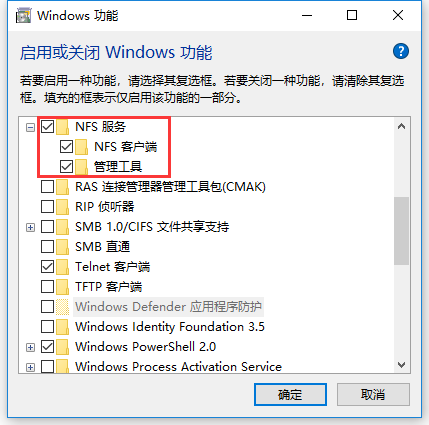

## NFS协议定义

Network FileSystem (NFS) 可以让主机之间透过网络分享彼此的档案与目录  

## NFS服务器

### 搭建方式

1. 检测rpcbind 与 nfs 是否已安装

   ```bash
   rpm -qa | grep nfs
   rpm -qa | grep rpcbind
   ```

   若未安装，使用如下命令安装 rpcbind  和 nfs-utils  

   ```bash
   yum install rpcbind
   yum install nfs-utils
   ```

2. 编辑/etc/exports，指定共享目录及权限

   ```bash
   [root@www ~]# vim /etc/exports
   /tmp 192.168.100.0/24(ro) localhost(rw) *.ev.ncku.edu.tw(ro,sync)
   ```

3. 启动rpcbind (若已经启动了， 就不要重新启动)

   ```bash
   /etc/init.d/rpcbind start
   ```

4. 启动 nfs   

   ```bash
   [root@www ~]# /etc/init.d/nfs start
   [root@www ~]# /etc/init.d/nfslock start
   ```

   > 若要设置开机自启动，可以使用如下命令
   >
   > ```bash
   > [root@www ~]# chkconfig rpcbind on
   > [root@www ~]# chkconfig nfs on
   > [root@www ~]# chkconfig nfslock on
   > ```

5. 观察nfs是否启动

   观察日志

   ```bash
   [root@www ~]# tail /var/log/messages
   Jun 30 07:30:50 localhost kernel: Installing knfsd (copyright (C) 1996 okir@monad.swb.de).
   Jun 30 07:30:50 localhost systemd: Mounted NFSD configuration filesystem.
   Jun 30 07:30:50 localhost systemd: Starting NFS Mount Daemon...
   Jun 30 07:30:50 localhost systemd: Started NFS Mount Daemon.
   Jun 30 07:30:50 localhost systemd: Starting NFS server and services...
   Jun 30 07:30:50 localhost rpc.mountd[24301]: Version 1.3.0 starting
   ...
   ```

   观察端口

   ```bash
   [root@nfs nfs]# netstat -tulnp | grep -E 'rpc|nfs'
   tcp   0      0 0.0.0.0:20048      0.0.0.0:*           LISTEN      24301/rpc.mountd
   tcp   0      0 0.0.0.0:54704      0.0.0.0:*           LISTEN      24268/rpc.statd
   tcp6  0      0 :::20048           :::*                LISTEN      24301/rpc.mountd
   tcp6  0      0 :::48114           :::*                LISTEN      24268/rpc.statd
   udp   0      0 0.0.0.0:20048      0.0.0.0:*                       24301/rpc.mountd
   udp   0      0 0.0.0.0:636        0.0.0.0:*                       1402/rpcbind
   udp   0      0 127.0.0.1:703      0.0.0.0:*                       24268/rpc.statd
   udp   0      0 0.0.0.0:46941      0.0.0.0:*                       24268/rpc.statd
   udp6  0      0 :::59713           :::*                            24268/rpc.statd
   udp6  0      0 :::20048           :::*                            24301/rpc.mountd
   udp6  0      0 :::636             :::*                            1402/rpcbind
   ```

### 配置

权限方面常见参数如下，详情请查看参考文档

- rw/ro
- sync/async
- no_root_squash/root_squash/all_squash
- anonuid/anongid  


配置发生变更时候，通过如下命令重新加载/etc/exports

```bash
[root@www ~]# exportfs -arv
exporting 192.168.100.10:/home/test
exporting 192.168.100.0/24:/home/public
exporting *.centos.vbird:/home/linux
exporting *:/home/public
exporting *:/tmp
```

## NFS 客户端 

### 手动挂载 NFS 服务器分享的资源  (Linux)

1. 确认本地端已经启动了 rpcbind 服务！

   ```bash
   [root@client mnt]# netstat -tulnp | grep rpc
   udp        0      0 0.0.0.0:685       0.0.0.0:*               2218/rpcbind
   udp6       0      0 :::685            :::*                    2218/rpcbind
   ```

   > 若rpcbind未启动，使用如下命令启动
   >
   > ```bash
   > [root@client ~]# /etc/init.d/rpcbind start
   > ```

2. 使用`showmount`命令，扫瞄 NFS 服务器分享的目录有哪些， 并了解我们是否有权使用

   ```bash
   showmount -e 192.168.100.254
   ```

3. 使用`mkdir`命令，在本地端建立预计要挂载的挂载点目录

   ```bash
   [root@client ~]# mkdir -p /home/nfs/public
   ```

4. 利用 mount 将远程主机直接挂载到相关目录。  

   ```bash
   [root@client ~]# mount -t nfs 192.168.100.254:/home/public /home/nfs/public
   ```

   > 取消挂载请使用如下`umount`命令：
   >
   > ```bash
   > [root@client ~]# umount /home/nfs/public
   > ```

### 手动挂载 NFS 服务器分享的资源  (windows)

1. 点击`控制面板→所有控制面板项→程序和功能→启用或关闭windos功能`，启用nfs

   

2. 在cmd命令行中，使用`mount`命令， 将远程主机挂载到指定盘符

   ```bash
   mount 192.168.61.51:/tmp/share Z:
   ```


### 配置

以下配置参数，详情请查看参考文档

主要参数

- suid/nosuid
- rw/ro
- dev/nodev
- exec/noexec
- user/nouser
- auto/noauto  

特殊参数

- fg/bg
- soft/hard
- intr
- rsize/wsize  

## NFS优势


## NFS劣势

权限：在客户端与服务器端可能必须要具备相同的账号才能够存取某些目录或档案  

依赖：启动 NFS，需要启动 RPC 服务  


## 注意点

防火墙问题：NFS需要rpc.mountd, rpc.rquotad 等服务的支持，而这些服务的端口是不固定的，会给防火墙的设置带来困难

文件权限问题：用户对目录的权限受两方面约束：NFS认证权限、Posix权限；

并发安全问题：多个客户端同时尝试写入某个档案时，可能对于该档案造成一些问题  

配额问题：若不做配额限制，NFS 磁盘可能被塞满，那么你的系统将会造成无法读写的困扰。  

联网问题：如果你的 NFS 服务器与客户端之间的联机因为网络问题， 或者是服务器端先关机了， 却没有通知客户端， 那么客户端只要动到文件系统的指令 (例如 df, ls, cp 等等) ， 整个系统就会慢到爆！   

## NFS与SMB协议的对比


## 参考文档

鸟哥的Linux私房菜：服务器架构篇 第三版 - NFS服务器