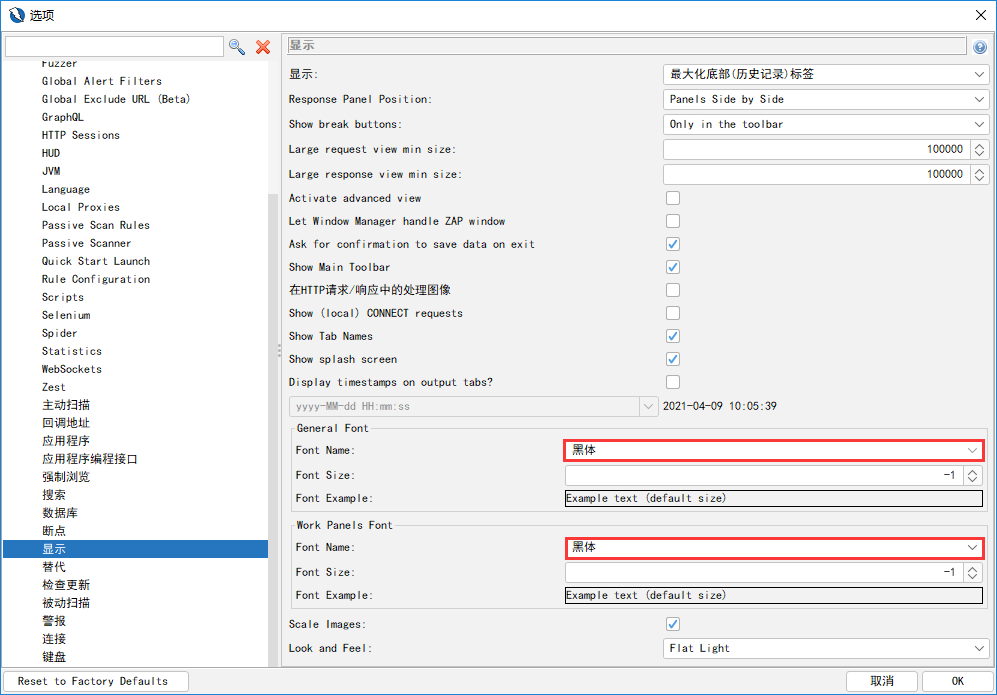

## 侦察工具

- Httrack

  HTTrack 是一个免费开源的网站离线浏览器。通过它可以将整个网站下载到本地的某个目录，包括html、图片和脚本以及样式文件，并对其中的链接进行重构以便于在本地进行浏览。

  目的：减少与目标系统交互

  ```bash
  
  ```

  

## 代理提供商网站

[hidemyass](https://www.hidemyass.com/en-us/index)

## 扫描工具

- Nikto
- Vega
- Skipfish
- W3af
- Arachni
- Owasp zap

### NIKTO

Perh语言开发的开源web安全扫描器

#### 扫描内容

- 软件版本
- 搜索存在安全隐患的文件
- 服务器配置漏洞
- WEB Application层面的安全隐患


#### 特点

避免404误判

- 很多服务器不遵守RFC标准，对于不存在的对象返回200响应码
- 依据响应文件内容判断，不同扩展名的文件404响应内容不同
- 去除时间信息后的内容取MD5值

> 可通过`-no404`关闭该功能

-evasion :使用LibWhisker中对IDS的躲避技术，可使用以下几种类型:

1. 随机URL编码(非UTF 8方式)
2. 自选择路径(/./)
3. 过早结束的URL优先
4. 考虑长随机字符串
5. 参数欺骗
6. 使用TAB作为命令的分隔符
7. 使用变化的URL
8. 使用Windows路径分隔符" \ "

#### 常见命令及用法

```bash
nikto -list-plugins
nikto -update
nikto -host http://1.1.1.1
nikto -host 192.168.1.1 -ssl -port 443,8443,995
nikto -host 192.168.1.1 -useproxy http://localhost:8087
nikto -host host.txt
nmap -p80 192.168.1.0/24 -0G- | nikto -host-
-vhost
```

> 注意：nikto -update时，会通过cirt.net拉取升级包，若无法拉取，可前往http://cirt.net/nikto/UPDATES手动下载升级包


#### Nikto-interactive（交互式命令）

```bash
Space - report current scan status
V - verbose mode on/off
d - debug mode on/off
e - error reporting on/off
p - progress reporting on/off
r - redirect display on/off
C - cookie display on/off
a - auth display on/off
q - quit
N - next host
P - Pause
```


#### 配置

配置文件地址

/etc/nikto .conf

配置cookie

```bash
STATIC-COOKIE="cookie1"="cookie value";"cookie2"="cookie value"
```

使用方式可参考[Kali Linux渗透测试之扫描工具——Nikto](https://www.pianshen.com/article/3418457807/)

### vega

#### 特点

JAVA编写的开源Web扫描器

扫描模式

代理模式

爬站、处理表单、注入测试
支持SSL : http://vega/ca.crt

#### 使用

使用方式可参考[Kali Linux渗透测试 073 扫描工具-Vega](https://www.pianshen.com/article/82381058949/)

​	

浏览器代理插件

AutoProxy


### skipfish

#### 特点

- C语言编写
- 实验性的主动web安全评估工具。
- 递归爬网
- 基于字典的探测
- 速度较快
  - 多路单线程，全异步网络IV/O,消除内存管理和调度开销
  - 启发式自动内容识别
- 误报较低


#### 常用命令

```bash
skipfish -o test http://1.1.1.1
skipfish -o test @url.txt
skipfish -o test -S complet.wl -W a.wl http://1.1.1.1 #字典
```

- -I∶只检查包含'string'的URL
- -X:不检查包含'string '的URL         #logout
- -K:不对指定参数进行Fuzz测试
- -D:跨站点爬另外一个域
- -l:每秒最大请求数
- -m :每IP最大并发连接数
- --config :指定配置文件

> 提示：扫描结束太快
>
> 触发了目标站点的连接数限制，降低-m -l数值

身份认证命令

```bash
skipfish -A user:pass -o test http://1.1.1.1
skipfish -C "name=val" -o test http://1.1.1.1
Username / Password
```


### w3af

Web Application Attack and Audit Framework，基于python语言开发，此框架的目标是帮助你**发现**和**利用**所有WEB应用程序漏洞

#### 插件

w3af具有9大类，近150个plugin

- audit
- infrastructure
- grep
- evasion
- mangle
- auth
- bruteforce
- output
- crawl

额外的第10类

- attack

#### 安装步骤

若kali自带版本执行扫描时挂死，请手动安装w3af，命令如下

```bash
cd ~
apt-get update
apt-get install -y python-pip w3af
pip install -upgrade pip
git clone https://github.com/andresriancho/w3af.git
cd w3af
./w3af_console (./w3af_gui)
apt-get build-dep python-lxml
/tmp/w3af_dependency_install.sh
```


升级

git pull

创建快捷方式

/usr/share/applications/w3af.desktop

用户接口

- Console
- Gui
- API


#### 命令

```bash
W3af_ console
- help													 #显示可用指令
- plugin                                                 #进入plugin子命令
  - Help											     #显示可用指令
  - list audit                                           #列出audit类所有插件
  - audit sqli XSS                                       #选择使用的audit插件
- http-settings / misc settings                          #全局配置
  - help
  - view                                                 #查看可配置的参数
  - set                                                  #设置参数
  - back                                                 #回到上一级命令
```


```bash
- Profiles
  - save. as self-contained
  - save as test sell-contained
- Target
  - set target http://1.1.1.1/
- Start
- Script
  - script/*.w3af

```


W3af_身份认证

- HTTP Basic
- NTLM
- Form
- Cookie       #双因素身份认证/ anti-CSRF tokens


截断代理

HTTP header file(另类的身份认证方法)

w3af不支持客户端技术(Javascript、Flash、Java applet 等)、

截断代理手动爬网

- spider_man
- output.export_requests
- http://127.7.7.7/spider_man?terminate   #终止spider man

crawl.import results

- base64

```bash
explolt
Fuzzy Requests
- Numbers from 0 to 4: $range(5)$
- First ten letters: $string.lowercase[ :10]$
- The words spam and eggs: $[ 'spam', 'eggs']$
- The content of a file: $[l.strip() for l in file('input.txt')]$
Cluster responses
```

### Arachni

Arachni是是一款开源的非常好用的漏洞扫描工具。它是一个包含很多特性、模块化的、高性能的Ruby框架,目的是帮助渗透测试人员和管理者评估现代web应用程序的安全。

- Kali自带了旧的arachni阉割版。

- 安装

  ```bash
  http://www.arachni-scanner.com/download/#Linux
  tar xvf arachni.tar.gz
  http://localhost:9292/
  admin@admin.admin/administrator
  ```

  

Profile

- lmport
- Export
- New

Dispatcher

- ./arachni_rpcd --address=127.0.0.1 --port=1111 --nickname=test1

Grid

- ./arachni_rpcd --nickname=test2 --address=127.0.0.1--neighbour=127.0.0.1:1111

Scan


### OWASP_ZAP

OWASP ZAP(zed attack proxy)是世界上最受欢迎的免费安全审计工具之一

- zed attack proxy
- WEB Application集成渗透测试和漏洞挖掘工具
- 开源免费跨平台简单易用


#### 主要拥有以下重要功能：

- 截断代理
- 主动、被动扫描
- Fuzzy、暴力破解
- API
  http://zap/


- Persist Session
- Mode Safe、Protected、Standard、ATTACK 
- 升级add-ons
- Scan policy
- Anti CSRF Tokens
- https——CA
- Scope / Contexts /filter
- Http Sessions—default session tokens & site session tokens
- Note / tag
- Passive scan


对于中文网站，为了防止`请求响应`中文乱码，需要更改字体并重启OWASP_ZAP，如下：




#### 标准扫描工作流程

- 设置代理
- 手动爬网
- 自动爬网
- 主动扫描

#### 使用方式

参考：[Kali学习笔记26：OWASP_ZAP](https://www.pianshen.com/article/5365550868/)

[OWASP ZAP下载、安装、使用（详解）教程](https://www.fujieace.com/kali-linux/owasp-zed-zap.html)


### Burpsuite

- Web安全工具中的瑞士军刀
- 统一的集成工具发现全部现代WEB安全漏洞
- PortSwigger公司开发
  - Burp Free
  - Burp Professional
  - http://www.portswigger.net

所有的工具共享一个能处理并显示HTTP消息的可扩展框架，模块之间无缝交
换信息。

字体

Proxy

Options

- Invisible (主机头/多目标域名)
- CA (导入/导出)
- Intercept (入站 /出站)
- Response modify

Target

- Scope (logout)
- Filter
- Comparing site map


## 其他文档

[黑客最常用的10种黑客工具](https://www.fujieace.com/hacker/tools/10.html)

