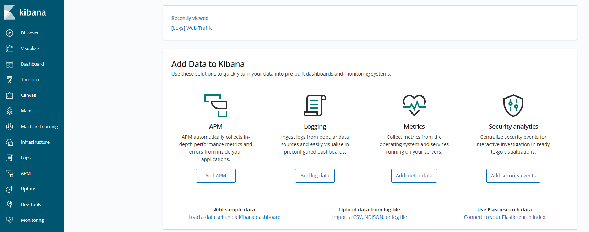

# kibana环境搭建

本小节以docker方式搭建，更多搭建方式详见官方文档：[Installing Kibana](https://www.elastic.co/guide/en/kibana/6.8/install.html)


## 安装步骤

### 1. 拉取镜像

```sh
docker pull kibana:6.8.5
```

### 2. 运行

```sh
docker run -d --name kibana --link elasticsearch:elasticsearch -p 5601:5601 kibana:6.8.5
```

### 3. 验证安装结果

浏览器请求 http://192.168.61.10:5601有如下返回则代表搭建成功。注意：ip地址需要更换为你自己的。

