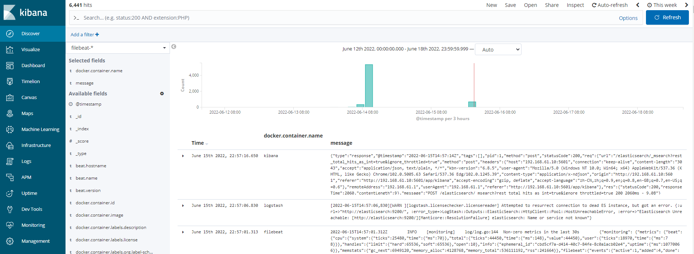

# filebeat环境搭建

本小节以docker方式搭建，更多搭建方式详见官方文档：[Install Filebeat](https://www.elastic.co/guide/en/beats/filebeat/6.8/filebeat-installation.html)

## 安装步骤

yum安装

1. 下载并安装公共签名密钥：

   ```sh
   sudo rpm --import https://packages.elastic.co/GPG-KEY-elasticsearch
   ```

2. 在目录`/etc/yum.repos.d/`中创建elastic.repo文件，并添加以下内容：

   ```sh
   [elastic-6.x]
   name=Elastic repository for 6.x packages
   baseurl=https://artifacts.elastic.co/packages/6.x/yum
   gpgcheck=1
   gpgkey=https://artifacts.elastic.co/GPG-KEY-elasticsearch
   enabled=1
   autorefresh=1
   type=rpm-md
   ```

3. 通过运行以下命令来安装 Filebeat：

   ```bash
   sudo yum install filebeat
   ```

4. 配置filebeat开机自启动：

   ```bash
   sudo chkconfig --add filebeat
   ```

   


启动filebeat

```bash
systemctl start filebeat
```


配置文件位置：/etc/filebeat/filebeat.yml


检查filebeat的正确性

```bash
# filebeat -c filebeat.yml  -configtest

Flag --configtest has been deprecated, use test config subcommand
Config OK
```


### 1. 拉取镜像

```sh
docker pull docker.elastic.co/beats/filebeat:6.8.5
```

### 2. 初始化索引

执行filebeat的setup命令， 在elasticsearch和kibana中生成index

```sh
docker run \
    docker.elastic.co/beats/filebeat:6.8.5 \
    setup \
    -E setup.kibana.host=192.168.61.10:5601 \
    -E output.elasticsearch.hosts=["192.168.61.10:9200"]
```

### 3. 运行容器

使用如下命令获取示例配置：

```bash
curl -L -O https://raw.githubusercontent.com/elastic/beats/6.8/deploy/docker/filebeat.docker.yml
```

filebeat.docker.yml内容如下：

```yaml
filebeat.config:
  modules:
    path: ${path.config}/modules.d/*.yml
    reload.enabled: false

filebeat.autodiscover:
  providers:
    - type: docker
      hints.enabled: true

processors:
- add_cloud_metadata: ~

output.elasticsearch:
  hosts: '${ELASTICSEARCH_HOSTS:elasticsearch:9200}'
  username: '${ELASTICSEARCH_USERNAME:}'
  password: '${ELASTICSEARCH_PASSWORD:}'
```

运行容器

```bash
docker run -d \
  --name=filebeat \
  --user=root \
  --volume="$(pwd)/filebeat.docker.yml:/usr/share/filebeat/filebeat.yml:ro" \
  --volume="/var/lib/docker/containers:/var/lib/docker/containers:ro" \
  --volume="/var/run/docker.sock:/var/run/docker.sock:ro" \
  docker.elastic.co/beats/filebeat:6.8.5 filebeat -e -strict.perms=false \
  -E output.elasticsearch.hosts=["192.168.61.10:9200"]
```

### 4. 验证安装结果

浏览器请求 http://192.168.61.10:5601，切换到filebeat-*索引下，有数据则代表搭建成功。注意：ip地址需要更换为你自己的。




## filebeat的配置

文件详见：[Step 2: Configure Filebeat](https://www.elastic.co/guide/en/beats/filebeat/6.8/filebeat-configuration.html)

```yaml
filebeat.inputs:
- type: log
  enabled: true
  paths:
    - /var/log/mo/*/*.log
output.logstash:
  hosts: ["192.168.61.10:5044"]
```


### 1. 配置输入

```yaml
filebeat.inputs:
- type: log
  enabled: true
  paths:
    - /var/log/*.log
    #- c:\programdata\elasticsearch\logs\*
```

### 配置输出

```yaml
output.logstash:
  hosts: ["127.0.0.1:5044"]
```

