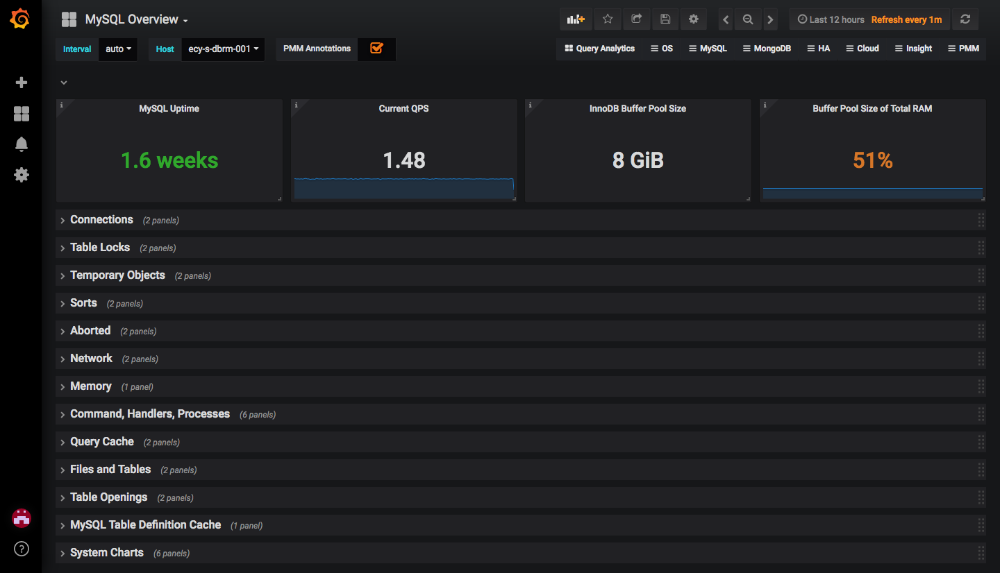
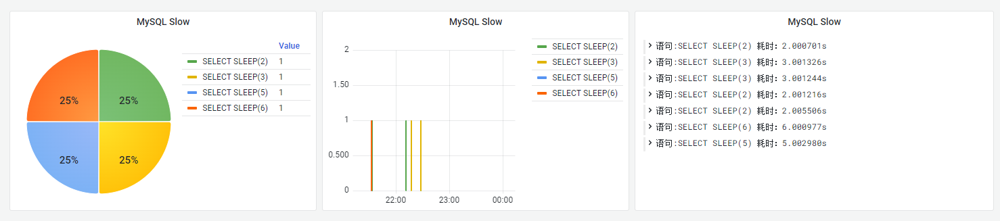
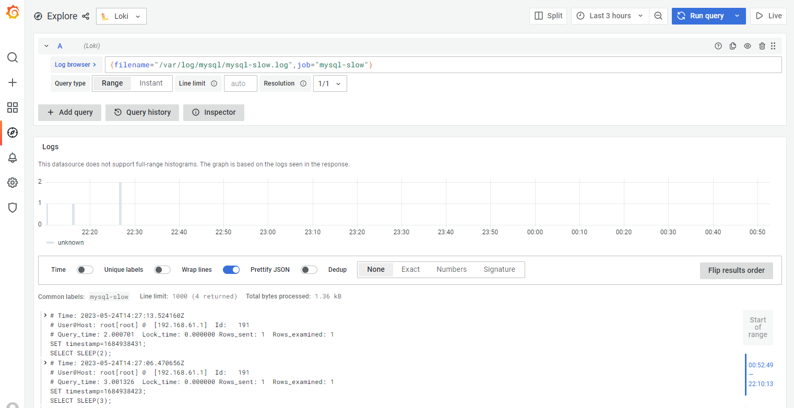
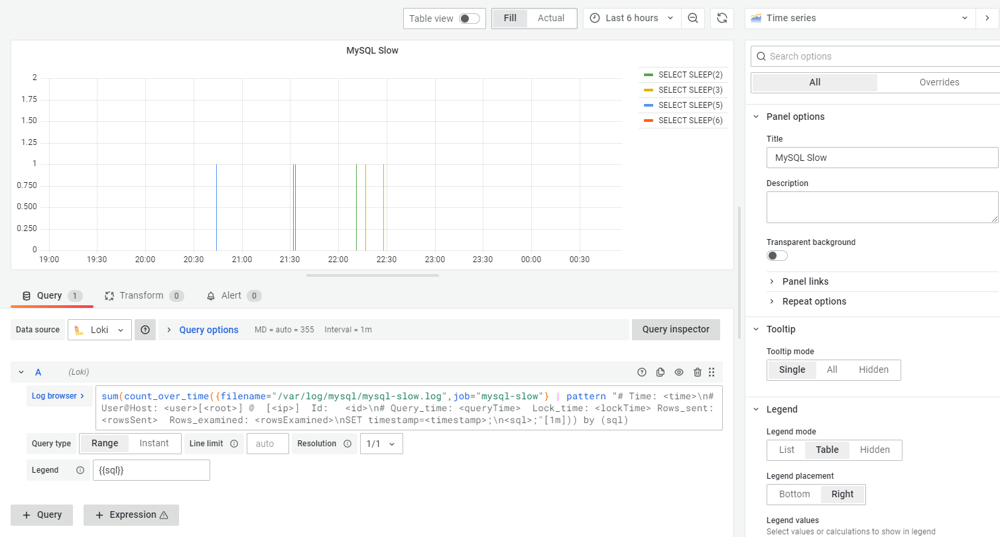

# MySQL慢查询可视化

为了优化SQL，我们首先需要发现有问题的SQL语句，网上诸多教程都在教你使用诸如`mysqldumpslow`、`pt-query-digest`这类工具分析MySQL慢查询日志。然而这一系列的工具都存在一个致命的缺陷，无法实时监控。

而说起实时监控，有经验的小伙伴可能都会想到 `mysqld_exporter` + `prometheus` + `grafana` 的组合，再结合Grafana官网提供的[MySQL 模板](https://grafana.com/grafana/dashboards/7362-mysql-overview/)，便可以实时监控Mysql的多项指标，如下图所示：



然而，该方案仅能让我们知道什么时候发生了慢查询，却无法直接看出发生慢查询的SQL语句是什么。于是乎便有了该篇博文的诞生。

本小节我们将使用 `promtail` + `loki` + `grafana` 来实现MySQL慢查询的可视化。直接将慢查询的SQL语句显示在grafana中，如下图所示：



## 实现步骤

### 1. 启用MySQL的慢查询日志

在MySQL中开启慢查询日志的方法有很多种，这里我们以在my.cnf配置文件中开启为例，找到`my.cnf`文件，添加以下配置：

   ```ini
   slow_query_log = 1
   slow_query_log_file = /var/log/mysql/mysql-slow.log
   long_query_time = 2
   ```

   > 其中，`slow_query_log`表示开启慢查询日志功能，`slow_query_log_file`表示慢查询日志文件的路径，`long_query_time`表示查询执行时间超过多少秒才被记录到慢查询日志中。

### 2. 采集MySQL的慢查询日志

市面上的日志采集工具同样很多，如Logstash、Fluentd等，你可以使用你喜欢的日志采集工具，本文中使用grafana官方提供的 `promtail`，其部署脚本如下：

docker-compose.yaml

   ```yaml
   version: "3"
   services:
     promtail:
       image: grafana/promtail:2.7.0
       volumes:
         - /var/log/mysql:/var/log/mysql
         - /etc/promtail/promtail-config.yaml:/etc/promtail/promtail-config.yaml
       command: -config.file=/etc/promtail/promtail-config.yaml
   ```

`promtail-config.yaml`为`promtail`的配置文件，具体内容如下：

   ```yaml
   server:
     http_listen_port: 9080
     grpc_listen_port: 0
   
   positions:
     filename: /tmp/positions.yaml
   
   clients:
     - url: http://loki:3100/loki/api/v1/push
   
   scrape_configs:
     - job_name: mysql-slow
       static_configs:
         - targets:
             - localhost
           labels:
             job: mysql-slow
             __path__: /var/log/mysql/*.log
       pipeline_stages:
         - match:
             selector: '{job="mysql-slow"}'
             stages:
               - multiline:
                   firstline: '^(# Time)'
                   max_wait_time: 3s
   ```

   > 其中，`__path__`用于指定采集日志的位置；`multiline` 表示合并多行Mysql慢查询日志为一行，`firstline`指定了多行日志的起始行

通过运行`promtail`，日志将被采集并推送到 `loki` 中进行存储。接下去我们只要将其读取并进行展示即可。

### 3. 配置Grafana

在Grafana → Explore中，通过查询语句`{filename="/var/log/mysql/mysql-slow.log",job="mysql-slow"}`，便可查询到MySQL慢查询日志，如下图所示：



   同时，你也可以在DashBoards中直接配置可视化面板，例如：



   例子中使用到的Loki查询语句如下：

   ```bash
   sum(count_over_time({filename="/var/log/mysql/mysql-slow.log",job="mysql-slow"} | pattern "# Time: <time>\n# User@Host: <user>[<root>] @  [<ip>]  Id:   <id>\n# Query_time: <queryTime>  Lock_time: <lockTime> Rows_sent: <rowsSent>  Rows_examined: <rowsExamined>\nSET timestamp=<timestamp>;\n<sql>;"[1m])) by (sql)
   ```

   > 其中，`pattern` 从日志行中提取字段，字段和MySQL慢查询日志的对应关系如下：
   >
   > ```bash
   > # Time: 2023-05-24T08:03:10.794543Z
   > # User@Host: root[root] @  [192.168.61.1]  Id:   191
   > # Query_time: 5.001091  Lock_time: 0.000000 Rows_sent: 1  Rows_examined: 1
   > SET timestamp=1684915385;
   > SELECT SLEEP(5);
   > ```
   >
   > ```bash
   > # Time: <time>
   > # User@Host: <user>[<root>] @  [<ip>]  Id:   <id>
   > # Query_time: <queryTime>  Lock_time: <lockTime> Rows_sent: <rowsSent>  Rows_examined: <rowsExamined>
   > SET timestamp=<timestamp>;
   > <sql>;
   > ```
   >
   > 对于出现换行的地方，需要使用`\n`代替，便得到了我们最终的表达式
   >
   > ```bash
   > # Time: <time>\n# User@Host: <user>[<host>] @  [<ip>]  Id:   <id>\n# Query_time: <queryTime>  Lock_time: <lockTime> Rows_sent: <rowsSent>  Rows_examined: <rowsExamined>\nSET timestamp=<timestamp>;\n<sql>;
   > ```

按照同样的方式，你可以做出更多的DashBoards面板，这里就不在演示，小伙伴们可根据自己的需求进行定制。

### 4. 测试

你可以使用线上真实的慢查询SQL语句进行测试，也可以为了方便简单，和小编一样，使用 `SLEEP()` 阻塞执行的方式进行测试，如下：

   ```mysql
SELECT SLEEP(5);
   ```

阻塞5秒执行。

## 小结

到此，我们使用 `promtail` + `loki` + `grafana` 的组合完成了MySQL慢查询的可视化，将慢查询的SQL语句直接显示在grafana中。但我们不应该局限于 `promtail` + `loki` + `grafana` 的组合，而应该扩展思路，既然`promtail` + `loki` + `grafana` 组合可以，那 `ElasticSearch` + `Logstash` + `Kibana` 等其他组合同样可以。只要敢想敢干，路总会有的！加油

## 参考文档

[LogQL: Log query language | Grafana Loki documentation](https://grafana.com/docs/loki/latest/logql/)

[MySQL Overview | Grafana Labs](https://grafana.com/grafana/dashboards/7362-mysql-overview/)

