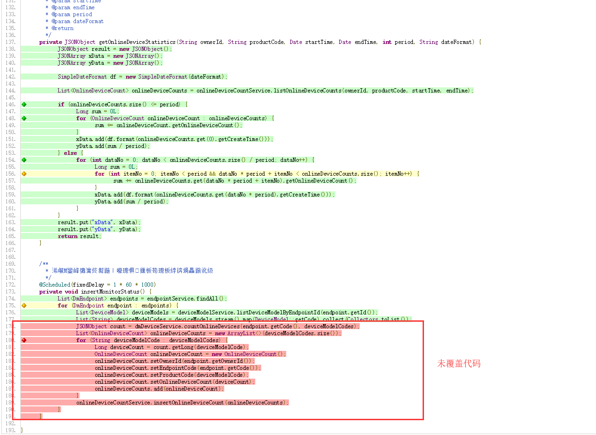

# 单元测试之报告查看

## 运行所有单元测试

点击"Gradle"→"verification"→"test"

## 查看单元测试报告

1.点击"Gradle"→"verification"→"jacocoTestReport"，生成文档

2.单元测试报告文档存放位置

3.浏览器打开“index.html”查看报告

## 查看单元测试覆盖率及代码覆盖情况

1.点击"Gradle"→"verification"→"jacocoTestCoverageVerification"，生成单元测试覆盖率报告

2.单元测试覆盖率报告文件存放位置

3.浏览器打开“index.html”查看报告，最底部为项目总的覆盖率

3.查看代码详细报告

