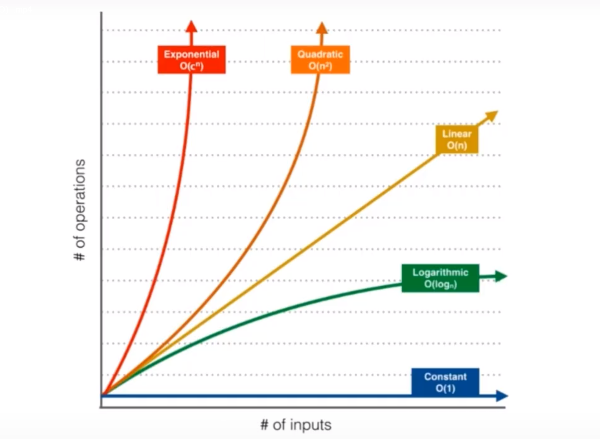

# 算法复杂度

在计算机科学中，算法复杂度是指算法执行所需的**时间**和**空间**资源的量度。算法复杂度是评估算法效率的一种重要指标，通常用**时间复杂度**和**空间复杂度**来描述。

## 时间复杂度

时间复杂度是指算法执行所需的时间资源量度，通常用大O符号表示。在计算时间复杂度时，我们通常关注算法执行的基本操作次数，而不是具体的执行时间。因此，时间复杂度可以用来比较不同算法的效率，以及预测算法在不同输入规模下的执行时间。

以下是常见的时间复杂度：

- O(1)：常数时间复杂度，表示算法执行的基本操作次数是一个常数，与输入规模无关。
- O(log n)：对数时间复杂度，表示算法执行的基本操作次数与输入规模的对数成正比。
- O(n)：线性时间复杂度，表示算法执行的基本操作次数与输入规模成正比。
- O(n log n)：线性对数时间复杂度，表示算法执行的基本操作次数与输入规模的对数乘以输入规模成正比。
- O(n^2)：平方时间复杂度，表示算法执行的基本操作次数与输入规模的平方成正比。
- O(2^n)：指数时间复杂度，表示算法执行的基本操作次数与输入规模的指数成正比。



## 空间复杂度

空间复杂度是指算法执行所需的空间资源量度，通常用大O符号表示。在计算空间复杂度时，我们通常关注算法执行所需的额外空间，而不是输入数据所占用的空间。因此，空间复杂度可以用来比较不同算法的空间占用情况，以及预测算法在不同输入规模下的空间占用情况。

以下是常见的空间复杂度：

- O(1)：常数空间复杂度，表示算法执行所需的额外空间是一个常数，与输入规模无关。
- O(n)：线性空间复杂度，表示算法执行所需的额外空间与输入规模成正比。
- O(n^2)：平方空间复杂度，表示算法执行所需的额外空间与输入规模的平方成正比。

## 算法复杂度分析

算法复杂度分析是指对算法时间复杂度和空间复杂度进行评估和预测的过程。在进行算法复杂度分析时，我们通常需要考虑以下几个因素：

- 算法执行的基本操作：不同算法执行的基本操作不同，因此算法复杂度也会有所不同。
- 输入规模：算法复杂度通常与输入规模成正比，因此需要考虑输入规模对算法复杂度的影响。
- 最坏情况复杂度：算法复杂度通常以最坏情况为基准进行评估，因为最坏情况下算法的执行时间和空间复杂度是最高的。
- 算法优化：通过对算法进行优化，可以降低算法的时间复杂度和空间复杂度，提高算法效率。

## 算法复杂度实例

以下是一个简单的Java代码示例，用于计算数组中所有元素的和：

```java
public static int sum(int[] arr) {
    int sum = 0;
    for (int i = 0; i < arr.length; i++) {
        sum += arr[i];
    }
    return sum;
}
```

该算法的时间复杂度为O(n)，空间复杂度为O(1)。因为算法执行的基本操作是加法，与输入规模成正比；算法执行所需的额外空间是一个常数，与输入规模无关。

## 总结

算法复杂度是评估算法效率的一种重要指标，通常用时间复杂度和空间复杂度来描述。在进行算法复杂度分析时，我们需要考虑算法执行的基本操作、输入规模、最坏情况复杂度和算法优化等因素。通过对算法复杂度的评估和预测，可以选择合适的算法来解决问题，提高程序的效率。

## 参考文档

[玩转算法面试-- Leetcode真题分门别类讲解-第二章](https://coding.imooc.com/class/chapter/82.html#Anchor)

