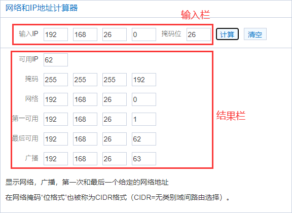

# 网络基础知识

一台主机要连上Internet需要考虑以下因素：

1. 要能够使用网络，则必须要有IP

2. 非同网域的封包传递，则需要Default Gateway 

3. 想通过域名访问服务，则需要DNS服务器的IP

   > 注意：IP的设定需要IP、Network、Broadcast、Netmask等参数。
   >
   > 但由于Network与Broadcast可以经由IP/Netmask的计算而得到，因此只提供IP, Netmask即可。


综上，一组可以连上Internet的必要网络参数如下：

- IP
- Netmask
- Default Gateway
- DNS


linux中网络配置主要关注IPADDR、NETMASK

/etc/sysconfig/network-scripts/

```bash
# cat ifcfg-eth0
DEVICE="eth0"
BOOTPROTO="dhcp"
ONBOOT="yes"
TYPE="Ethernet"
PERSISTENT_DHCLIENT="yes"
ZONE=public

# cat ifcfg-eth1
#VAGRANT-BEGIN
# The contents below are automatically generated by Vagrant. Do not modify.
NM_CONTROLLED=yes
BOOTPROTO=none
ONBOOT=yes
IPADDR=192.168.61.22
NETMASK=255.255.255.0
DEVICE=eth1
PEERDNS=no
#VAGRANT-END

```


## 使用Network和Netmask表示一个网域

```bash
格式：Network/Netmask
示例：192.168.0.0/255.255.255.0 或者 192.168.0.0/255.255.255.0
```

> 提示：一般来说，如果我们知道了NetWork以及Netmask之后，就可以定义出该网域的所有IP！因为由Netmask就可以推算出Broadcast的IP


计算一个网域内包含得IP范围、广播地址

- 手动计算

- 使用网络工具

  通过Network和Netmask，你可以手动计算广播地址和ip范围，也可以通过网络工具
  `网络和IP地址计算器`https://www.sojson.com/convert/subnetmask.html
  


## 子网划分

通过子网掩码，我们可以将一个网域划分。子网划分可分为以下两种方式

- 划小：将一部分HOST_ID作为Net_ID使用，从而划小。

- 划大：将一部分Net_ID作为HOST_ID使用，从而划大。这种行为也称为无等级网域间路由（CIDR）

> 提示：Net_ID为网络号，HOST_ID指主机号，我们都知道ip是由网络号和主机号构成


划分子网的方法

- 手动计算划分

- 使用网络工具划分

  我们可以使用`网络和IP地址计算器`将一个网域划分，获取划分子网所需的子网掩码，获得网络列表

  https://www.sojson.com/convert/subnetmask.html


> 提示：上图中得网络类型中得A类、B类、C类网，指代的是A类、B类、C类子网掩码。或者说划分子网时，使用的网络号为几位，A类网8位、B类网16位、C类网25位


## A类、B类、C类 XXX

在网络中，我们常常听到有人说A类、B类、C类，当

- A类、B类、C类IP

  A类IP地址范围：0.0.0.0~127.0.0.0

  B类IP地址范围：128.0.0.1~191.255.0.0

  C类IP地址范围：192.168.0.0~239.255.255.0

  D类IP地址范围：244.0.0.0~239.255.255.0

  

- A类、B类、C类私有IP地址

  根据网域范围，我们将网络分为A类IP、B类IP、C类IP

  而根据是否能链接到Internet，网络其实只有两种类别，分别为Public IP（公共IP）和 Private IP（私有IP）

  而对应的，A类IP中的私有IP称为A类私有IP地址；B类IP中的私有IP称为B类私有IP地址；C类IP中的私有IP称为C类私有IP地址；

  A类私有IP地址范围：10.0.0.0~10.255.255.255

  B类私有IP地址范围：172.16.0.0~172.31.255.255

  C类私有IP地址范围：192.168.0.0~192.168.255.255

  

- A类、B类、C类子网掩码

  A类IP的网络号占8位，掩码位元数为8，点格式掩码为255.0.0.0，成为A类子网掩码

  B类IP的网络号占16位，掩码位元数为16，点格式掩码为255.255.0.0，成为B类子网掩码

  C类IP的网络号占24位，掩码位元数为24，点格式掩码为255.255.255.0，成为C类子网掩码

  A类子网掩码：255.0.0.0

  B类子网掩码：255.255.0.0

  C类子网掩码：255.255.255.0