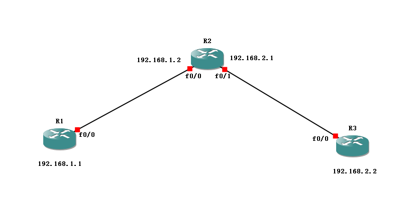

## 静态路由

人为手工设置的路由


## 命令格式

命令格式：ip route NETWORK-ADDRESS SUBNET-MASK {ip-address | exit-interface}

根据命令格式，存在三种设置静态路由的方式

1. ip route NETWORK-ADDRESS SUBNET-MASK IP-ADDRESS

   ```bash
   ip route 192.168.2.0 255.255.255.0 192.168.1.2
   ```

   由于没有指定出接口，即数据包的源IP将无法确定。而这将导致递归查询，再次查询路由表得到出接口

2. ip route NETWORK-ADDRESS SUBNET-MASK EXIT—INTERFACE

   ```bash
   ip route 192.168.2.0 255.255.255.0 f0/0
   ```

   由于没有指定下一跳，导致路由不是最优，ARP

3. ip route NETWORK-ADDRESS SUBNET-MASK EXIT—INTERFACE IP-ADDRESS

   ```bash
   ip route 192.168.2.0 255.255.255.0 f0/0 192.168.1.2
   ```

   最完美的写法，但请注意，先写出接口，再写下一跳。请不要先写下一跳，再写出接口
   
   > 提示：默认路由的NETWORK-ADDRESS和SUBNET-MASK均为0.0.0.0，如：
   >
   > ```bash
   > ip route 0.0.0.0 0.0.0.0 192.168.1.2
   > ```
   >
   > 默认路由适用于末梢网络的场景

## 静态路由的优缺点

优点

- 由人设定，是最靠谱的路由

缺点

- 必须了解网络拓扑结构，设定者方可设定静态路由

- 当网络拓扑很巨大时，静态路由设置相当繁琐


## 实验

### 题目

1. 搭建如下的拓扑结构



2. 按下表，设置路由器的IP地址

   | 路由器 | f0/0接口IP  | f1/0接口IP  |
   | ------ | ---- | ---- |
   | R1     | 192.168.1.1 |             |
   | R2     | 192.168.1.2 | 192.168.2.1 |
   | R3     | 192.168.2.2 |             |

3. 设置静态路由，使R1、R2、R3能相互ping通

### 答案

1. 设置ip地址

   R1

   ```bash
   R1#conf t
   R1(config)#int f0/0
   R1(config-if)ip add 192.168.1.1 255.255.255.0
   R1(config-if)no sh
   R1(config-if)end
   
   R1#show ip interface brief
   R1#show ip route
   ```

   R2

   ```bash
   R2#conf t
   R2(config)#int f0/0
   R2(config-if)ip add 192.168.1.2 255.255.255.0
   R2(config-if)no sh
   R2(config-if)end
   
   
   R2#conf t
   R2(config)#int f0/1
   R2(config-if)ip add 192.168.2.1 255.255.255.0
   R2(config-if)no sh
   R2(config-if)end
   
   R2#show ip interface brief
   R2#show ip route
   ```

   R3

   ```bash
   R3#conf t
   R3(config)#int f0/0
   R3(config-if)ip add 192.168.2.2 255.255.255.0
   R3(config-if)no sh
   R3(config-if)end
   
   R3#show ip interface brief
   R3#show ip route
   ```

   > 提示：设置完IP之后，在特权模式下，可通过`show ip interface brief`查看。

   设置完IP之后，系统自动生成以IP地址相关的直连路由，可通过`show ip route`查看。由于直连路由的存在
   
   R1 f0/0（192.168.1.1）与 R2 f0/0（192.168.1.2）互通
   
   R2 f0/1（192.168.2.1）与 R3 f0/0（192.168.2.2）互通
   
   但
   
   R1  f0/0（192.168.1.1）与 R2 f0/1（192.168.2.1）不通
   
   R1  f0/0（192.168.1.1）与 R3  f0/0（192.168.2.2）不通
   
   

2. 配置静态路由

   R1

   ```bash
   R1#conf t
   R1(config)#ip route 192.168.2.0 255.255.255.0 192.168.1.2
   R1(config)#end
   
   R1#show ip route
   ```

   此时，R1  f0/0（192.168.1.1）与  R2 f1/0（192.168.2.1）相通

   但，由于R3没有回程路由，R1 （192.168.1.1）与 R3（192.168.2.2）仍然不通

   

   R3

   ```bash
   R3#conf t
   R3(config)#ip route 192.168.1.0 255.255.255.0 192.168.2.1
   R3(config)#end
   
   R3#show ip route
   ```

   到此R1、R2、R3都可以ping通


