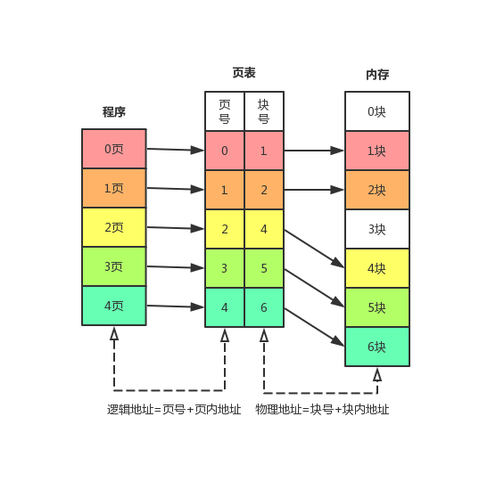
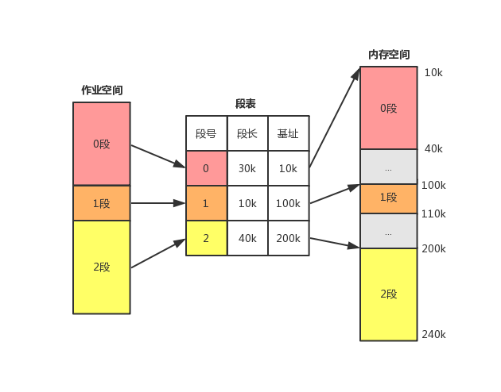

# 存储管理

## 页式存储

将**程序**和**内存**均分为大小相同的块（比如4k），以页为单位将程序调入内存

> 提示：
>
> 页内的存储还会进一步细分，每一个细分出来的单元都有自己的地址，即页内地址
>
> 块号也称为页帧号，故物理地址还可表示为 物理地址=页帧号+块内地址​；而内存块和程序块大小相等，故物理地址也可表示为 **物理地址=页帧号+页内地址**

## 段式存储

按用户自然段来划分逻辑空间，然后调入内存，段的长度不一样

## 段页式存储

段式和页式的综合体，先分段，再分页，一个程序有若个段，每个段中可以有若干页，每个页大小相同，但每个段大小不同。