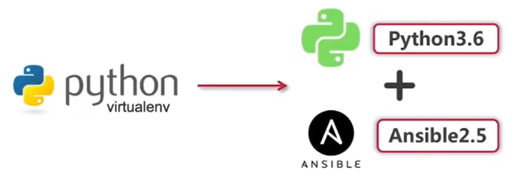

# Ansible安装

在开始安装之前，为了避免firewalld和selinux的干扰，我们将其关闭。该操作仅限于实验环境，请勿在生产环境操作

- 关闭firewalld防火墙

  ```bash
  $ systemctl stop firewalld
  $ systemctl disable firewalld
  ```

- 关闭selinux

  ```bash
  # 编辑配置，将SELINUX设置为disable
  $ vi /etc/sysconfig/selinux
  SELINUX=disabled
  # 重启虚机，使配置生效
  $ reboot
  # 重启成功后，执行如下命令，若返回Disabled则说明成功关闭SELINUX
  $ getenforce
  Disabled
  ```

## Ansible的两种安装模式(CentOS7)

1. Yum包管理安装

   ```bash
   # yum install epel-release
   # yum repolist
   # yum -y install ansible
   ```

2. Git源代码安装[推荐]

   ```bash
   # git clone https://github.com/ansible/ansible.git
   ```

# Ansible2.5+Python3.6安装步骤(CentOS7)



1. 预先安装Python3.6版本

2. 安装virtualenv

   ```bash
   # pip install virtualenv
   ```

3. 创建Ansible账户并安装python3.6版本virtualenv实例

   ```bash
   # useradd deploy && su - deploy
   # virtualenv -p /usr/local/bin/python3 .py3-a2.5-env
   ```

4. Git源代码安装ansible2.5

   ```bash
   # cd /home/deploy/.py3-a2.5-env
   # git clone https://github.coy/ansible/ansible.git
   # cd ansible && git checkout stable-2.5
   ```

5. 加载python3.6 virtualenv环境

   ```bash
   # source /home/deploy/.py3-a2.5-env/bin/activate
   ```

6. 安装ansible依赖包

   ```bash
   # pip install paramiko PyYAML jinja2
   ```

7. 在python3.6虚拟环境下加载ansible2.5

   ```bash
   # source /home/deployl.py3-a2.5-env/ansible/hacking/env-setup -q
   ```

8. 验证ansible2.5

   ```bash
   # ansible --version
   ```


## 更多安装方式

更多安装方式请见：[Installation Guide](https://docs.ansible.com/ansible/latest/installation_guide/index.html)

