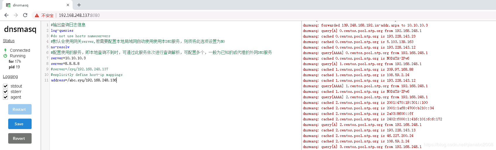

# docker部署dnsmasq

1.下载镜像

```bash
docker pull jpillora/dnsmasq
```

2.新建 /dns/conf/dnsmasq.conf 配置文件

```bash
#输出查询日志信息
log-queries
#do not use hosts nameservers
#默认会使用网关server,若需要配置本地局域网自动使用使用本DNS服务，则须将此选项设置为NO
no-resolv 
#配置使用的服务，即本地查询不到时，可通过此服务依次进行查询解析，可配置多个，一般为已知的或代理的外网DNS服务
server=10.10.10.3
server=8.8.8.8
#server=/syq/192.168.248.137
#explicitly define host-ip mappings
address=/abc.syq/192.168.248.136
```

3.运行容器

```bash
docker run \
    --name dnsmasq \
    -d \
    -p 53:53/udp \
    -p 8080:8080 \
    -v /dns/conf/dnsmasq.conf:/etc/dnsmasq.conf \
    -v /etc/localtime:/etc/localtime:ro \
    -e "HTTP_USER=admin" \
    -e "HTTP_PASS=admin" \
    --restart always \
    jpillora/dnsmasq
```

4.访问web UI

访问http://{dns-host}:8080，使用admin/admin登录，进入类似如下界面，可直接修改配置，点击save即可快速生效。



5.测试解析

```bash
[root@master dns]# ping abc.syq
PING abc.syq (192.168.248.136) 56(84) bytes of data.
From 192.168.2.1 (192.168.2.1) icmp_seq=10 Time to live exceeded
From 192.168.2.1 (192.168.2.1) icmp_seq=25 Time to live exceeded
From 192.168.2.1 (192.168.2.1) icmp_seq=26 Time to live exceeded
From 192.168.2.1 (192.168.2.1) icmp_seq=28 Time to live exceeded
```

6.配置网关DNS或客户端DNS

配置网关的首选DNS为本服务，局域网内部自动使用本DNS服务，无需客户端再手动设置DNS。