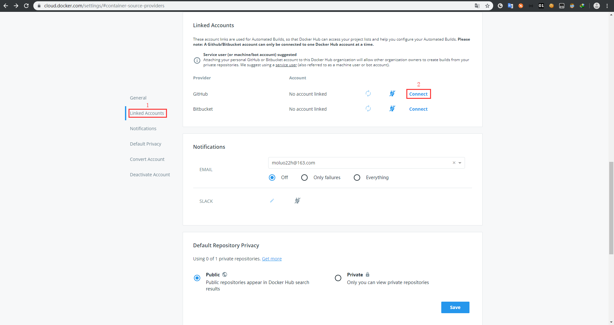
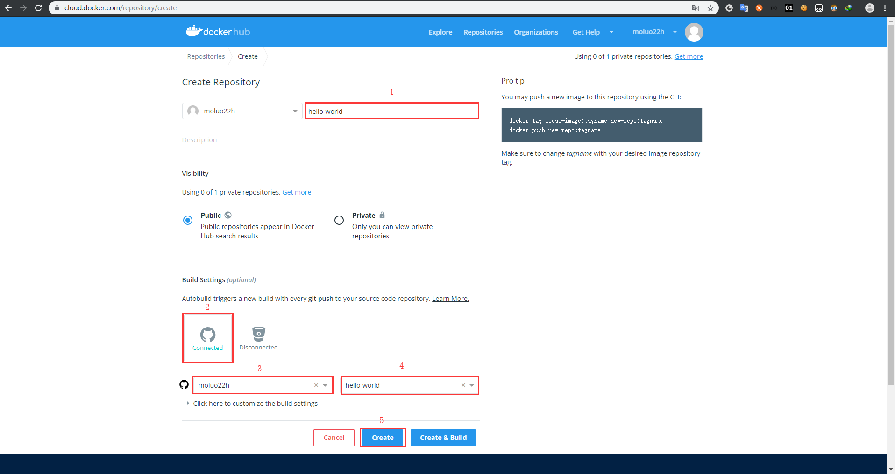
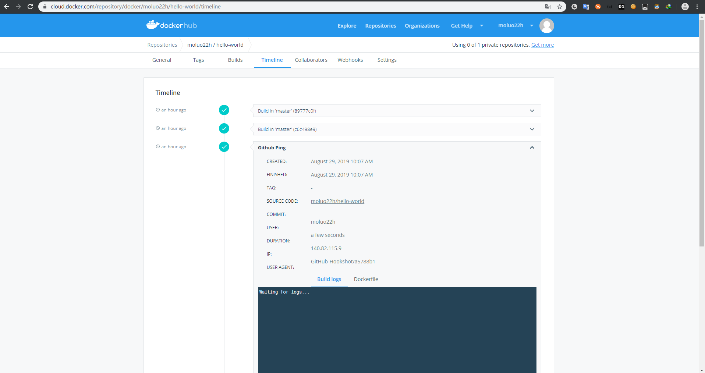

# 镜像的发布

在本节中，我们将把我们构建的镜像发布到镜像仓库

下面我们提供3中镜像发布方式：

- 直接发布镜像到Docker Hub
- 间接发布镜像到Docker Hub（通过Dockerfile间接发布，推荐使用该方式）
- 发布到私有Docker仓库

> Docker Hub：类似于Github的Docker 仓库网站

## 前提条件

拥有Docker Hub账号，若没有Docker Hub账号，请到[docker官网](https://hub.docker.com)注册

拥有Github账号，若没有Github账号，请到[Github官网](https://github.com/))注册

主机已安装git，若未安装git，可使用命令`yum install git`安装

## 直接发布镜像到Docker Hub

1.登录docker hub账号

```bash
[root@master vagrant]# docker login
Login with your Docker ID to push and pull images from Docker Hub. If you don't have a Docker ID, head over to https://hub.docker.com to create one.
Username: moluo22h
Password: 
WARNING! Your password will be stored unencrypted in /root/.docker/config.json.
Configure a credential helper to remove this warning. See
https://docs.docker.com/engine/reference/commandline/login/#credentials-store

Login Succeeded
```

2.push镜像到Dockers hub仓库

```bash
[root@master vagrant]# docker push moluo22h/hello-world
The push refers to repository [docker.io/moluo22h/hello-world]
5c3f36232789: Pushed 
latest: digest: sha256:3e96ae565808f90dc32c462b57fbe07067b7af6ddd2ede500ff2c0327a64d050 size: 527
```

> 注意：push的镜像名称必须为 {自己的Docker Hub id}/IMAGE，如示例中的moluo22h/hello-world

## 间接发布镜像到Docker Hub

本小节中，我们将使用Github托管我们的Dockerfile文件，通过建立Docker hub和Gitlab的关联，实现Docker hub自动拉取Dockerfile变更，自动编译Dockerfile成镜像并上传指docker hub中。具体步骤如下：

1.点击头像下的“Account Settings”→“Linked Accounts”，使用Docker hub连接Github



2.主页点击"Create Repository +"新建Docker Repository



> 注意：第4步中的hello-world项目，是提前在Github中建立的名为“hello-world”的项目，如果未创建该项目，请先到[Github](https://github.com/)中创建

3.push带有Dockerfile文件的代码到Github仓库，Docker Hub将自动监听Github的代码更新，编译并上传镜像到Docker Hub，编译过程可在镜像的“Timeline”中查看



## 发布到私有Docker仓库

### 前提条件

两台网络互通的虚机，一台作为服务器（示例IP：192.168.61.61），一台作为客户端

两台虚机都已安装docker

### 服务器搭建

1.在服务器虚机中，使用如下命令创建一个私有仓库容器并查看。

```bash
[root@master hello-world]# docker run -d -p 5000:5000 --restart=always --name registry registry:2
Unable to find image 'registry:2' locally
2: Pulling from library/registry
c87736221ed0: Pull complete 
1cc8e0bb44df: Pull complete 
54d33bcb37f5: Pull complete 
e8afc091c171: Pull complete 
b4541f6d3db6: Pull complete 
Digest: sha256:8004747f1e8cd820a148fb7499d71a76d45ff66bac6a29129bfdbfdc0154d146
Status: Downloaded newer image for registry:2
270e6311fad03cab41733104adc3a2e8267da0663282cd501b29bcfa1bdfc76d

[root@master hello-world]# docker ps 
CONTAINER ID    IMAGE        COMMAND                  CREATED             STATUS                 PORTS                                               NAMES
270e6311fad0    registry:2   "/entrypoint.sh /etc…"   15 seconds ago      Up 13 seconds          0.0.0.0:5000->5000/tcp                              registry
```

通过如上命令，我们已经搭建好了一个docker私有服务器。

## 客户端上传镜像到私有服务器

1.在客户端虚机中，编辑docker配置文件/etc/docker/daemon.json，如果没有daemon.json，请先新建。

```bash
cd /etc/docker
vi daemon.json
```

> 提示：不要把daemon.json文件名写错，如果你写成deamon.json，那么将是一件很糟糕的事。

在daemon.json文件中添加如下json，配置我们搭建的docker服务器为可信任的docker仓库

```json
{"insecure-registries":["192.168.61.61:5000"]}
```

> 可选：（不推荐使用，仅作参考）
>
> 除json添加配置方式外，我们还可以通过修改启动文件的方式添加配置。配置方式如下：
>
> 编辑/lib/systemd/system/docker.service文件，在`ExecStart=/usr/bin/dockerd`后添加`--insecure-registry 192.168.61.61:5000`。如下：
>
> ```bash
> vi /lib/systemd/system/docker.service
> ```
>
> ```bash
> ExecStart=/usr/bin/dockerd --insecure-registry 192.168.61.61:5000 -H fd:// --containerd=/run/containerd/containerd.sock
> ```


2.在客户端虚机中，依此执行一下两条命令，重启docker。

```bash
systemctl daemon-reload
systemctl restart docker
```


3.在客户端虚机中，push镜像到私有仓库。

```bash
docker push 192.168.61.61:5000/hello-world
```

> 注意：镜像名称格式为`{服务器ip地址}:5000/{镜像名}`


4.查看镜像是否上传成功，返回json中存在hello-world，即说明上传成功。

```bash
[root@master2 /]# curl 192.168.61.61:5000/v2/_catalog
{"repositories":["hello-world"]}
```

## 参考

[docker官方-Deploy a registry server](https://docs.docker.com/registry/deploying/)